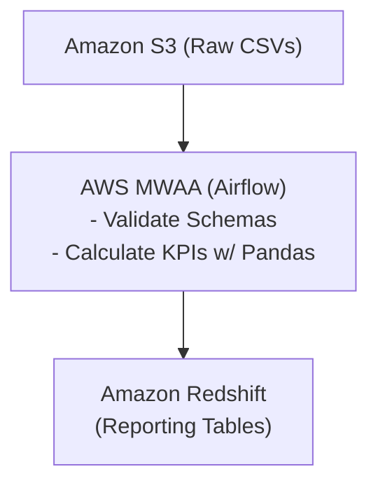
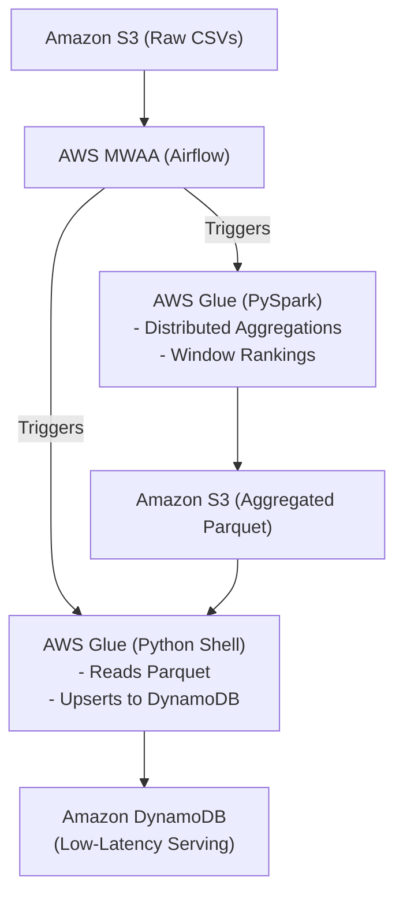
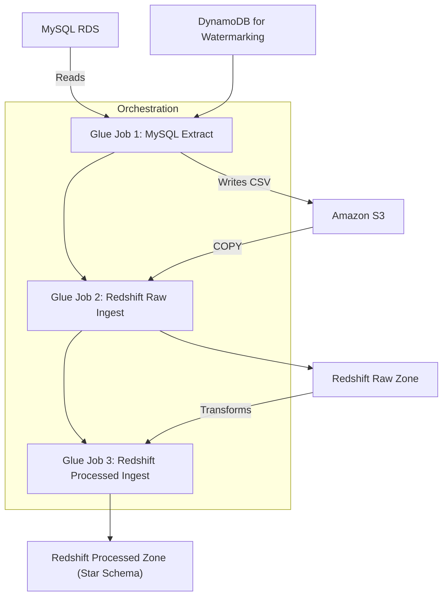
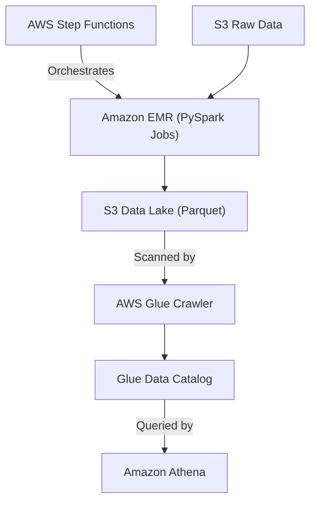
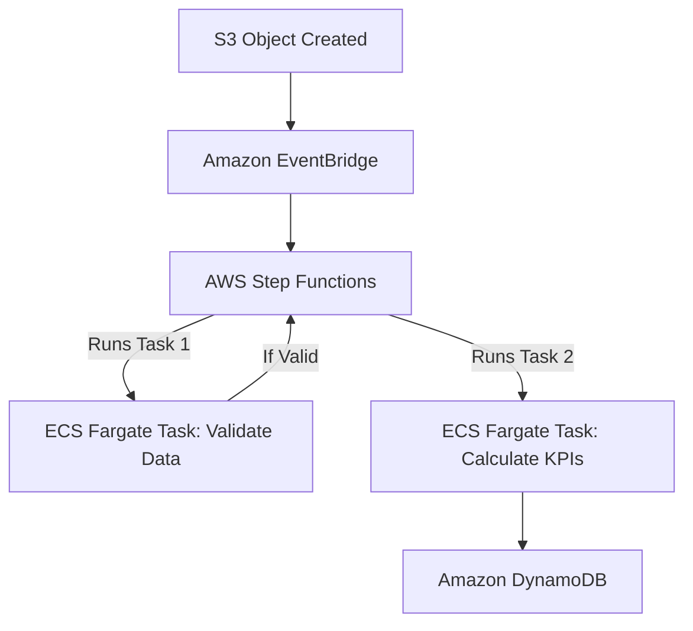
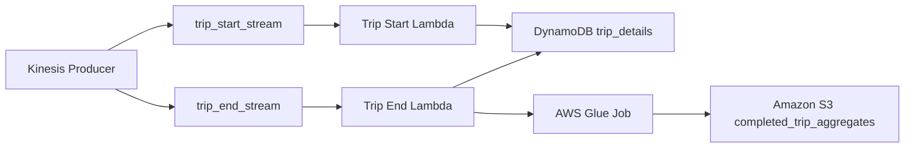
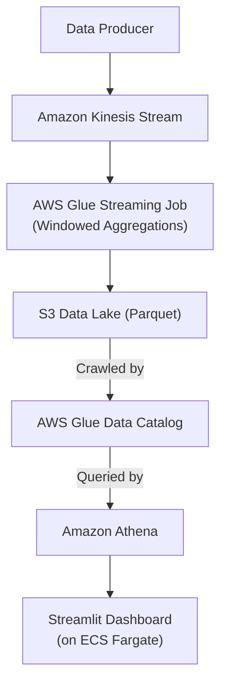
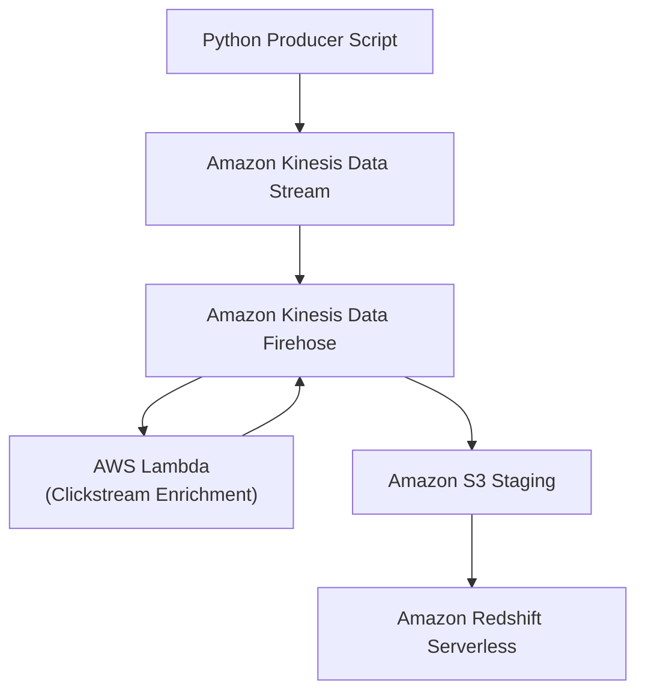

# AWS Data Engineering Projects Portfolio

This repository contains a collection of enterprise-grade data engineering pipelines built on Amazon Web Services (AWS). Each project demonstrates a unique architecture designed to solve a specific data-driven business problem, showcasing a wide range of AWS services, design patterns, and architectural paradigms (such as **Medallion**, **Lambda Architecture**, **Kappa Architecture**, **Event-Driven (EDA)**, and **Data Lakehouse**).

> 🎓 **Exam Reference**
> * **AWS Data Engineer Associate Exam**: These projects were built and used for hands-on practice in preparation for the **AWS Certified Data Engineer - Associate** exam.

---

## 📂 Projects Overview

| Project | Domain | Core Technologies | Architecture Pattern & Style |
| :--- | :--- | :--- | :--- |
| **1. [Spotify Batch KPI Pipeline](#-project-1-spotify-music-streaming-batch-kpi-pipeline)** | Music Streaming | MWAA (Airflow), Pandas, Redshift | **Batch ETL**, Data Warehousing |
| **2. [Spotify Real-Time Metrics](#-project-2-spotify-music-streaming-metrics-pipeline)** | Music Streaming | Glue (PySpark), Airflow, DynamoDB | **Lambda Architecture (Serving)**, Serverless NoSQL |
| **3. [Rental Apartments ETL](#-project-3-rental-apartments-data-pipeline)** | Real Estate | MySQL, Glue, Redshift, Step Functions | **Medallion Architecture**, Dimensional Modeling |
| **4. [Rental Vehicles Big Data](#-project-4-rental-vehicles-big-data-pipeline)** | Transportation | EMR (PySpark), Step Functions, Athena | **Data Lakehouse**, Dual EMR (EC2 vs Serverless) |
| **5. [E-Commerce Event-Driven Pipeline](#-project-5-e-commerce-event-driven-pipeline)** | E-Commerce | ECS Fargate, Step Functions, EventBridge, DynamoDB | **Event-Driven Architecture (EDA)**, Containers |
| **6. [Streaming Taxi Trips Pipeline](#-project-6-streaming-taxi-trips-pipeline)** | Transportation | Kinesis, Lambda, DynamoDB, Glue | **Lambda Architecture**, State Machine |
| **7. [Real-Time Telecom Streaming Analytics](#-project-7-real-time-telecom-streaming-analytics)** | Telecommunications | Kinesis, Glue Streaming, Athena, ECS | **Kappa Architecture**, Streamlit Dashboard |
| **8. [Real-Time Clickstream Analytics](#-project-8-real-time-clickstream-analytics)** | Web Analytics | Kinesis, Firehose, Lambda, Redshift | **Micro-Batching**, Near Real-Time DWH |

---

## 🎵 Project 1: Spotify Music Streaming Batch KPI Pipeline

An enterprise-grade, batch data engineering pipeline to ingest, validate, transform, and analyze music streaming datasets.

*   **Architecture Pattern**: **Classic Batch ETL & Data Warehousing** — Daily batch ingestion from S3, schema validation and Pandas transformation via MWAA Airflow, and idempotent loading into Amazon Redshift Serverless.
*   **Objective**: Process daily batches of Spotify user streaming data to calculate business KPIs for reporting and business intelligence.
*   **Key Services**: AWS MWAA (Airflow), Amazon S3, Python/Pandas, Amazon Redshift Serverless.
*   **Architecture Flow**: Raw CSV files (streams, songs, users) are ingested from S3, validated, and transformed using Python/Pandas tasks orchestrated by an Airflow DAG. The resulting KPIs are loaded idempotently into a Redshift data warehouse.
*   **Source Directory**: [`project1_spotifysongs/`](./project1_spotifysongs/)

---

## 🎶 Project 2: Spotify Music Streaming Metrics Pipeline

A serverless pipeline that processes streaming logs at scale using AWS Glue and serves aggregated metrics with low latency via DynamoDB.

*   **Architecture Pattern**: **Lambda Architecture (Serving Layer)** — Decouples distributed Spark batch computations from low-latency NoSQL serving by pushing aggregated metrics from Glue PySpark into DynamoDB for downstream microservices.
*   **Objective**: Compute track-level performance metrics and windowed rankings from raw streaming logs and serve them for fast access by downstream applications or APIs.
*   **Key Services**: AWS Glue (PySpark & Python Shell), AWS MWAA (Airflow), Amazon S3, Amazon DynamoDB.
*   **Architecture Flow**: An Airflow DAG checks for data availability in S3, then triggers a Glue PySpark job to perform large-scale aggregations. The transformed data is written back to S3. A subsequent Glue Python Shell job reads the results and performs atomic upserts into a DynamoDB table.
*   **Source Directory**: [`project2_spotifysongs/`](./project2_spotifysongs/)

---

## 🏢 Project 3: Rental Apartments Data Pipeline

A serverless data pipeline to incrementally ingest data from a transactional MySQL database into a dimensional data warehouse in Amazon Redshift.

*   **Architecture Pattern**: **Medallion Architecture (Bronze/Raw to Silver/Gold Star Schema)** — Extracts incremental OLTP data into an S3 landing zone, loads raw tables (`raw_zone`), and transforms them into a clean dimensional star schema (`processed_zone`).
*   **Objective**: Build a 2-tier Medallion/Dimensional data warehouse for analytical queries on rental apartment listings and user viewing telemetry.
*   **Key Services**: AWS Step Functions, AWS Glue (Python Shell), Amazon S3, Amazon Redshift Serverless, MySQL RDS, Amazon DynamoDB.
*   **Architecture Flow**: A Step Functions workflow orchestrates a sequence of Glue jobs. The first job extracts incremental data from MySQL (using DynamoDB for state tracking) and lands it in S3. Subsequent jobs load this data into a `raw_zone` in Redshift and then transform it into a `processed_zone` with a clean star schema.
*   **Source Directory**: [`project3_rentalapartments/`](./project3_rentalapartments/)

---

## 🚗 Project 4: Rental Vehicles Big Data Pipeline

A big data processing pipeline using Amazon EMR to transform raw vehicle rental data into an optimized Parquet data lake, ready for analytics with Amazon Athena.

*   **Architecture Pattern**: **Data Lakehouse Architecture** — Combines raw CSV staging, EMR PySpark distributed processing, S3 Parquet Data Lake storage, and Glue Data Catalog integration for serverless Athena SQL analytics.
*   **Objective**: Process large volumes of transactional data to generate aggregated metrics on transactions, users, vehicles, and locations. The project supports both persistent (EMR on EC2) and transient (EMR Serverless) compute models.
*   **Key Services**: Amazon EMR (PySpark), AWS Step Functions, Amazon S3, AWS Glue Data Catalog, Amazon Athena.
*   **Architecture Flow**: An AWS Step Functions state machine orchestrates the pipeline. It launches an EMR cluster (or uses an EMR Serverless application) to run two sequential PySpark jobs. These jobs read raw CSVs from S3, perform complex aggregations, and write the results as Parquet files to an S3 data lake. A Glue Crawler catalogs the output, making it queryable via Athena.
*   **Source Directory**: [`project4_rentalvehicles/`](./project4_rentalvehicles/)

---

## 🛒 Project 5: E-Commerce Event-Driven Pipeline

An event-driven, containerized pipeline that automatically validates and processes e-commerce order data upon arrival in S3.

*   **Architecture Pattern**: **Event-Driven Architecture (EDA) & Containerized Microservices** — Uses S3 Object Created events routed by EventBridge to trigger Step Functions, executing serverless ECS Fargate Docker containers for schema validation and KPI processing.
*   **Objective**: Create a fully automated, serverless pipeline that triggers on file uploads, validates data schemas, computes KPIs, and stores them in a NoSQL database, all without managing servers.
*   **Key Services**: AWS Step Functions, AWS ECS Fargate, Amazon EventBridge, Amazon S3, Amazon DynamoDB.
*   **Architecture Flow**: An EventBridge rule detects new order files in S3 and triggers a Step Functions workflow. The workflow first launches an ECS Fargate container to validate the data. If validation succeeds, it launches a second container to perform ETL aggregations and write the resulting KPIs to DynamoDB.
*   **Source Directory**: [`project5_ecommerce/`](./project5_ecommerce/)

---

## 🚕 Project 6: Streaming Taxi Trips Pipeline

A streaming taxi trip pipeline that ingests start and end events through Kinesis, maintains trip state in DynamoDB, and produces aggregated completed-trip analytics with AWS Glue.

*   **Architecture Pattern**: **Lambda Architecture & State Machine** — Real-time event ingestion via Kinesis Data Streams and Lambda into a DynamoDB state store, combined with asynchronous Glue batch aggregations exported to S3.
*   **Objective**: Capture real-time taxi trip events, merge them into completed trip records, and generate daily trip aggregates for analytics.
*   **Key Services**: Amazon Kinesis Data Streams, AWS Lambda, Amazon DynamoDB, AWS Glue, Amazon S3.
*   **Architecture Flow**: A local producer sends trip start and trip end events to separate Kinesis streams. The first Lambda function writes start events into DynamoDB. The second Lambda function updates trip records on trip completion and invokes an AWS Glue ETL job, which scans DynamoDB and writes aggregate results to S3.
*   **Source Directory**: [`project6_streaming_taxitrips/`](./project6_streaming_taxitrips/)

---

## 📡 Project 7: Real-Time Telecom Streaming Analytics

A real-time serverless pipeline for mobile network telemetry that performs windowed aggregations in AWS Glue and visualizes results through Athena and a Streamlit dashboard on ECS Fargate.

*   **Architecture Pattern**: **Kappa Architecture (Pure Stream Processing)** — Continuous, single-path stream processing using Kinesis Data Streams and Glue Spark Streaming with tumbling time windows, eliminating batch layers for real-time dashboarding.
*   **Objective**: Monitor mobile network performance in near real time by processing telecom log events into aggregated KPIs and visualizing them.
*   **Key Services**: Amazon Kinesis Data Streams, AWS Glue Streaming, Amazon S3, Amazon Athena, AWS Glue Data Catalog, Amazon ECS Fargate, Streamlit.
*   **Architecture Flow**: A producer script publishes mobile log records to a Kinesis stream. A Glue Spark Streaming job reads the stream, computes aggregations such as signal strength, GPS precision, and status counts, and writes Parquet output to S3. Glue Crawlers catalog the results. Athena queries support a Streamlit dashboard deployed on ECS Fargate.
*   **Source Directory**: [`project7_streaming_telecom_logs/`](./project7_streaming_telecom_logs/)

---

## 🖥️ Project 8: Real-Time Clickstream Analytics

A serverless clickstream pipeline that enriches events in-flight using Lambda, buffers them with Kinesis Firehose, stages them to S3, and loads them into Amazon Redshift Serverless for analytics.

*   **Architecture Pattern**: **Stream Ingestion & Micro-Batching** — Real-time event capture via Kinesis Data Streams, in-flight transformation using Lambda inline processing inside Firehose, and micro-batch staging to S3 for automated Redshift COPY loading.
*   **Objective**: Capture application clickstream activity, enrich events with device and traffic source metadata, and deliver them into Redshift for analysis.
*   **Key Services**: Amazon Kinesis Data Streams, Amazon Kinesis Data Firehose, AWS Lambda, Amazon S3, Amazon Redshift Serverless.
*   **Architecture Flow**: A Python producer sends clickstream events to a Kinesis stream. A Firehose delivery stream buffers the incoming data and invokes a Lambda function for transformation. The enriched records are staged in S3 and then automatically loaded into Redshift Serverless.
*   **Source Directory**: [`project8_clickstreamdata/`](./project8_clickstreamdata/)

> 🎓 **Course Reference**
> * **Course & Instructor Reference**: Based on and referenced from the Udemy course **"Ultimate AWS Data Engineering Bootcamp: 15 Real-World Labs"** taught by instructor **Sid Raghunath**.