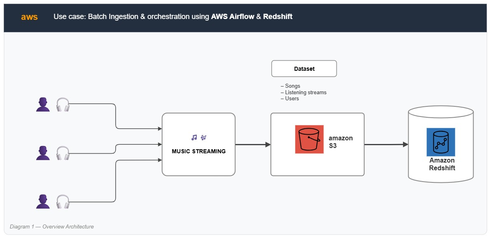
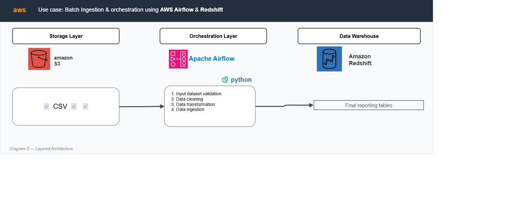
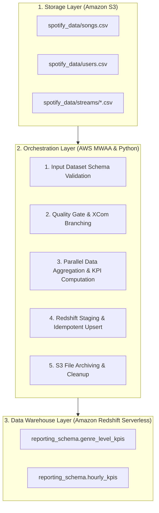
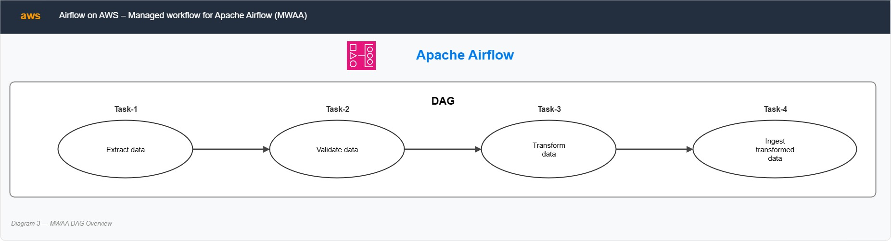
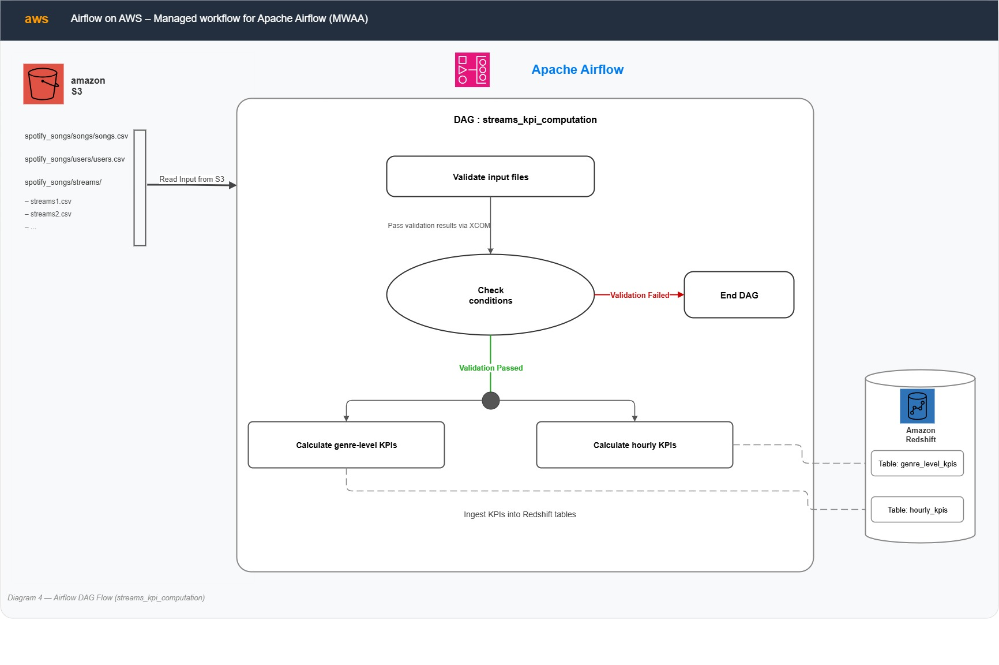
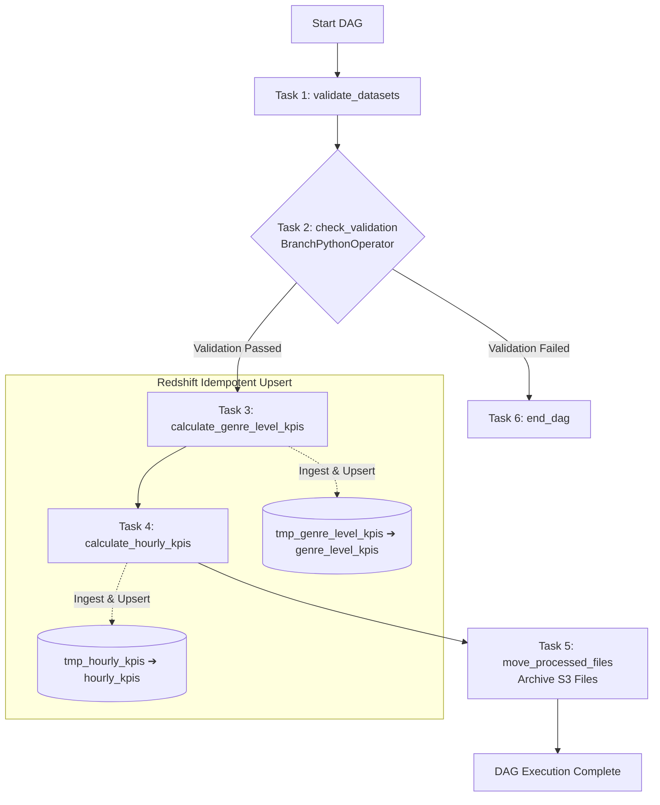

# 🎵 Spotify Music Streaming Batch Ingestion & KPI Orchestration Pipeline


An enterprise-grade, batch data engineering pipeline built on AWS to ingest, validate, transform, and analyze music streaming datasets. Orchestrated using **AWS Managed Workflows for Apache Airflow (MWAA)**, transformed using **Python & Pandas**, and loaded into **AWS Redshift Serverless** for reporting and business intelligence.

---

## 📌 Table of Contents
- [Architecture Overview](#-architecture-overview)
  - [High-Level End-to-End System Architecture](#-high-level-end-to-end-system-architecture)
  - [3-Tier Layered Architecture](#-3-tier-layered-architecture)
- [Airflow DAG Workflow & Logic](#-airflow-dag-workflow--logic)
  - [MWAA Airflow Overview](#-mwaa-airflow-overview)
  - [Detailed Airflow DAG Walkthrough](#-detailed-airflow-dag-walkthrough)
  - [DAG Task Breakdown](#dag-task-breakdown)
- [Key Features](#-key-features)
- [AWS Infrastructure](#-aws-infrastructure)
- [Datasets & Data Schema](#-datasets--data-schema)
- [Redshift Data Warehouse Schema](#-redshift-data-warehouse-schema)
- [Calculated Business KPIs](#-calculated-business-kpis)
- [Repository Structure](#-repository-structure)
- [Deployment & Operational Guide](#-deployment--operational-guide)
- [Local Development & Testing](#-local-development--testing)

---

## 🏗️ Architecture Overview

The system processes batch streams, user profiles, and song metadata from Amazon S3, performs schema validation and complex KPI aggregations via Apache Airflow, and maintains an idempotent data warehouse in Amazon Redshift Serverless.

### 🌐 High-Level End-to-End System Architecture



```
                               ┌────────────────────────────────────────────────────────┐
                               │                    AWS Cloud Environment               │
                               │                                                        │
┌───────────────────┐          │   ┌───────────────────┐      ┌─────────────────────┐   │      ┌─────────────────────┐
│  Music Streaming  │          │   │     Amazon S3     │      │   AWS MWAA (Airflow)│   │      │  Amazon Redshift    │
│   User Activity   ├─────────┼──►│  Project Bucket   ├─────►│  Python/Pandas ETL  ├──┼─────►│     Serverless      │
│ (Telemetry Logs)  │          │   │ (Songs/Users/     │      │  Validation & KPIs  │   │      │ (Reporting Database)│
└───────────────────┘          │   │  Streams CSVs)    │      └─────────────────────┘   │      └─────────────────────┘
                               │   └───────────────────┘                                │
                               └────────────────────────────────────────────────────────┘
```

### 🧩 3-Tier Layered Architecture





---

## 🔄 Airflow DAG Workflow & Logic

The Airflow DAG `data_validation_and_kpi_computation` executes daily, guaranteeing data quality, fault isolation, and archival post-ingestion.

### ☁️ MWAA Airflow Overview



---

### 📊 Detailed Airflow DAG Walkthrough





### DAG Task Breakdown
1. **`validate_datasets`**: Reads raw CSV files from S3 and verifies schema integrity.
2. **`check_validation`**: `BranchPythonOperator` decides whether to proceed or halt based on data quality.
3. **`calculate_genre_level_kpis`**: Joins streaming data with track metadata and upserts via staging tables.
4. **`calculate_hourly_kpis`**: Generates hourly engagement metrics and upserts into Redshift.
5. **`move_processed_files`**: Archives processed streams to prevent duplicate ingestion.
6. **`end_dag`**: Graceful termination for failed validations.

---

## ✨ Key Features

- **Automated Data Quality Gate**: Validates column integrity before running resource-intensive aggregations.
- **Idempotent Redshift Upsert**: Uses temporary staging tables and `DELETE/INSERT` transactions to prevent duplicate records.
- **Dynamic File Ingestion & Archival**: Automatically discovers and archives batch files under `spotify_data/streams/`.
- **Multi-Granular Analytics**: Computes both daily (genre) and hourly (behavioral) KPIs.
- **Production-Ready AWS Orchestration**: Designed for MWAA with zero local filesystem state dependencies.

---

## ⚡ AWS Infrastructure

| Infrastructure Component | Configuration Details |
| :--- | :--- |
| **Data Warehouse** | AWS Redshift Serverless (4 RPUs, `songs_db`) |
| **Storage Buckets** | S3 Data Bucket (`dcn-dataengg`) & Airflow DAG Bucket |
| **Orchestration** | AWS Managed Workflows for Apache Airflow (MWAA) |

---

## 📁 Datasets & Data Schema

Source files located in S3:
1. **`songs.csv`**: Contains track metadata (artist, track_name, genre, etc).
2. **`users.csv`**: Contains demographic info (age, country).
3. **`streams/*.csv`**: Raw telemetry logs (user_id, track_id, listen_time).

---

## 🗄️ Redshift Data Warehouse Schema

The data warehouse contains two target reporting tables and two matching temporary staging tables inside the `reporting_schema` schema.

```sql
CREATE DATABASE songs_db;
CREATE SCHEMA reporting_schema;

-- 1. Genre Level KPIs Table
CREATE TABLE reporting_schema.genre_level_kpis (
    listen_date DATE NOT NULL,
    track_genre VARCHAR(255) NOT NULL,
    listen_count INT,
    popularity_index FLOAT,
    average_duration FLOAT,
    most_popular_track_id VARCHAR(255)
);

-- Staging Table
CREATE TABLE reporting_schema.tmp_genre_level_kpis (LIKE reporting_schema.genre_level_kpis);

-- 2. Hourly KPIs Table
CREATE TABLE reporting_schema.hourly_kpis (
    listen_date DATE NOT NULL,
    listen_hour INT NOT NULL,
    unique_listeners INT,
    listen_counts INT,
    top_artist VARCHAR(255),
    avg_sessions_per_user FLOAT,
    diversity_index FLOAT,
    most_engaged_age_group VARCHAR(255)
);

-- Staging Table
CREATE TABLE reporting_schema.tmp_hourly_kpis (LIKE reporting_schema.hourly_kpis);
```

---

## 📈 Calculated Business KPIs

### 1. Genre-Level Daily KPIs (`reporting_schema.genre_level_kpis`)
- **Listen Count**: Total streams per genre on a given date.
- **Popularity Index**: Share of genre streams relative to total daily streaming volume (`listen_count / total_daily_listens`).
- **Average Duration**: Mean song playback duration in seconds for each genre.
- **Most Popular Track ID**: Top listened track identifier within each genre per day.

### 2. Hourly User & Engagement KPIs (`reporting_schema.hourly_kpis`)
- **Unique Listeners**: Distinct count of users active during the hour.
- **Listen Counts**: Total playback events during the hour.
- **Top Artist**: Most listened-to artist during that specific hour.
- **Avg Sessions per User**: Mean active listening sessions per user (`user_id + listen_time` combination).
- **Diversity Index**: Unique tracks listened divided by total streams in the hour (`unique_tracks / total_streams`).
- **Most Engaged Age Group**: Demographic age segment (`18-25`, `26-35`, `36-45`, `46-55`, `56-65`, `66+`) generating peak streams per hour.

---

## 📂 Repository Structure

```
project1_spotifysongs/
├── Infra.txt                         # AWS infrastructure resource summary
├── README.md                         # Project documentation and architecture reference
├── requirements.txt                  # MWAA Airflow extra dependencies (pandas, boto3)
├── airflow/
│   └── dag-song-kpi-calculations.py  # MWAA Airflow DAG definition script
├── redshift/
│   └── redshift-tables.sql           # Redshift DDL setup queries
├── docs/                             # Architecture diagrams & documentation assets
│   └── architecture/
│       ├── 1_overview_architecture.jpg
│       ├── 2_layered_architecture.jpg
│       ├── 3_mwaa_dag_overview.jpg
│       └── 4_airflow_dag_flow.jpg
├── local-script/                     # Jupyter notebooks for local prototyping
│   ├── genre-level-kpis.ipynb
│   └── hourly-kpis.ipynb
└── data/                             # Sample local input datasets
    ├── songs.csv
    ├── users.csv
    ├── streams1.csv
    ├── streams2.csv
    └── streams3.csv
```

---

## 🚀 Deployment & Getting Started

You can provision the AWS infrastructure using **Option A (AWS Console Manual Setup)**.

### 🖥️ Option C: Manual Setup via AWS Management Console

If you prefer using the AWS Console, follow these step-by-step instructions to create the custom VPC, S3 buckets, Redshift Serverless, and MWAA environment:

#### 1️⃣ VPC & Networking Configuration
1. Open the **VPC Console** and click **Create VPC**.
2. Select **VPC and more** (VPC Wizard):
   - **Name tag**: `spotify-songs-kpi-vpc`
   - **IPv4 CIDR block**: `10.0.0.0/16`
   - **Number of Availability Zones (AZs)**: `2` (e.g., `us-east-1a` and `us-east-1b`)
   - **Number of Public subnets**: `2` (`10.0.1.0/24` and `10.0.2.0/24`)
   - **Number of Private subnets**: `2` (`10.0.10.0/24` and `10.0.11.0/24`)
   - **NAT Gateways**: `1 in 1 AZ` *(Required by MWAA private subnets for outbound internet/API access)*
   - **VPC Endpoints**: `None`
3. Click **Create VPC** and wait for subnets, route tables, and NAT Gateway creation.

#### 2️⃣ Security Groups Setup
1. **Redshift Security Group (`spotify-redshift-sg`)**:
   - In VPC Console ➔ **Security Groups** ➔ **Create Security Group**.
   - Name: `spotify-redshift-sg`, Select VPC: `spotify-songs-kpi-vpc`.
   - **Inbound Rules**: Add **Custom TCP**, Port `5439`, Source `0.0.0.0/0` (or your specific IP).
   - **Outbound Rules**: All traffic (`0.0.0.0/0`).
2. **MWAA Security Group (`spotify-mwaa-sg`)**:
   - Name: `spotify-mwaa-sg`, Select VPC: `spotify-songs-kpi-vpc`.
   - **Inbound Rules**: Add **All traffic**, Source: Select `spotify-mwaa-sg` (self-referencing rule).
   - **Outbound Rules**: All traffic (`0.0.0.0/0`).

#### 3️⃣ Amazon S3 Buckets Setup
1. **Project Data Bucket**:
   - Create bucket `dcn-dataengg`.
   - Inside the bucket, create the folder structure:
     - `spotify_data/`
     - `spotify_data/streams/`
     - `spotify_data/streams/archived/`
2. **Airflow DAGs Bucket**:
   - Create bucket `spotify-mwaa-airflow-<unique-suffix>`.
   - Enable **Bucket Versioning** under Bucket Properties *(Required by MWAA)*.
   - Upload [`airflow/dag-song-kpi-calculations.py`] to `dags/dag-song-kpi-calculations.py`.
   - Upload [`requirements.txt`] to the bucket root.

#### 4️⃣ Amazon Redshift Serverless Provisioning
1. Open the **Amazon Redshift Console** ➔ **Redshift Serverless**.
2. **Namespace**: Click **Create Namespace**.
   - Name: `spotify-songs-namespace`
   - Database name: `songs_db`
   - Master user credentials: Username `awsuser`, Password `<YourStrongPassword123!>`.
3. **Workgroup**: Click **Create Workgroup**.
   - Name: `spotify-songs-workgroup`
   - Base capacity: `4 RPUs`
   - VPC: Select `spotify-songs-kpi-vpc`.
   - Subnets: Select the **2 Public Subnets**.
   - Security group: Attach `spotify-redshift-sg`.
   - Turn **Publicly accessible**: `ON`.
4. Click **Save** to launch Redshift Serverless.

#### 5️⃣ AWS MWAA (Managed Workflows for Apache Airflow) Setup
1. Open the **Amazon MWAA Console** ➔ **Create environment**.
2. **Environment details**:
   - Name: `spotify-mwaa-env`
   - Environment class: `mw1.small`
3. **DAG code and dependencies**:
   - S3 bucket: Select `spotify-mwaa-airflow-<unique-suffix>`
   - DAGs folder: `dags`
   - Requirements file: `requirements.txt`
4. **Networking**:
   - VPC: Select `spotify-songs-kpi-vpc`
   - Web server access: **Public network (Internet accessible)**
   - Subnets: Select the **2 Private Subnets** *(MWAA workers run in private subnets)*
   - Security group: Select `spotify-mwaa-sg`
5. **Permissions & Logging**:
   - Execution role: Choose **Create a new role** *(MWAA will auto-generate an IAM role with required S3 and CloudWatch permissions)*.
   - Airflow logs: Enable `INFO` level for Task, Scheduler, and Worker logs.
6. Click **Create environment** *(Initialization takes ~20–25 minutes)*.

---

### 📊 Step 2: Database Initialization

Connect to Redshift Serverless using Query Editor v2 or `psql` and execute the DDL queries in [`redshift/redshift-tables.sql`](file:///d:/Study/Udemy/AWS/SidRaghunath/AWSDataEngineering-BootCamp/dcn-aws-dataengg-projects/project1-songs/redshift/redshift-tables.sql):

```sql
CREATE DATABASE songs_db;
CREATE SCHEMA reporting_schema;

-- Run table definitions from redshift/redshift-tables.sql
```

---

### 📥 Step 3: Ingest Data & Trigger Airflow Workflow

1. **Upload Datasets to S3:**
   ```bash
   aws s3 cp data/songs.csv s3://dcn-dataengg/spotify_data/songs.csv
   aws s3 cp data/users.csv s3://dcn-dataengg/spotify_data/users.csv
   aws s3 cp data/streams1.csv s3://dcn-dataengg/spotify_data/streams/streams1.csv
   aws s3 cp data/streams2.csv s3://dcn-dataengg/spotify_data/streams/streams2.csv
   ```

2. **Configure Airflow Connection:**
   Open Airflow UI ➔ **Admin ➔ Connections** ➔ Add Connection `redshift_default`:
   - **Connection Id**: `redshift_default`
   - **Connection Type**: `Postgres`
   - **Host**: `<redshift-workgroup-endpoint>`
   - **Database**: `songs_db`
   - **Port**: `5439`
   - **Login**: `awsuser`
   - **Password**: `<your-redshift-password>`

3. **Unpause DAG:**
   In Airflow UI, toggle the DAG `data_validation_and_kpi_computation` to **On** to initiate automated data validation, KPI calculation, Redshift loading, and S3 file archiving.

---

## 🔬 Local Development & Testing

Jupyter notebooks are provided under `local-script/` for offline KPI verification:
1. Run [`genre-level-kpis.ipynb`] to validate daily genre metrics output against sample CSVs.
2. Run [`hourly-kpis.ipynb`] to inspect hourly listener diversity and demographic engagement logic.

