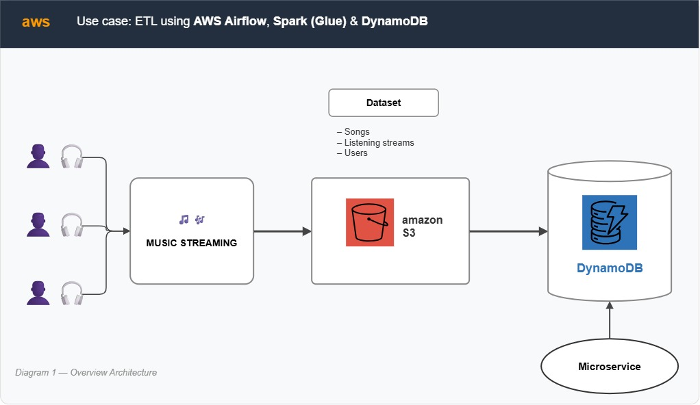
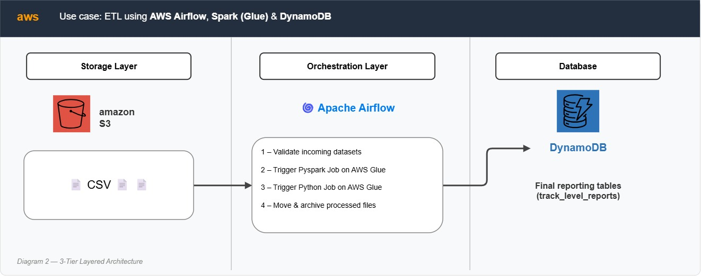
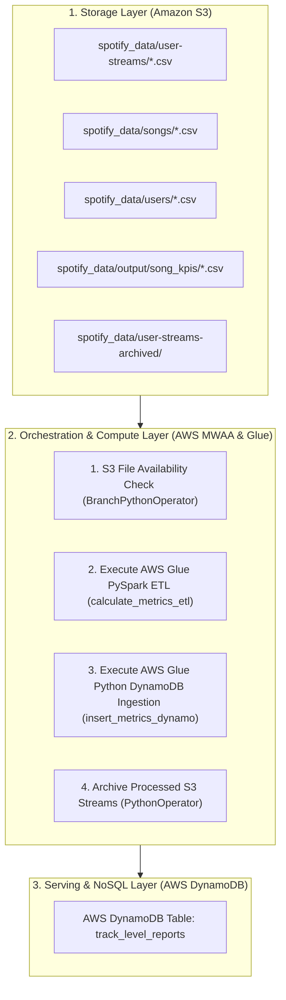
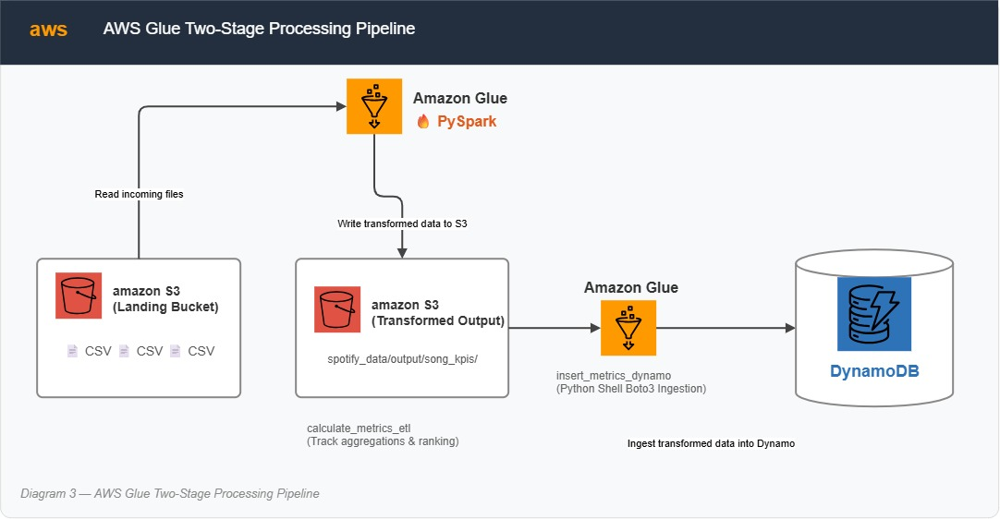
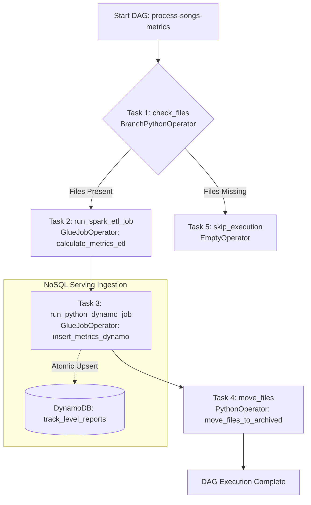

# 🎵 Spotify Music Streaming Metrics Pipeline: S3, Glue PySpark, Airflow & DynamoDB


An enterprise-grade, serverless data engineering pipeline built on AWS to ingest, validate, transform, and serve music streaming metrics. Orchestrated using **AWS Managed Workflows for Apache Airflow (MWAA)**, calculated at scale using **AWS Glue (PySpark)**, ingested via **AWS Glue (Python Shell)**, and served low-latency through **AWS DynamoDB** for downstream reporting and microservice APIs.

---

## 📌 Table of Contents
- [Architecture Overview](#-architecture-overview)
- [Airflow DAG Workflow & Logic](#-airflow-dag-workflow--logic)
- [Key Features](#-key-features)
- [AWS Infrastructure](#-aws-infrastructure)
- [Datasets & Input Data Schema](#-datasets--input-data-schema)
- [AWS Glue Transformation Logic & KPIs](#-aws-glue-transformation-logic--kpis)
- [DynamoDB Data Model](#-dynamodb-data-model)
- [Repository Structure](#-repository-structure)
- [Deployment & Getting Started](#-deployment--getting-started)

---

## 🏗️ Architecture Overview

The system ingests daily music streaming logs, song catalogs, and user metadata from Amazon S3, checks dataset availability via Apache Airflow, computes track-level performance metrics and window rankings using PySpark on AWS Glue, and atomically upserts the metrics into AWS DynamoDB for fast serving.

### 🌐 High-Level End-to-End System Architecture



```
                               ┌────────────────────────────────────────────────────────┐
                               │                    AWS Cloud Environment               │
                               │                                                        │
┌───────────────────┐          │   ┌───────────────────┐      ┌─────────────────────┐   │      ┌─────────────────────┐
│  Music Streaming  │          │   │     Amazon S3     │      │   AWS MWAA (Airflow)│   │      │    AWS DynamoDB     │
│   User Activity   ├─────────┼──►│  Project Bucket   ├─────►│  AWS Glue (PySpark) ├──┼─────►│ `track_level_reports`│
│ (Telemetry Logs)  │          │   │ (Songs/Users/     │      │  & Python Shell Job │   │      │(Low-latency Serving)│
└───────────────────┘          │   │  Streams CSVs)    │      └─────────────────────┘   │      └──────────┬──────────┘
                               │   └───────────────────┘                                │                 │
                               └────────────────────────────────────────────────────────┘                 │
                                                                                                          ▼
                                                                                               ┌─────────────────────┐
                                                                                               │    Microservice /   │
                                                                                               │  Reporting Dashboard│
                                                                                               └─────────────────────┘
```

### 🧩 3-Tier Layered Architecture Diagram





### ⚡ AWS Glue Two-Stage Processing Pipeline



1. **Stage 1 (PySpark Job - `calculate_metrics_etl`)**:
   - Reads raw CSV files from S3 (`user-streams/`, `songs/`, `users/`).
   - Executes distributed transformations, parses dates (`report_date`), aggregates metrics (`total_listens`, `unique_users`, `total_listening_time`, `avg_listening_time_per_user`), and computes genre rankings.
   - Writes enriched output back to S3 (`spotify_data/output/song_kpis/`).
2. **Stage 2 (Python Shell Job - `insert_metrics_dynamo`)**:
   - Reads the latest transformed KPI output from S3.
   - Ingests data into the target DynamoDB table (`track_level_reports`) using `boto3` upserts (`update_item`).

---

## 🔄 Airflow DAG Workflow & Logic

The Airflow DAG `process-songs-metrics` scheduled at `@daily` orchestrates data checks, distributed processing, database ingestion, and stream archiving.

### 📊 Airflow DAG Flowchart & State Diagram



### DAG Task Breakdown
1. **`check_files`** ([dag-glue-workflow.py](airflow/dag-glue-workflow.py)): `BranchPythonOperator` that inspects S3 prefixes `spotify_data/user-streams/`, `spotify_data/songs/`, and `spotify_data/users/`.
   - If non-empty files exist in all 3 paths: Proceeds to `run_spark_etl_job`.
   - If any prefix is empty: Branches to `skip_execution` to avoid unnecessary processing costs.
2. **`run_spark_etl_job`** ([dag-glue-workflow.py](airflow/dag-glue-workflow.py)): Triggers the PySpark Glue Job `calculate_metrics_etl` and waits for execution completion.
3. **`run_python_dynamo_job`** ([dag-glue-workflow.py](airflow/dag-glue-workflow.py)): Triggers the Python Shell Glue Job `insert_metrics_dynamo` to load transformed metrics from S3 to DynamoDB.
4. **`move_files`** ([dag-glue-workflow.py](airflow/dag-glue-workflow.py)): Copies processed stream logs from `spotify_data/user-streams/` to `spotify_data/user-streams-archived/` and removes originals from the input folder.
5. **`skip_execution`** ([dag-glue-workflow.py](airflow/dag-glue-workflow.py)): An `EmptyOperator` providing a graceful exit node when source files are absent.

---

## ✨ Key Features

- **Data Availability Readiness Gate**: Prevents Glue job invocation if required source files are missing in S3, optimizing compute costs.
- **Serverless Distributed Processing**: Leverages PySpark on AWS Glue to process millions of streaming events, join datasets, and compute window functions at scale.
- **Atomic NoSQL Upserts**: Uses DynamoDB `update_item` with expression parameters (`:tl`, `:uu`, `:tlt`, `:alt`) to guarantee idempotent database updates without duplication.
- **Automated Data Archiving Strategy**: Automatically moves ingested streaming files from landing (`user-streams/`) to long-term storage (`user-streams-archived/`).
- **Fully Managed Airflow Integration**: Custom Airflow DAG built for AWS MWAA using native `GlueJobOperator` with synchronous waiter enforcement (`wait_for_completion=True`).

---

## ⚡ AWS Infrastructure

| Infrastructure Component | Configuration / Specification |
| :--- | :--- |
| **NoSQL Database** | AWS DynamoDB (`track_level_reports`, Hash Key: `track_id`, Range Key: `report_date`) |
| **ETL Compute 1 (PySpark)** | AWS Glue Job `calculate_metrics_etl` (Spark engine, S3 input & output) |
| **ETL Compute 2 (Python)** | AWS Glue Job `insert_metrics_dynamo` (Python Shell engine, Boto3 SDK) |
| **Project Data Bucket** | Amazon S3 (`dcn-dataengg` storing `user-streams/`, `songs/`, `users/`, `output/`, `user-streams-archived/`) |
| **Airflow S3 Bucket** | Amazon S3 (Stores DAG script `dag-glue-workflow.py` and environment requirements) |
| **Orchestration Environment**| AWS MWAA (`mw1.small` instance, public endpoint enabled) |
| **IAM Security Role** | Glue IAM Role with permissions for S3 Read/Write, DynamoDB Full Access, and CloudWatch Logs |

---

## 📁 Datasets & Input Data Schema

Source files located in S3 bucket `dcn-dataengg`:

1. **`songs.csv`** (`spotify_data/songs/`):
   - `id`, `track_id`, `artists`, `album_name`, `track_name`, `popularity`, `duration_ms`, `explicit`, `danceability`, `energy`, `key`, `loudness`, `mode`, `speechiness`, `acousticness`, `instrumentalness`, `liveness`, `valence`, `tempo`, `time_signature`, `track_genre`
2. **`users.csv`** (`spotify_data/users/`):
   - `user_id`, `user_name`, `user_age`, `user_country`, `created_at`
3. **`streams*.csv`** (`spotify_data/user-streams/streams1.csv`, `streams2.csv`, etc.):
   - `user_id`, `track_id`, `listen_time`

---

## 📈 AWS Glue Transformation Logic & KPIs

The PySpark script ([glue-pyspark.py](glue/glue-pyspark.py)) executes the following analytical logic:

### 1. Daily Track KPI Aggregations
For each track on every listening date (`report_date` derived from `listen_time`):
- **`total_listens`**: `COUNT(*)` — Cumulative listen count per track per day.
- **`unique_users`**: `APPROX_COUNT_DISTINCT(user_id)` — Total distinct listeners.
- **`total_listening_time`**: `SUM(UNIX_TIMESTAMP(listen_time))` — Aggregate playback duration in seconds.
- **`avg_listening_time_per_user`**: `AVG(UNIX_TIMESTAMP(listen_time))` — Mean duration per user in seconds.

### 2. Window Ranking & Filtering
- **Song Rank per Genre**: Window partition by `report_date` and `track_genre`, ordered by `total_listens` DESC. Selects top 3 tracks per genre (`rank <= 3`).
- **Genre Rank**: Window partition by `report_date`, ordered by `total_listens` DESC across tracks. Selects top 5 genres overall (`genre_rank <= 5`).

---

## 🗄️ DynamoDB Data Model

Target Table: **`track_level_reports`**

| Attribute Name | Data Type | Key Type | Description |
| :--- | :--- | :--- | :--- |
| `track_id` | String | **Partition Key (Hash Key)** | Unique track identifier |
| `report_date` | String | **Sort Key (Range Key)** | Metrics aggregation date (`YYYY-MM-DD`) |
| `total_listens` | Number (Integer) | Attribute | Total stream count |
| `unique_users` | Number (Integer) | Attribute | Distinct listener count |
| `total_listening_time` | Number (Decimal) | Attribute | Cumulative duration in seconds |
| `avg_listening_time_per_user` | Number (Decimal) | Attribute | Average duration per listener in seconds |

---

## 📂 Repository Structure

```
project2-s3-glue-airflow-dynamodb/
├── Infra.txt                     # Infrastructure specifications & environment notes
├── README.md                     # Main project documentation
├── airflow/
│   └── dag-glue-workflow.py      # Apache Airflow DAG workflow definition
├── data/
│   ├── songs.csv                 # Sample songs metadata
│   ├── streams1.csv              # Sample streaming logs batch 1
│   ├── streams2.csv              # Sample streaming logs batch 2
│   └── users.csv                 # Sample users metadata
├── docs/
│   └── architecture/
│       ├── 1-architecture.png    # Visual architecture diagram (System Overview)
│       ├── 2-layeredarchitecture.png # Visual architecture diagram (Layered & Airflow Flow)
│       └── 3-glueflow.png        # Visual architecture diagram (Glue 2-Stage Flow)
└── glue/
    ├── glue-pyspark.py           # AWS Glue PySpark ETL script (Stage 1)
    └── glue-dynamo.py            # AWS Glue Python script for DynamoDB loading (Stage 2)
```

---

## 🚀 Deployment & Getting Started

Follow these step-by-step instructions to configure and execute the pipeline using the AWS Management Console:

### 1️⃣ Amazon S3 Buckets Setup
1. **Create Data Bucket**: `dcn-dataengg`
   - Create sub-folders:
     - `spotify_data/user-streams/`
     - `spotify_data/songs/`
     - `spotify_data/users/`
     - `spotify_data/output/song_kpis/`
     - `spotify_data/user-streams-archived/`
2. **Create Airflow Bucket**: `spotify-airflow-mwaa-<unique-suffix>`
   - Upload [`airflow/dag-glue-workflow.py`](airflow/dag-glue-workflow.py) to `dags/dag-glue-workflow.py`.

---

### 2️⃣ AWS IAM Permissions Setup
Create an IAM Role `SpotifyGlueExecutionRole` for AWS Glue with the following policies:
- `AmazonS3FullAccess` (or restricted policy for bucket `dcn-dataengg`)
- `AmazonDynamoDBFullAccess` (or restricted policy for table `track_level_reports`)
- `AWSGlueServiceRole`

---

### 3️⃣ AWS DynamoDB Table Setup
1. Open **DynamoDB Console** ➔ **Tables** ➔ **Create table**.
2. **Table name**: `track_level_reports`
3. **Partition key**: `track_id` (Type: `String`)
4. **Sort key**: `report_date` (Type: `String`)
5. **Table settings**: Use **On-Demand** or **Provisioned** capacity settings as desired.
6. Click **Create table**.

---

### 4️⃣ AWS Glue Jobs Provisioning

#### Job 1: PySpark ETL (`calculate_metrics_etl`)
1. Open **AWS Glue Console** ➔ **ETL jobs** ➔ **Script editor**.
2. Engine: **Spark (Python)**.
3. Paste the contents of [`glue/glue-pyspark.py`](glue/glue-pyspark.py).
4. **Job details**:
   - Name: `calculate_metrics_etl`
   - IAM Role: `SpotifyGlueExecutionRole`
   - Type: `Spark`
   - Glue version: `3.0` or `4.0`
5. Save the job.

#### Job 2: DynamoDB Loader (`insert_metrics_dynamo`)
1. Open **AWS Glue Console** ➔ **ETL jobs** ➔ **Script editor**.
2. Engine: **Python Shell**.
3. Paste the contents of [`glue/glue-dynamo.py`](glue/glue-dynamo.py).
4. **Job details**:
   - Name: `insert_metrics_dynamo`
   - IAM Role: `SpotifyGlueExecutionRole`
   - Type: `Python shell`
   - Python version: `3.9`
5. Save the job.

---

### 5️⃣ AWS MWAA & Airflow Setup
1. In the **MWAA Console**, launch an environment `mw1.small` linked to your Airflow S3 bucket.
2. In the **Airflow UI**, ensure the AWS Connection `aws_default` is configured with appropriate regional permissions (`ap-south-1`).
3. Toggle the DAG `process-songs-metrics` to **On**.

---

### 6️⃣ Ingest Data & Run Workflow
1. Upload raw sample files to S3:
   ```bash
   aws s3 cp data/songs.csv s3://dcn-dataengg/spotify_data/songs/songs.csv
   aws s3 cp data/users.csv s3://dcn-dataengg/spotify_data/users/users.csv
   aws s3 cp data/streams1.csv s3://dcn-dataengg/spotify_data/user-streams/streams1.csv
   aws s3 cp data/streams2.csv s3://dcn-dataengg/spotify_data/user-streams/streams2.csv
   ```
2. Trigger DAG `process-songs-metrics` in Airflow UI.
3. Verify that:
   - `check_files` branches to `run_spark_etl_job`.
   - PySpark Glue job outputs KPI CSV files to `spotify_data/output/song_kpis/`.
   - Python Glue job upserts records into DynamoDB table `track_level_reports`.
   - Processed stream files are safely archived to `spotify_data/user-streams-archived/`.
