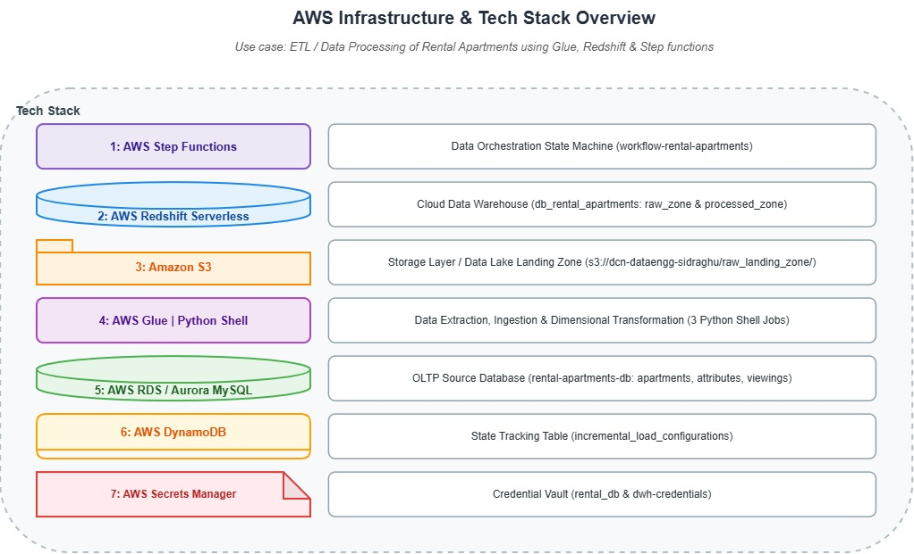
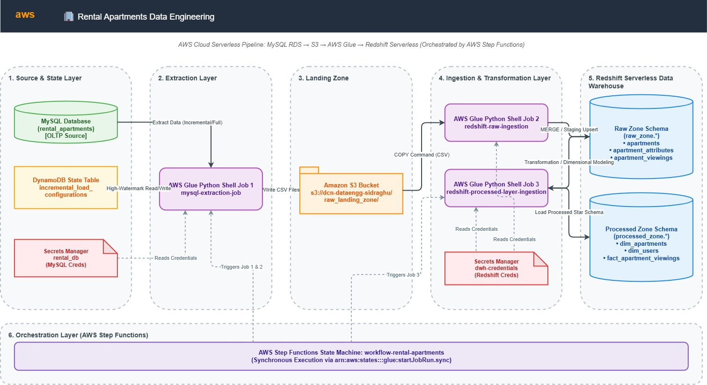
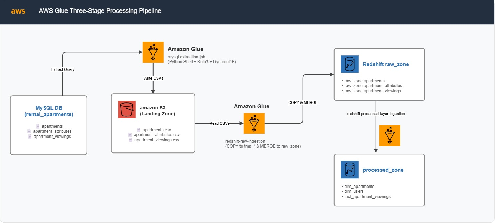
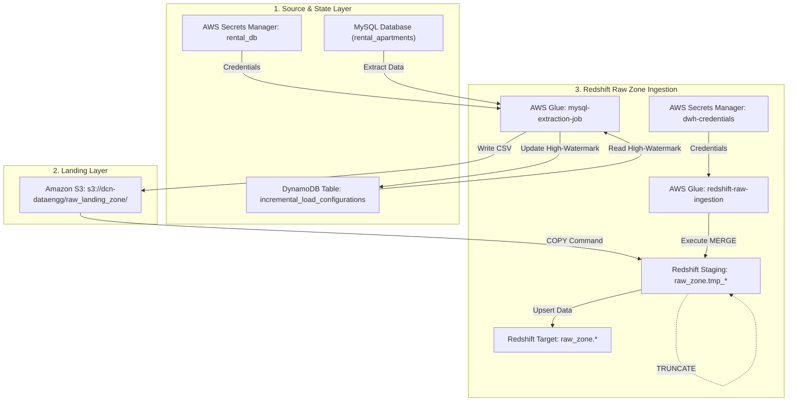
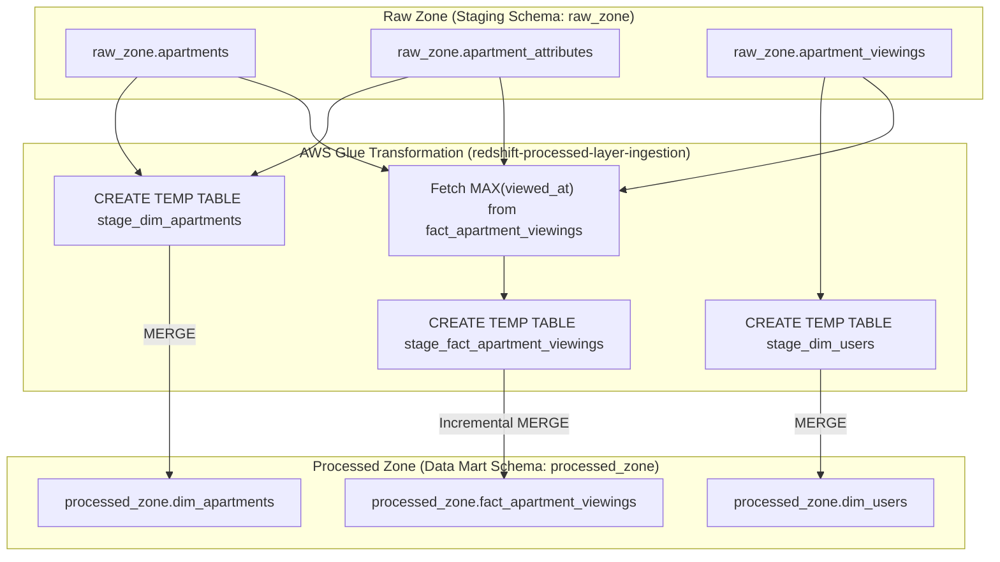
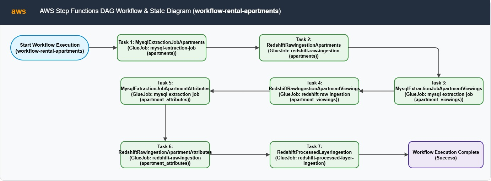
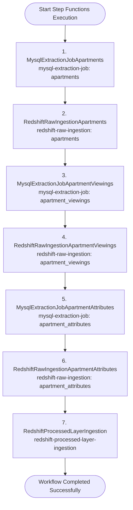
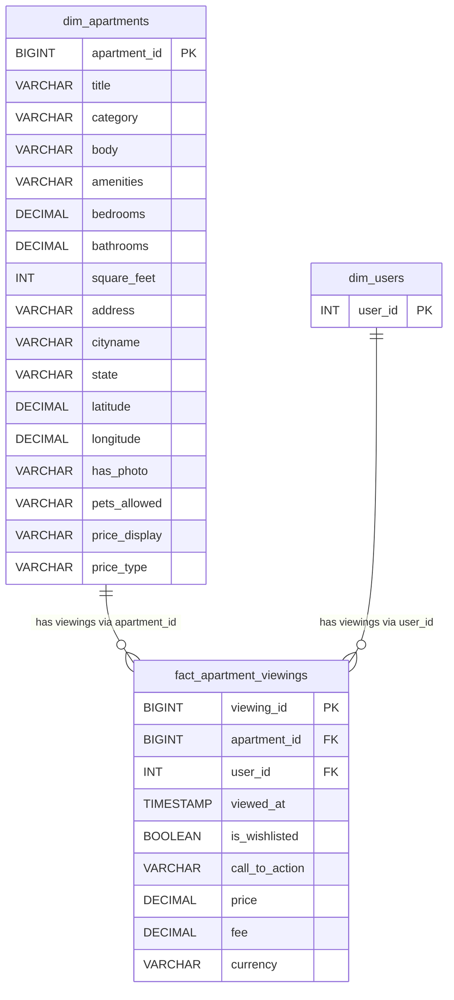

# 🏢 Rental Apartments Data Engineering Pipeline: MySQL, S3, AWS Glue, Redshift & Step Functions


An enterprise-grade, serverless data engineering pipeline built on AWS to ingest, extract, transform, and serve rental apartment listings and viewing telemetry. Orchestrated synchronously using **AWS Step Functions**, extracted incrementally from **MySQL RDS** via **AWS Glue (Python Shell)**, tracked dynamically using **AWS DynamoDB**, staged in **Amazon S3**, and loaded into a 2-tier Medallion/Dimensional Data Warehouse on **Amazon Redshift Serverless**.

---

## 📌 Table of Contents
- [Architecture Overview](#-architecture-overview)
  - [AWS Services Infrastructure](#-aws-services-infrastructure)
  - [High-Level End-to-End System Architecture](#-high-level-end-to-end-system-architecture)
  - [Data Extraction & Ingestion Flow](#-data-extraction--ingestion-flow)
  - [Data Warehouse Layered Architecture & Processing](#-data-warehouse-layered-architecture--processing)
  - [AWS Step Functions Orchestration Workflow](#-aws-step-functions-orchestration-workflow)
- [Step Functions Workflow & Execution Logic](#-step-functions-workflow--execution-logic)
- [Key Features](#-key-features)
- [AWS Infrastructure Specifications](#-aws-infrastructure-specifications)
- [Datasets & Database Schemas](#-datasets--database-schemas)
  - [MySQL Source Database](#mysql-source-database)
  - [Redshift Raw Zone (`raw_zone`)](#redshift-raw-zone-raw_zone)
  - [Redshift Processed Zone (`processed_zone` - Dimensional Model)](#redshift-processed-layer-processed_zone---dimensional-model)
  - [Star Schema ER Diagram (`processed_zone`)](#4-⭐️-star-schema-er-diagram-processed_zone)
- [AWS Glue Jobs & ETL Transformation Logic](#-aws-glue-jobs--etl-transformation-logic)
  - [Job 1: `mysql-extraction-job`](#job-1-mysql-extraction-job)
  - [Job 2: `redshift-raw-ingestion`](#job-2-redshift-raw-ingestion)
  - [Job 3: `redshift-processed-layer-ingestion`](#job-3-redshift-processed-layer-ingestion)
- [DynamoDB Incremental State Model](#-dynamodb-incremental-state-model)
- [Repository Structure](#-repository-structure)
- [Deployment & Getting Started](#-deployment--getting-started)

---

## 🏗️ Architecture Overview

The system extracts rental apartment data (apartments, attributes, user viewings) from an OLTP MySQL database, tracks incremental extraction high-watermarks using AWS DynamoDB, stores raw CSV extracts in Amazon S3, loads data into Redshift raw staging tables via `COPY` and `MERGE` commands, builds dimensional models (`dim_apartments`, `dim_users`, `fact_apartment_viewings`), and orchestrates the end-to-end lifecycle using AWS Step Functions.

### 🌐 AWS Services Infrastructure



---

### 🌐 High-Level End-to-End System Architecture



```
┌──────────────────────────────────────────────────────────────────────────────────────────────────────────────────────────┐
│                                                 AWS Cloud Environment                                                   │
│                                                                                                                          │
│  ┌──────────────┐         ┌────────────────────┐         ┌──────────────┐         ┌────────────────────┐        ┌─────────────┐  │
│  │  MySQL DB    ├────────►│  AWS Glue Job 1    ├────────►│  Amazon S3   ├────────►│  AWS Glue Job 2    ├───────►│  Redshift   │  │
│  │ (OLTP Source)│         │(mysql-extraction)  │         │(Landing Zone)│         │(redshift-raw-ingest│        │ (Raw Zone)  │  │
│  └──────┬───────┘         └─────────┬──────────┘         └──────────────┘         └─────────┬──────────┘        └──────┬──────┘  │
│         │                           │                                                       │                          │     │
│         │                 ┌─────────┴──────────┐                                  ┌─────────┴──────────┐               │     │
│         │                 │    AWS DynamoDB    │                                  │AWS Secrets Manager │               │     │
│         │                 │(incremental_configs│                                  │ (`dwh-credentials`)│               │     │
│         │                 └────────────────────┘                                  └────────────────────┘               │     │
│         │                                                                                                              ▼     │
│         │                                                                                                     ┌─────────────┐│
│         │                                                                                                     │AWS Glue Job 3││
│         │                                                                                                     │ (Processed) ││
│         │                                                                                                     └──────┬──────┘│
│         │                                                                                                            │       │
│         │                                                                                                            ▼       │
│         │                                                                                                     ┌─────────────┐│
│         │                                                                                                     │  Redshift   ││
│         │                                                                                                     │ (Processed) ││
│         │                                                                                                     └─────────────┘│
│         │                                                                                                                    │
│         └─────────────────────────── AWS Step Functions Workflow (`workflow-rental-apartments`) ─────────────────────────────┘
```

---

### 🔄 Data Extraction & Ingestion Flow





---

### 🧩 Data Warehouse Layered Architecture & Processing



---

### ⚡ AWS Step Functions Orchestration Workflow





---

## 🔄 Step Functions Workflow & Execution Logic

The AWS Step Functions state machine **`workflow-rental-apartments`** orchestrates the sequence of data extraction, staging, and data warehouse building using `arn:aws:states:::glue:startJobRun.sync` synchronous task execution.

### Task Sequential Flow

1. **`MysqlExtractionJobApartments`**:
   - Triggers `mysql-extraction-job` with `--table_name apartments` and `--load_type incremental`.
   - Reads high-watermark timestamp (`last_modified_timestamp`) from DynamoDB, queries MySQL, outputs CSV to S3, and updates DynamoDB.
2. **`RedshiftRawIngestionApartments`**:
   - Triggers `redshift-raw-ingestion` with `--table_name apartments`.
   - Runs `COPY` into `raw_zone.tmp_apartments`, merges into `raw_zone.apartments`, and truncates the temporary table.
3. **`MysqlExtractionJobApartmentViewings`**:
   - Triggers `mysql-extraction-job` with `--table_name apartment_viewings` and `--load_type incremental`.
   - Extracts incremental viewing logs based on `viewed_at`.
4. **`RedshiftRawIngestionApartmentViewings`**:
   - Triggers `redshift-raw-ingestion` with `--table_name apartment_viewings`.
   - Runs `COPY` into `raw_zone.tmp_apartment_viewings` and merges into `raw_zone.apartment_viewings`.
5. **`MysqlExtractionJobApartmentAttributes`**:
   - Triggers `mysql-extraction-job` with `--table_name apartment_attributes` and `--load_type full_load`.
   - Extracts the full apartment metadata attributes table.
6. **`RedshiftRawIngestionApartmentAttributes`**:
   - Triggers `redshift-raw-ingestion` with `--table_name apartment_attributes`.
   - Merges attributes into `raw_zone.apartment_attributes`.
7. **`RedshiftProcessedLayerIngestion`**:
   - Triggers `redshift-processed-layer-ingestion`.
   - Performs dimension modeling and incremental fact loading in `processed_zone`.

---

## ✨ Key Features

- **Stateful Incremental Ingestion**: Uses DynamoDB (`incremental_load_configurations`) to record extraction high-watermarks, enabling seamless CDC/incremental loads for transactional tables (`apartments` and `apartment_viewings`) alongside full refreshes for catalog tables (`apartment_attributes`).
- **Secure Credential Management**: Zero hardcoded secrets in Glue scripts. Integrates with AWS Secrets Manager (`rental_db` and `dwh-credentials`) to fetch MySQL and Redshift cluster credentials dynamically at runtime.
- **Idempotent Staging & Upserts**: Leverages Redshift temporary staging tables (`tmp_*`) combined with native SQL `MERGE INTO` statements to ensure idempotent loading without duplicate records.
- **Dimensional Data Modeling (Medallion Architecture)**: Transforms raw landing tables (`raw_zone`) into a clean Data Mart schema (`processed_zone`), producing `dim_apartments`, `dim_users`, and `fact_apartment_viewings`.
- **Synchronous Serverless Orchestration**: Native AWS Step Functions state machine with `.sync` service integration guarantees that dependent ingestion steps wait for upstream extractions to complete before executing.

---

## ⚡ AWS Infrastructure Specifications

| Infrastructure Component | Configuration / Specification |
| :--- | :--- |
| **Source Relational DB** | MySQL RDS (`rental-apartments-db`, Database: `rental_apartments`) |
| **State Management** | AWS DynamoDB Table (`incremental_load_configurations`, Partition Key: `table_name`) |
| **Secrets Management** | AWS Secrets Manager (`rental_db`, `dwh-credentials`) |
| **Landing Zone Storage** | Amazon S3 (`dcn-dataengg/raw_landing_zone/apartment_db/`) |
| **Data Warehouse** | Amazon Redshift Serverless (`db_rental_apartments`, Schemas: `raw_zone`, `processed_zone`) |
| **ETL Compute 1** | AWS Glue Python Shell Job (`mysql-extraction-job`) |
| **ETL Compute 2** | AWS Glue Python Shell Job (`redshift-raw-ingestion`) |
| **ETL Compute 3** | AWS Glue Python Shell Job (`redshift-processed-layer-ingestion`) |
| **Orchestration Workflow** | AWS Step Functions State Machine (`workflow-rental-apartments`) |
| **IAM Security Roles** | `dcn-dataengg-glue-role` (S3, DynamoDB, Secrets Manager, CloudWatch), `dcn-dataengg-stepfunctions` |

---

## 📁 Datasets & Database Schemas

### MySQL Source Database
Database: **`rental_apartments`**

1. **`apartments`**:
   - `id` (BIGINT, PK), `title` (VARCHAR(255)), `source` (VARCHAR(50)), `price` (DECIMAL(10,2)), `currency` (VARCHAR(10)), `listing_created_on` (DATETIME), `is_active` (BOOLEAN), `last_modified_timestamp` (DATETIME)
2. **`apartment_attributes`**:
   - `id` (BIGINT, PK), `category` (VARCHAR(255)), `body` (TEXT), `amenities` (TEXT), `bathrooms` (DECIMAL(3,1)), `bedrooms` (DECIMAL(3,1)), `fee` (DECIMAL(10,2)), `has_photo` (VARCHAR(10)), `pets_allowed` (VARCHAR(255)), `price_display` (VARCHAR(255)), `price_type` (VARCHAR(50)), `square_feet` (INT), `address` (VARCHAR(255)), `cityname` (VARCHAR(100)), `state` (VARCHAR(50)), `latitude` (DECIMAL(10,7)), `longitude` (DECIMAL(10,7))
3. **`apartment_viewings`**:
   - `user_id` (INT), `id` (BIGINT), `viewed_at` (DATETIME), `is_wishlisted` (CHAR(1)), `call_to_action` (VARCHAR(50))

---

### Redshift Raw Zone (`raw_zone`)
Database: **`db_rental_apartments`** | Schema: **`raw_zone`**

- **Tables**: `raw_zone.apartments`, `raw_zone.apartment_attributes`, `raw_zone.apartment_viewings`
- **Staging Tables**: `raw_zone.tmp_apartments`, `raw_zone.tmp_apartment_attributes`, `raw_zone.tmp_apartment_viewings`

---

### Redshift Processed Layer (`processed_zone` - Dimensional Model)
Database: **`db_rental_apartments`** | Schema: **`processed_zone`**

#### 1. `processed_zone.dim_apartments`
| Column | Data Type | Key Type | Description |
| :--- | :--- | :--- | :--- |
| `apartment_id` | BIGINT | **Primary Key** | Unique apartment identifier |
| `title` | VARCHAR(255) | Attribute | Listing title |
| `category` | VARCHAR(255) | Attribute | Property category |
| `body` | VARCHAR(2000) | Attribute | Listing description text |
| `amenities` | TEXT | Attribute | List of amenities |
| `bedrooms` | DECIMAL(3,1) | Attribute | Bedroom count |
| `bathrooms` | DECIMAL(3,1) | Attribute | Bathroom count |
| `square_feet` | INT | Attribute | Area in square feet |
| `address` | VARCHAR(255) | Attribute | Street address |
| `cityname` | VARCHAR(100) | Attribute | City name |
| `state` | VARCHAR(50) | Attribute | State code/name |
| `latitude` | DECIMAL(10,7) | Attribute | Geographic latitude |
| `longitude` | DECIMAL(10,7) | Attribute | Geographic longitude |
| `has_photo` | VARCHAR(10) | Attribute | Photo availability flag |
| `pets_allowed` | VARCHAR(255) | Attribute | Pet policy details |
| `price_display` | VARCHAR(255) | Attribute | Formatted price text |
| `price_type` | VARCHAR(50) | Attribute | Price frequency (monthly, weekly) |

#### 2. `processed_zone.dim_users`
| Column | Data Type | Key Type | Description |
| :--- | :--- | :--- | :--- |
| `user_id` | INT | **Primary Key** | Unique user identifier |

#### 3. `processed_zone.fact_apartment_viewings`
| Column | Data Type | Key Type | Description |
| :--- | :--- | :--- | :--- |
| `viewing_id` | BIGINT | **Primary Key (IDENTITY)** | Auto-incrementing surrogate primary key |
| `apartment_id` | BIGINT | **Foreign Key** | Reference to `dim_apartments` |
| `user_id` | INT | **Foreign Key** | Reference to `dim_users` |
| `viewed_at` | TIMESTAMP | Attribute | Viewing timestamp |
| `is_wishlisted` | BOOLEAN | Attribute | Wishlist indicator (`TRUE`/`FALSE`) |
| `call_to_action` | VARCHAR(50) | Attribute | User interaction (e.g., Contact Agent) |
| `price` | DECIMAL(10,2) | Attribute | Listing price at viewing time |
| `fee` | DECIMAL(10,2) | Attribute | Application / agency fee |
| `currency` | VARCHAR(10) | Attribute | Currency code (USD) |

#### 4. ⭐️ Star Schema ER Diagram (`processed_zone`)

The Processed Zone follows a **Star Schema** dimensional architecture designed for fast analytical queries, slice-and-dice aggregations, and BI reporting on rental listing performance and user engagements:



```
                              ┌───────────────────────────────────────────┐
                              │       dim_apartments (Dimension)          │
                              ├───────────────────────────────────────────┤
                              │ PK  apartment_id                          │
                              │     title, category, body, amenities      │
                              │     bedrooms, bathrooms, square_feet      │
                              │     address, cityname, state, lat/long    │
                              │     has_photo, pets_allowed, price_type   │
                              └─────────────────────┬─────────────────────┘
                                                    │
                                                    │ 1:N (apartment_id)
                                                    ▼
┌──────────────────────────────┐          ┌───────────────────────────────────────────┐
│     dim_users (Dimension)    │          │  fact_apartment_viewings (Fact Table)     │
├──────────────────────────────┤          ├───────────────────────────────────────────┤
│ PK  user_id                  ├─────────►│ PK  viewing_id (IDENTITY)                 │
└──────────────────────────────┘ 1:N      │ FK  apartment_id                          │
                            (user_id)     │ FK  user_id                               │
                                          │     viewed_at                             │
                                          │     is_wishlisted                         │
                                          │     call_to_action                        │
                                          │     price, fee, currency                  │
                                          └───────────────────────────────────────────┘
```

##### Modeling Highlights:
- **Central Fact Table (`fact_apartment_viewings`)**: Stores high-frequency user viewing events, prices, fees, wishlist indicators (`is_wishlisted`), and user call-to-action responses (`call_to_action`).
- **Denormalized Property Dimension (`dim_apartments`)**: Pre-joins property metadata from `apartments` and `apartment_attributes` into a single dimension table to minimize query joins during analytical aggregations.
- **User Dimension (`dim_users`)**: Captures unique users viewing property listings.

---

## 📈 AWS Glue Jobs & ETL Transformation Logic

### Job 1: `mysql-extraction-job`
- **File**: [`glue/mysql-extraction.py`](glue/mysql-extraction.py)
- **Engine**: Python Shell
- **Parameters**: `--table_name`, `--load_type`
- **Logic**:
  1. Fetches MySQL credentials from Secrets Manager secret `rental_db`.
  2. Queries DynamoDB table `incremental_load_configurations` for table high-watermark (`last_extracted_value`) if `--load_type incremental`.
  3. Executes `SELECT * FROM {table_name} WHERE {incr_column} > '{last_extracted_value}' ORDER BY {incr_column} DESC`.
  4. Formats returned dictionary rows into CSV buffer and uploads to `s3://dcn-dataengg/raw_landing_zone/apartment_db/{table_name}/data.csv`.
  5. Updates DynamoDB with the new maximum `last_extracted_value`.

### Job 2: `redshift-raw-ingestion`
- **File**: [`glue/redshift-raw-ingestion.py`](glue/redshift-raw-ingestion.py)
- **Engine**: Python Shell
- **Parameters**: `--table_name`
- **Logic**:
  1. Fetches Redshift credentials & IAM role from Secrets Manager secret `dwh-credentials`.
  2. Executes Redshift `COPY raw_zone.tmp_{table_name} FROM 's3://dcn-dataengg/raw_landing_zone/apartment_db/{table_name}/' IAM_ROLE '{redshift_iam_arn}' CSV IGNOREHEADER 1;`.
  3. Executes table-specific `MERGE INTO raw_zone.{table_name} USING raw_zone.tmp_{table_name}` on primary keys.
  4. Truncates temporary staging table `raw_zone.tmp_{table_name}`.

### Job 3: `redshift-processed-layer-ingestion`
- **File**: [`glue/redshift-processed-layer.py`](glue/redshift-processed-layer.py)
- **Engine**: Python Shell
- **Logic**:
  1. Queries `SELECT MAX(viewed_at) FROM processed_zone.fact_apartment_viewings` to determine incremental watermark.
  2. Creates temporary staging table `stage_dim_apartments` by joining `raw_zone.apartments` and `raw_zone.apartment_attributes`, then performs `MERGE` into `processed_zone.dim_apartments`.
  3. Extracts distinct `user_id` values and merges into `processed_zone.dim_users`.
  4. Extracts new viewings (`viewed_at >= last_processed_value`), joins price/fee attributes, and performs incremental `MERGE` into `processed_zone.fact_apartment_viewings`.

---

## 🗄️ DynamoDB Incremental State Model

Table: **`incremental_load_configurations`**

| Partition Key (`table_name`) | Attribute (`load_column`) | Attribute (`last_extracted_value`) | Description |
| :--- | :--- | :--- | :--- |
| `apartments` | `last_modified_timestamp` | `2024-07-15 12:00:00` | Incremental extraction tracking for listing changes |
| `apartment_attributes` | `NULL` | `NULL` | Full reload strategy for attribute catalog |
| `apartment_viewings` | `viewed_at` | `2024-07-15 14:30:00` | Incremental extraction tracking for viewing telemetry |

---

## 📂 Repository Structure

```
project3_rentalapartments-mysql-s3-glue-redshift-stepfunctions/
├── Infra.txt                              # AWS Infrastructure specifications & resource summary
├── README.md                              # Main project documentation
├── data/
│   ├── apartment_attributes.csv           # Raw dataset: apartment attributes metadata
│   ├── apartments.csv                     # Raw dataset: apartment listings metadata
│   └── user_viewings.csv                  # Raw dataset: user viewing interactions
├── docs/
│   └── architecture/
│       ├── 0-services.png                 # AWS Services Overview diagram
│       ├── 1-highlevelflow.png            # Visual architecture diagram (End-to-End System Flow)
│       ├── 2-extract_ingestdata.png       # Visual architecture diagram (Data Extraction & Ingestion)
│       ├── 3-datawarehouseprocessing.png  # Visual architecture diagram (Data Warehouse Layered Flow)
│       ├── 4-stepfunctionsorchestration.png # Visual architecture diagram (Step Functions High-Level)
│       └── 5-stepfunctionworkflow.png     # Visual architecture diagram (Step Functions Workflow Graph)
├── dynamodb/
│   └── write-to-dynamo.py                 # Initializer script for DynamoDB incremental state table
├── glue/
│   ├── mysql-extraction.py                # AWS Glue script: Extract from MySQL to S3 Landing
│   ├── redshift-processed-layer.py        # AWS Glue script: Build Redshift Processed Layer (Dimensions/Facts)
│   └── redshift-raw-ingestion.py          # AWS Glue script: Load S3 CSVs into Redshift Raw Zone
├── mysql/
│   └── mysql-schema.sql                   # DDL schema & bulk import scripts for MySQL RDS
├── redshift/
│   ├── redshift-create-processedzone.sql  # DDL script: Redshift Processed Zone (Data Mart)
│   └── redshift-create-rawzone.sql        # DDL script: Redshift Raw Zone & Temp Staging Tables
└── step-functions/
    └── step-functions.json                # ASL definition for Step Functions State Machine
```

---

## 🚀 Deployment & Getting Started

Follow these step-by-step instructions to setup, configure, and execute the end-to-end data pipeline:

### 1️⃣ MySQL Database Provisioning & Data Loading
1. Create a MySQL DB Instance on AWS RDS (`rental-apartments-db`).
2. Run the DDL script [`mysql/mysql-schema.sql`](mysql/mysql-schema.sql) to set up database `rental_apartments` and source tables:
   ```bash
   mysql --local-infile=1 -h <rds-mysql-endpoint> -P 3306 -u admin -p < mysql/mysql-schema.sql
   ```
3. Verify that `apartments`, `apartment_attributes`, and `apartment_viewings` tables are populated.

---

### 2️⃣ DynamoDB Table Setup & Configuration
1. In the **AWS DynamoDB Console**, create table **`incremental_load_configurations`**:
   - Partition key (Hash key): `table_name` (String)
2. Execute the initialization script [`dynamodb/write-to-dynamo.py`](dynamodb/write-to-dynamo.py):
   ```bash
   python dynamodb/write-to-dynamo.py
   ```

---

### 3️⃣ AWS Secrets Manager Setup
Store relational database connection credentials securely in AWS Secrets Manager:
1. **Secret 1**: `rental_db` (Secret type: Other)
   - Keys: `username`, `password`, `host`
2. **Secret 2**: `dwh-credentials` (Secret type: Other)
   - Keys: `username`, `password`, `host`, `dbname` (`db_rental_apartments`), `redshift_iam_arn`

---

### 4️⃣ Amazon S3 Landing Zone Bucket
1. Create S3 Bucket `dcn-dataengg`.
2. Ensure prefix path `raw_landing_zone/apartment_db/` is writable by AWS Glue IAM role.

---

### 5️⃣ Amazon Redshift Serverless Database Setup
1. Launch an Amazon Redshift Serverless workgroup and namespace.
2. Execute DDL script [`redshift/redshift-create-rawzone.sql`](redshift/redshift-create-rawzone.sql) to create `db_rental_apartments` database, `raw_zone` schema, and target/staging tables.
3. Execute DDL script [`redshift/redshift-create-processedzone.sql`](redshift/redshift-create-processedzone.sql) to create `processed_zone` schema and dimensional tables (`dim_apartments`, `dim_users`, `fact_apartment_viewings`).

---

### 6️⃣ AWS Glue Jobs Setup
Create three Python Shell jobs in AWS Glue:

1. **Job 1: `mysql-extraction-job`**:
   - Engine: Python Shell (Python 3.9)
   - Script path: [`glue/mysql-extraction.py`](glue/mysql-extraction.py)
   - Parameters: `--table_name`, `--load_type`
2. **Job 2: `redshift-raw-ingestion`**:
   - Engine: Python Shell (Python 3.9)
   - Script path: [`glue/redshift-raw-ingestion.py`](glue/redshift-raw-ingestion.py)
   - Parameters: `--table_name`
3. **Job 3: `redshift-processed-layer-ingestion`**:
   - Engine: Python Shell (Python 3.9)
   - Script path: [`glue/redshift-processed-layer.py`](glue/redshift-processed-layer.py)

---

### 7️⃣ AWS Step Functions Setup & Execution
1. Open **AWS Step Functions Console** ➔ **State machines** ➔ **Create state machine**.
2. Select **Blank** workflow, paste the JSON workflow definition from [`step-functions/step-functions.json`](step-functions/step-functions.json).
3. Name state machine: `workflow-rental-apartments`.
4. Assign IAM Role `dcn-dataengg-stepfunctions` (with permissions to trigger Glue jobs).
5. Click **Start execution**.
6. Verify that all 7 steps complete sequentially in the execution graph, populating Redshift `raw_zone` and `processed_zone`.
