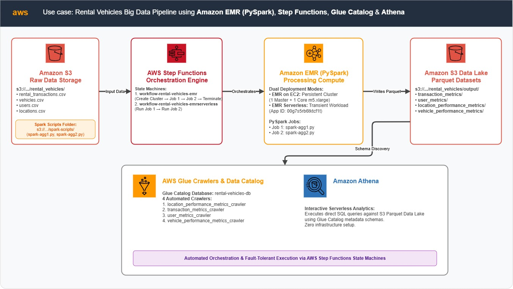
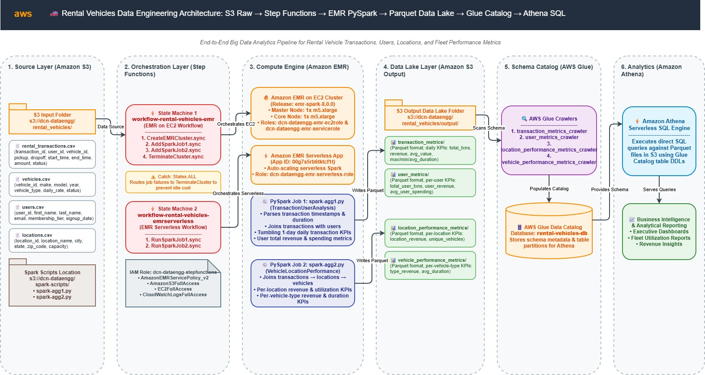
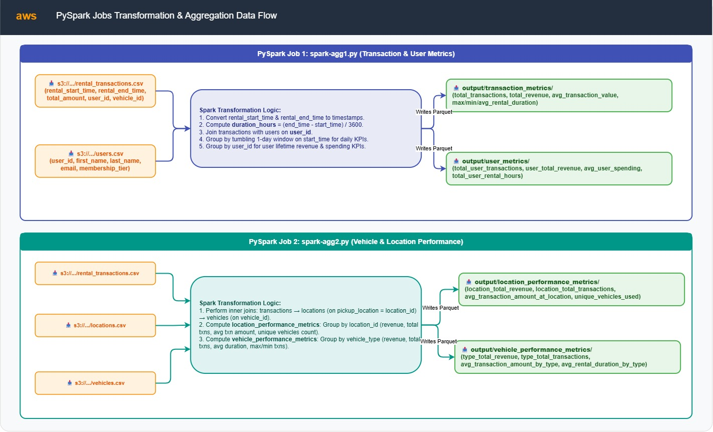
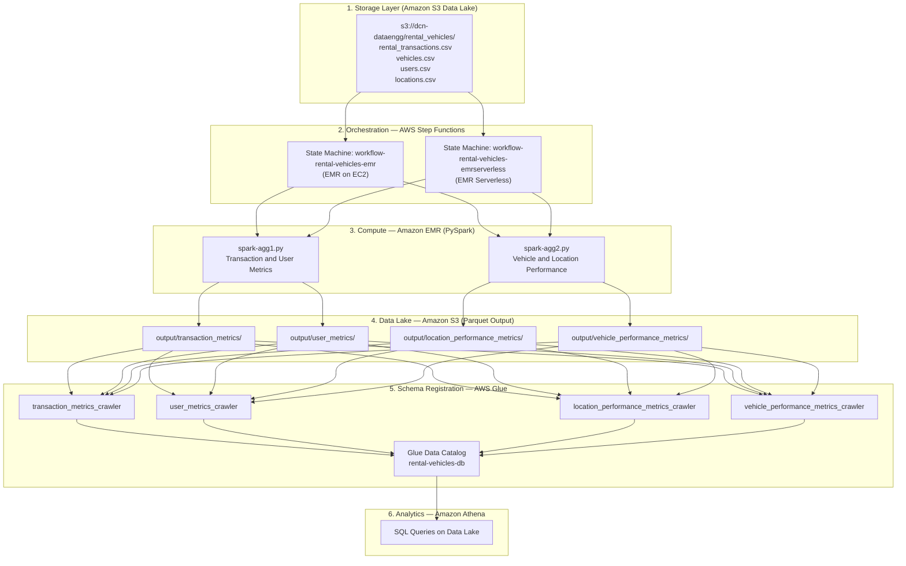
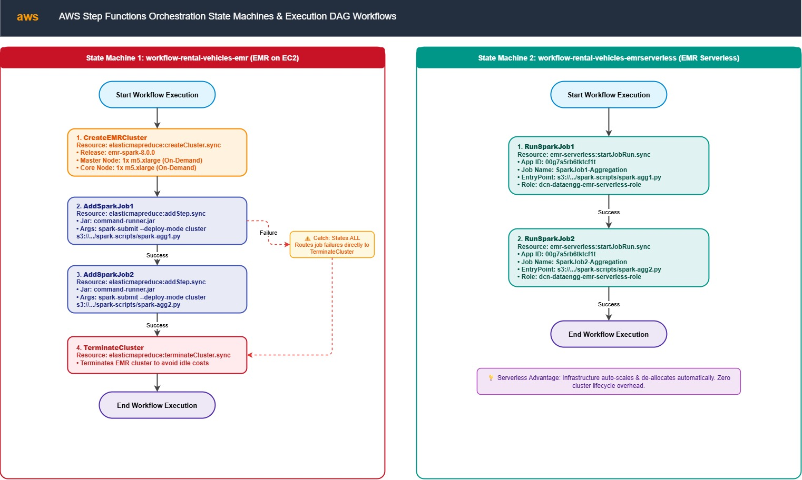
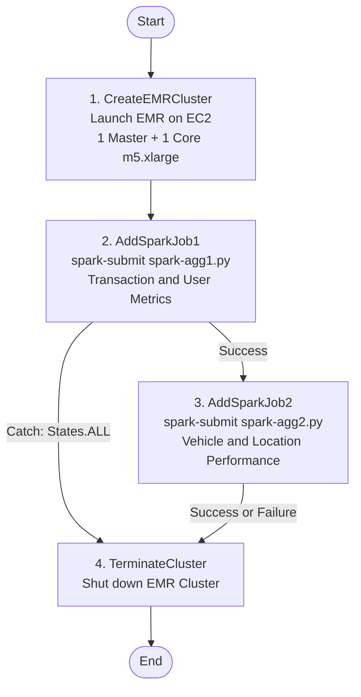
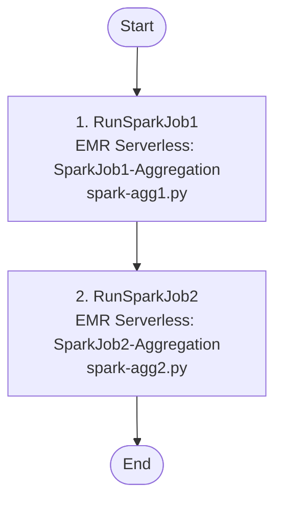

# 🚗 Rental Vehicles Big Data Pipeline: S3, EMR (PySpark), Glue Catalog, Athena & Step Functions


An enterprise-grade big data processing pipeline built on AWS to transform raw rental vehicle transactional data into optimised analytical Parquet datasets. Powered by **Amazon EMR** running **PySpark** jobs, orchestrated end-to-end using **AWS Step Functions**, stored as a queryable **S3 Data Lake** catalogued by **AWS Glue Crawlers**, and analysed through **Amazon Athena**.

Two deployment modes are supported: **EMR on EC2** for long-running, persistent cluster workloads and **EMR Serverless** for transient, cost-optimised job execution — each independently orchestrated by its own Step Functions state machine.

---

## 📌 Table of Contents
- [Architecture Overview](#️-architecture-overview)
  - [AWS Services & Tech Stack](#-aws-services--tech-stack)
  - [High-Level End-to-End System Architecture](#-high-level-end-to-end-system-architecture)
  - [Detailed Job Flow](#-detailed-job-flow)
  - [Step Functions — EMR on EC2 Workflow](#-step-functions--emr-on-ec2-workflow)
  - [Step Functions — EMR Serverless Workflow](#-step-functions--emr-serverless-workflow)
- [PySpark Jobs & Transformation Logic](#-pyspark-jobs--transformation-logic)
  - [Job 1: `spark-agg1.py` — Transaction & User Metrics](#job-1-spark-agg1py--transaction--user-metrics)
  - [Job 2: `spark-agg2.py` — Vehicle & Location Performance](#job-2-spark-agg2py--vehicle--location-performance)
- [Step Functions Orchestration](#-step-functions-orchestration)
  - [EMR on EC2 State Machine](#emr-on-ec2-state-machine-workflow-rental-vehicles-emr)
  - [EMR Serverless State Machine](#emr-serverless-state-machine-workflow-rental-vehicles-emrserverless)
- [Key Features](#-key-features)
- [AWS Infrastructure Specifications](#️-aws-infrastructure-specifications)
- [Datasets & Schemas](#-datasets--schemas)
- [Output Parquet Datasets (Data Lake)](#-output-parquet-datasets-data-lake)
- [IAM Security Model](#-iam-security-model)
- [Repository Structure](#-repository-structure)
- [Deployment & Getting Started](#-deployment--getting-started)

---

## 🏗️ Architecture Overview

The pipeline ingests four raw CSV datasets (rental transactions, vehicles, users, locations) from **Amazon S3**, processes them using two sequential **PySpark jobs** running on **Amazon EMR**, writes the aggregated results as **Parquet files** back to the S3 Data Lake, registers the schema via **AWS Glue Crawlers** into the **Glue Data Catalog**, and exposes the data for ad-hoc analytical querying via **Amazon Athena** — all orchestrated via **AWS Step Functions**.

---

### 🌐 AWS Services & Tech Stack


| # | Service | Role |
| :--- | :--- | :--- |
| **1** | **Amazon EMR** | Distributed PySpark compute engine |
| **2** | **Amazon S3** | Raw data input storage & Parquet Data Lake output |
| **3** | **AWS Glue Crawlers & Data Catalog** | Schema discovery & metadata management for Athena |
| **4** | **AWS Step Functions** | End-to-end pipeline orchestration |
| **5** | **Amazon Athena** | Serverless SQL analytics on the S3 Data Lake |

---

### 🌐 High-Level End-to-End System Architecture





```
┌────────────────────────────────────────────────────────────────────────────────────────────┐
│                                       AWS Cloud Environment                                │
│                                                                                            │
│  ┌──────────────────┐       ┌──────────────────────────┐       ┌──────────────────────┐   │
│  │   Amazon S3      │       │       Amazon EMR          │       │   Amazon S3          │   │
│  │ (Raw Input Data) ├──────►│  PySpark Job 1 (spark-   ├──────►│  (Data Lake Output)  │   │
│  │                  │       │     agg1.py)              │       │  Parquet files       │   │
│  │ rental_vehicles/ │       │  PySpark Job 2 (spark-   │       │  rental_vehicles/    │   │
│  │  *.csv           │       │     agg2.py)              │       │  output/*.parquet    │   │
│  └──────────────────┘       └──────────────────────────┘       └──────────┬───────────┘   │
│                                          ▲                                 │               │
│                                          │                                 │               │
│                             ┌────────────┴───────────┐        ┌───────────▼───────────┐   │
│                             │   AWS Step Functions   │        │  AWS Glue Crawlers    │   │
│                             │  (Orchestration)       │        │  (Schema Discovery)   │   │
│                             └────────────────────────┘        └───────────┬───────────┘   │
│                                                                            │               │
│                                                                ┌───────────▼───────────┐   │
│                                                                │   Amazon Athena        │   │
│                                                                │  (Analytical SQL)      │   │
│                                                                └───────────────────────┘   │
└────────────────────────────────────────────────────────────────────────────────────────────┘
```

---

### 🔄 Detailed Job Flow





---

### ⚡ Step Functions — EMR on EC2 Workflow





---

### ⚡ Step Functions — EMR Serverless Workflow




---

## 🔬 PySpark Jobs & Transformation Logic

### Job 1: `spark-agg1.py` — Transaction & User Metrics
**File**: [`emr/spark-agg1.py`](emr/spark-agg1.py)  
**App Name**: `TransactionUserAnalysis`

**Input Datasets**:
- `s3://.../rental_vehicles/rental_transactions.csv`
- `s3://.../rental_vehicles/users.csv`

**Transformation Logic**:
1. Loads rental transactions and users CSVs from S3.
2. Converts `rental_start_time` and `rental_end_time` to timestamps and computes `duration_hours` from epoch difference.
3. Joins transactions with users on `user_id`.
4. **Transaction-level Metrics** — Groups by tumbling 1-day `window` on `rental_start_time`:
   - `total_transactions` (count)
   - `total_revenue` (sum of `total_amount`)
   - `average_transaction_value` (avg of `total_amount`)
   - `max_rental_duration`, `min_rental_duration`, `avg_rental_duration`
5. **User Engagement Metrics** — Groups by `user_id`:
   - `total_user_transactions`, `user_total_revenue`, `average_user_spending`
   - `total_user_rental_hours`, `max_user_spending`, `min_user_spending`

**Output** (Parquet, `overwrite` mode):

| Output Path | Description |
| :--- | :--- |
| `output/transaction_metrics/` | Daily aggregated transaction KPIs |
| `output/user_metrics/` | Per-user spending & activity metrics |

---

### Job 2: `spark-agg2.py` — Vehicle & Location Performance
**File**: [`emr/spark-agg2.py`](emr/spark-agg2.py)  
**App Name**: `VehicleLocationPerformance`

**Input Datasets**:
- `s3://.../rental_vehicles/rental_transactions.csv`
- `s3://.../rental_vehicles/locations.csv`
- `s3://.../rental_vehicles/vehicles.csv`

**Transformation Logic**:
1. Loads all three CSVs from S3.
2. Converts timestamp columns and computes `duration_hours`.
3. Performs **inner joins**: transactions → locations (on `pickup_location == location_id`) → vehicles (on `vehicle_id`).
4. **Location Performance Metrics** — Groups by `location_id`:
   - `location_total_revenue`, `location_total_transactions`
   - `average_transaction_amount_at_location`
   - `max_transaction_amount`, `min_transaction_amount`
   - `unique_vehicles_used_at_location` (countDistinct)
5. **Vehicle Type Performance Metrics** — Groups by `vehicle_type`:
   - `type_total_revenue`, `type_total_transactions`
   - `average_transaction_amount_by_type`
   - `max_transaction_amount_by_type`, `min_transaction_amount_by_type`
   - `avg_rental_duration_by_type`

**Output** (Parquet, `overwrite` mode):

| Output Path | Description |
| :--- | :--- |
| `output/location_performance_metrics/` | Per-location revenue & utilisation metrics |
| `output/vehicle_performance_metrics/` | Per-vehicle-type revenue & rental duration metrics |

---

## ⚡ Step Functions Orchestration

### EMR on EC2 State Machine: `workflow-rental-vehicles-emr`

**File**: [`stepfunctions/step-functions-emr.json`](stepfunctions/step-functions-emr.json)

The state machine provisions a fresh **EMR on EC2** cluster, executes both Spark jobs sequentially, and **always terminates the cluster** — even on job failure (via `Catch: States.ALL`):

| State | Resource | Description |
| :--- | :--- | :--- |
| `CreateEMRCluster` | `elasticmapreduce:createCluster.sync` | Launches EMR cluster (EMR 8.0.0, 2x m5.xlarge) |
| `AddSparkJob1` | `elasticmapreduce:addStep.sync` | Submits `spark-agg1.py` via `spark-submit --deploy-mode cluster` |
| `AddSparkJob2` | `elasticmapreduce:addStep.sync` | Submits `spark-agg2.py` via `spark-submit --deploy-mode cluster` |
| `TerminateCluster` | `elasticmapreduce:terminateCluster.sync` | Shuts down the cluster (end state) |

> **Design Note**: Both `AddSparkJob1` and `AddSparkJob2` have a `Catch` handler routing to `TerminateCluster` on any error, guaranteeing no zombie clusters are left running even if a Spark job fails.

---

### EMR Serverless State Machine: `workflow-rental-vehicles-emrserverless`

**File**: [`stepfunctions/step-functions-emr-serverless.json`](stepfunctions/step-functions-emr-serverless.json)

The serverless state machine submits jobs directly to a pre-provisioned **EMR Serverless Application** — no cluster lifecycle management needed:

| State | Resource | Description |
| :--- | :--- | :--- |
| `RunSparkJob1` | `emr-serverless:startJobRun.sync` | Runs `spark-agg1.py` on EMR Serverless App `00g7s5rb6tktcf1t` |
| `RunSparkJob2` | `emr-serverless:startJobRun.sync` | Runs `spark-agg2.py` sequentially after Job 1 completes |

> **Design Note**: EMR Serverless is ideal for **transient/ad-hoc workloads** — infrastructure auto-scales and de-allocates automatically, with no cluster provisioning overhead.

---

## ✨ Key Features

- **Dual EMR Deployment Modes**: Supports both **EMR on EC2** (for persistent, long-running workloads with full cluster control) and **EMR Serverless** (for cost-efficient, transient job execution with zero cluster management).
- **Fault-Tolerant Orchestration**: The EMR on EC2 Step Functions workflow uses `Catch: States.ALL` error handling to ensure the EMR cluster is **always terminated**, preventing runaway infrastructure costs even on Spark job failures.
- **S3 Data Lake Architecture**: Aggregated results are persisted as **columnar Parquet files** to Amazon S3, enabling efficient predicate pushdown and cost-effective storage at scale.
- **Serverless Schema Discovery**: **AWS Glue Crawlers** automatically infer Parquet schema and populate the **Glue Data Catalog** with table definitions, making data immediately queryable via Athena — no manual DDL required.
- **Ad-hoc SQL Analytics**: **Amazon Athena** queries directly against S3 Parquet data using the Glue Catalog metadata — fully serverless, pay-per-query model.
- **Sequential Job Execution**: Both Spark jobs run in strict sequence (`Job 1` → `Job 2`) in both orchestration modes to maintain data processing dependency guarantees.

---

## ⚙️ AWS Infrastructure Specifications

| Infrastructure Component | Configuration / Specification |
| :--- | :--- |
| **Raw Input Storage** | Amazon S3 (`dcn-dataengg/rental_vehicles/`) |
| **Spark Scripts Storage** | Amazon S3 (`dcn-dataengg/spark-scripts/`) |
| **Data Lake Output** | Amazon S3 (`dcn-dataengg/rental_vehicles/output/`) |
| **Compute — EMR on EC2** | EMR Release `emr-spark-8.0.0`, 1 Master + 1 Core (`m5.xlarge`, On-Demand) |
| **Compute — EMR Serverless** | EMR Serverless Application ID `00g7s5rb6tktcf1t` |
| **ETL Scripts** | PySpark (`spark-agg1.py`, `spark-agg2.py`) |
| **Schema Registry** | AWS Glue Data Catalog (Database: `rental-vehicles-db`) |
| **Glue Crawlers** | `location_performance_metrics_crawler`, `transaction_metrics_crawler`, `user_metrics_crawler`, `vehicle_performance_metrics_crawler` |
| **SQL Analytics** | Amazon Athena |
| **Orchestration — EC2** | AWS Step Functions State Machine (`workflow-rental-vehicles-emr`) |
| **Orchestration — Serverless** | AWS Step Functions State Machine (`workflow-rental-vehicles-emrserverless`) |
| **IAM Role — Step Functions** | `dcn-dataengg-stepfunctions` (`AmazonEMRServicePolicy_v2`, `AmazonS3FullAccess`, EC2 Full Access, `CloudWatchLogsFullAccess`) |
| **IAM Role — EMR EC2** | `dcn-dataengg-emr-ec2role` (JobFlowRole for EC2 instances) |
| **IAM Role — EMR Service** | `dcn-dataengg-emr-servicerole` (Service role for EMR) |
| **IAM Role — EMR Serverless** | `dcn-dataengg-emr-serverless-role` (Execution role for Serverless jobs) |

---

## 📁 Datasets & Schemas

All source CSV datasets are staged in `s3://dcn-dataengg/rental_vehicles/`.

### 1. `rental_transactions.csv`
Core transactional table linking users, vehicles, and pickup locations.

| Column | Description |
| :--- | :--- |
| `transaction_id` | Unique rental transaction identifier |
| `user_id` | Foreign key to `users` |
| `vehicle_id` | Foreign key to `vehicles` |
| `pickup_location` | Foreign key to `locations.location_id` |
| `rental_start_time` | Rental start timestamp |
| `rental_end_time` | Rental end timestamp |
| `total_amount` | Total rental charge (currency units) |

### 2. `vehicles.csv`
Vehicle inventory catalog.

| Column | Description |
| :--- | :--- |
| `vehicle_id` | Unique vehicle identifier |
| `vehicle_type` | Vehicle category (e.g., SUV, Sedan, Truck) |

### 3. `users.csv`
Registered user profiles.

| Column | Description |
| :--- | :--- |
| `user_id` | Unique user identifier |

### 4. `locations.csv`
Pickup/dropoff location reference data.

| Column | Description |
| :--- | :--- |
| `location_id` | Unique location identifier |

---

## 📊 Output Parquet Datasets (Data Lake)

All outputs are written to `s3://dcn-dataengg/rental_vehicles/output/` as Parquet files in `overwrite` mode.

### 1. `transaction_metrics/`
*Produced by*: `spark-agg1.py`  
Daily tumbling-window aggregations of rental activity.

| Column | Type | Description |
| :--- | :--- | :--- |
| `rental_date` | Struct (window) | 1-day tumbling window `{start, end}` |
| `total_transactions` | Long | Total number of rentals in the day |
| `total_revenue` | Double | Sum of all `total_amount` values |
| `average_transaction_value` | Double | Mean transaction amount |
| `max_rental_duration` | Double | Longest rental duration (hours) |
| `min_rental_duration` | Double | Shortest rental duration (hours) |
| `avg_rental_duration` | Double | Average rental duration (hours) |

### 2. `user_metrics/`
*Produced by*: `spark-agg1.py`  
Per-user lifetime spending and activity metrics.

| Column | Type | Description |
| :--- | :--- | :--- |
| `user_id` | Integer | Unique user identifier |
| `total_user_transactions` | Long | Number of rentals by this user |
| `user_total_revenue` | Double | Lifetime spend by this user |
| `average_user_spending` | Double | Average spend per transaction |
| `total_user_rental_hours` | Double | Total hours rented |
| `max_user_spending` | Double | Highest single transaction value |
| `min_user_spending` | Double | Lowest single transaction value |

### 3. `location_performance_metrics/`
*Produced by*: `spark-agg2.py`  
Per-location revenue and fleet utilisation metrics.

| Column | Type | Description |
| :--- | :--- | :--- |
| `location_id` | String/Int | Pickup location identifier |
| `location_total_revenue` | Double | Total revenue generated at this location |
| `location_total_transactions` | Long | Total number of transactions at this location |
| `average_transaction_amount_at_location` | Double | Mean transaction value at this location |
| `max_transaction_amount` | Double | Highest transaction value |
| `min_transaction_amount` | Double | Lowest transaction value |
| `unique_vehicles_used_at_location` | Long | Count of distinct vehicles used |

### 4. `vehicle_performance_metrics/`
*Produced by*: `spark-agg2.py`  
Per-vehicle-type performance and utilisation metrics.

| Column | Type | Description |
| :--- | :--- | :--- |
| `vehicle_type` | String | Vehicle category (SUV, Sedan, etc.) |
| `type_total_revenue` | Double | Total revenue from this vehicle type |
| `type_total_transactions` | Long | Total transactions for this type |
| `average_transaction_amount_by_type` | Double | Mean revenue per transaction |
| `max_transaction_amount_by_type` | Double | Highest transaction value |
| `min_transaction_amount_by_type` | Double | Lowest transaction value |
| `avg_rental_duration_by_type` | Double | Average rental duration (hours) |

---

## 🔐 IAM Security Model

### Step Functions Execution Role: `dcn-dataengg-stepfunctions`

**Managed Policies**: `AmazonEMRServicePolicy_v2`, `AmazonS3FullAccess`, EC2 Full Access, `CloudWatchLogsFullAccess`

**Inline Pass Role Policy** ([`iam/execution-policy-step-functions.json`](iam/execution-policy-step-functions.json)):
- Grants `iam:PassRole` for `dcn-dataengg-emr-servicerole` and `dcn-dataengg-emr-ec2role` to `elasticmapreduce.amazonaws.com` and `ec2.amazonaws.com`.
- Grants EMR management permissions: `RunJobFlow`, `DescribeStep`, `ListClusters`, `DescribeCluster`, `TerminateJobFlows`, `AddJobFlowSteps`, `ModifyCluster`, `ListSteps`.

### EMR Serverless Execution Role Trust Policy ([`iam/emr-serverless-trust-policy.json`](iam/emr-serverless-trust-policy.json)):
- Allows `emr-serverless.amazonaws.com` to assume the `dcn-dataengg-emr-serverless-role`.
- Scoped to the specific EMR Serverless Application ARN and AWS Account ID for least-privilege access.

---

## 📂 Repository Structure

```
project4_rentalvehicles/
├── Infra.txt                                   # AWS infrastructure setup notes & resource summary
├── README.md                                   # Main project documentation (this file)
├── data/
│   ├── rental_transactions.csv                 # Raw dataset: rental transaction events
│   ├── vehicles.csv                            # Raw dataset: vehicle inventory catalog
│   ├── users.csv                               # Raw dataset: registered user profiles
│   └── locations.csv                           # Raw dataset: pickup/dropoff location reference
├── docs/
│   └── architecture/
│       ├── 0-services.png                      # AWS tech stack overview diagram
│       ├── 1-highlevelarchitecture.png         # High-level end-to-end architecture diagram
│       ├── 2-jobflow.png                       # Detailed Spark job flow diagram
│       ├── 3-stepfunctions-emrec2.png          # Step Functions EMR on EC2 workflow graph
│       └── 4-stepfunctions-emrserverless.png   # Step Functions EMR Serverless workflow graph
├── emr/
│   ├── spark-agg1.py                           # PySpark Job 1: Transaction & User Metrics
│   └── spark-agg2.py                           # PySpark Job 2: Vehicle & Location Performance
├── iam/
│   ├── execution-policy-step-functions.json    # Inline PassRole policy for Step Functions IAM role
│   └── emr-serverless-trust-policy.json        # Trust policy for EMR Serverless execution role
└── stepfunctions/
    ├── step-functions-emr.json                 # ASL definition: EMR on EC2 state machine
    └── step-functions-emr-serverless.json      # ASL definition: EMR Serverless state machine
```

---

## 🚀 Deployment & Getting Started

Follow these step-by-step instructions to set up and execute the end-to-end pipeline:

### 1️⃣ S3 Bucket & Data Upload

1. Create (or use existing) S3 Bucket `dcn-dataengg`.
2. Upload source datasets to S3:
   ```bash
   s3://dcn-dataengg/rental_vehicles/rental_transactions.csv
   s3://dcn-dataengg/rental_vehicles/vehicles.csv
   s3://dcn-dataengg/rental_vehicles/users.csv
   s3://dcn-dataengg/rental_vehicles/locations.csv
   ```
3. Upload PySpark scripts to S3:
   ```bash
   s3://dcn-dataengg/spark-scripts/spark-agg1.py
   s3://dcn-dataengg/spark-scripts/spark-agg2.py
   ```

---

### 2️⃣ IAM Role Configuration

1. **Create Step Functions IAM Role** (`dcn-dataengg-stepfunctions`):
   - Attach managed policies: `AmazonEMRServicePolicy_v2`, `AmazonS3FullAccess`, `AmazonEC2FullAccess`, `CloudWatchLogsFullAccess`.
   - Attach the inline execution pass-role policy from [`iam/execution-policy-step-functions.json`](iam/execution-policy-step-functions.json).

2. **Create EMR EC2 Instance Profile** (`dcn-dataengg-emr-ec2role`):
   - Attach `AmazonElasticMapReduceforEC2Role` or equivalent S3 read/write permissions.

3. **Create EMR Service Role** (`dcn-dataengg-emr-servicerole`):
   - Attach `AmazonElasticMapReduceRole` managed policy.

4. **Create EMR Serverless Execution Role** (`dcn-dataengg-emr-serverless-role`):
   - Apply the trust policy from [`iam/emr-serverless-trust-policy.json`](iam/emr-serverless-trust-policy.json).
   - Attach S3 read (input bucket) and write (output prefix) permissions.

---

### 3️⃣ AWS Glue Crawlers Setup

1. Open the **AWS Glue Console** → **Crawlers** → **Create Crawler**.
2. Create the following four crawlers, each pointing to the corresponding S3 output path:

| Crawler Name | S3 Data Source Path |
| :--- | :--- |
| `transaction_metrics_crawler` | `s3://dcn-dataengg/rental_vehicles/output/transaction_metrics/` |
| `user_metrics_crawler` | `s3://dcn-dataengg/rental_vehicles/output/user_metrics/` |
| `location_performance_metrics_crawler` | `s3://dcn-dataengg/rental_vehicles/output/location_performance_metrics/` |
| `vehicle_performance_metrics_crawler` | `s3://dcn-dataengg/rental_vehicles/output/vehicle_performance_metrics/` |

3. Set the **Target Database** to `rental-vehicles-db` for all crawlers.
4. Schedule crawlers to run on-demand (trigger manually after each pipeline execution, or on a schedule).

---

### 4️⃣ Option A: Deploy EMR on EC2 State Machine

1. Open **AWS Step Functions Console** → **State machines** → **Create state machine**.
2. Select **Blank** workflow, paste the JSON from [`stepfunctions/step-functions-emr.json`](stepfunctions/step-functions-emr.json).
3. Name the state machine: `workflow-rental-vehicles-emr`.
4. Assign IAM Role: `dcn-dataengg-stepfunctions`.
5. Click **Start execution**.
6. Monitor the execution graph — verify all four states (`CreateEMRCluster` → `AddSparkJob1` → `AddSparkJob2` → `TerminateCluster`) complete successfully.

---

### 5️⃣ Option B: Deploy EMR Serverless State Machine

1. **Create an EMR Serverless Application**:
   - Open **Amazon EMR Console** → **EMR Serverless** → **Create application**.
   - Note the **Application ID** (update `step-functions-emr-serverless.json` if different from `00g7s5rb6tktcf1t`).
   - Note the **Execution Role ARN** (update if different from the ARN in the JSON).

2. Open **AWS Step Functions Console** → **State machines** → **Create state machine**.
3. Select **Blank** workflow, paste the JSON from [`stepfunctions/step-functions-emr-serverless.json`](stepfunctions/step-functions-emr-serverless.json).
4. Name the state machine: `workflow-rental-vehicles-emrserverless`.
5. Assign IAM Role: `dcn-dataengg-stepfunctions`.
6. Click **Start execution**.
7. Monitor the execution graph — verify both states (`RunSparkJob1` → `RunSparkJob2`) complete successfully.

---

### 6️⃣ Run Glue Crawlers & Query with Athena

1. After the pipeline completes, run each of the four Glue Crawlers to populate the `rental-vehicles-db` catalog.
2. Open **Amazon Athena Console** → select database `rental-vehicles-db`.
3. Run analytical queries against the Parquet outputs, for example:

```sql
-- Daily transaction revenue trends
SELECT rental_date.start AS date, total_transactions, total_revenue
FROM transaction_metrics
ORDER BY date DESC
LIMIT 30;

-- Top performing vehicle types by revenue
SELECT vehicle_type, type_total_revenue, type_total_transactions, avg_rental_duration_by_type
FROM vehicle_performance_metrics
ORDER BY type_total_revenue DESC;

-- Top locations by transaction volume
SELECT location_id, location_total_transactions, location_total_revenue, unique_vehicles_used_at_location
FROM location_performance_metrics
ORDER BY location_total_transactions DESC;

-- High-value users by lifetime spend
SELECT user_id, user_total_revenue, total_user_transactions, average_user_spending
FROM user_metrics
ORDER BY user_total_revenue DESC
LIMIT 20;
```
