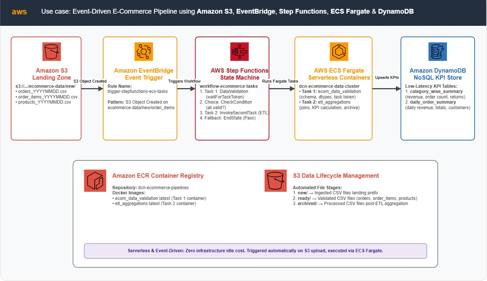
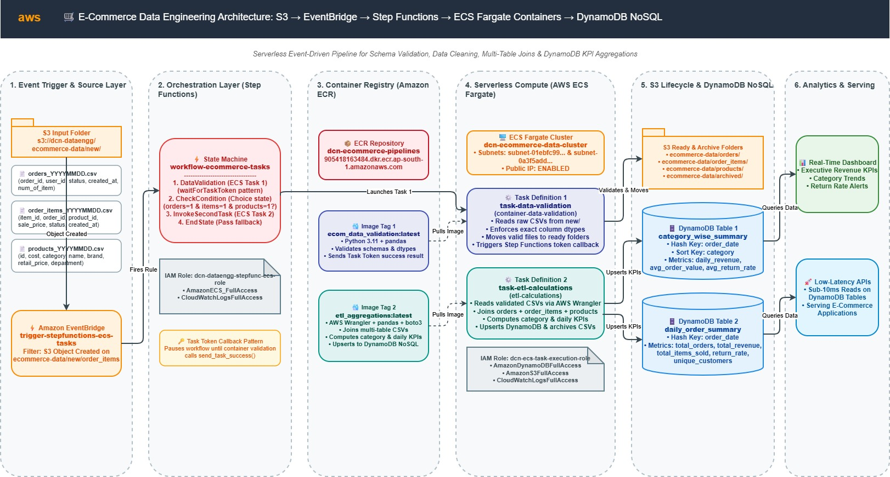
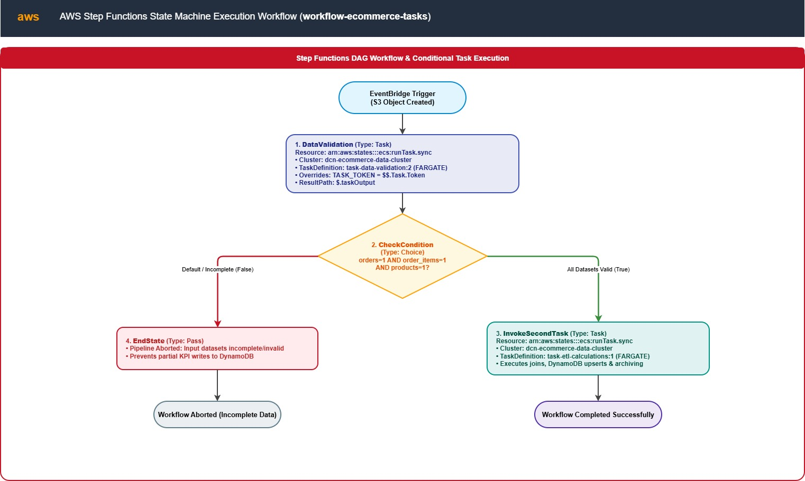
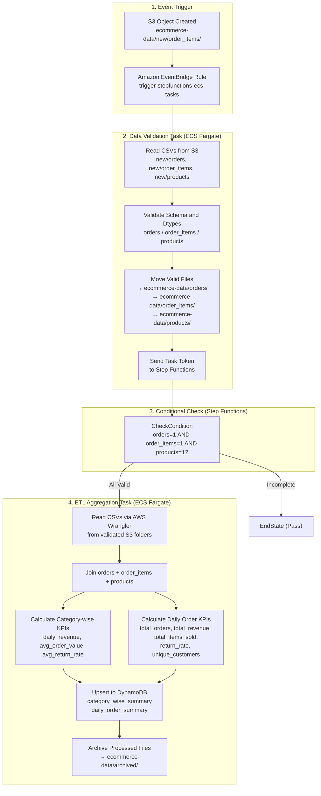
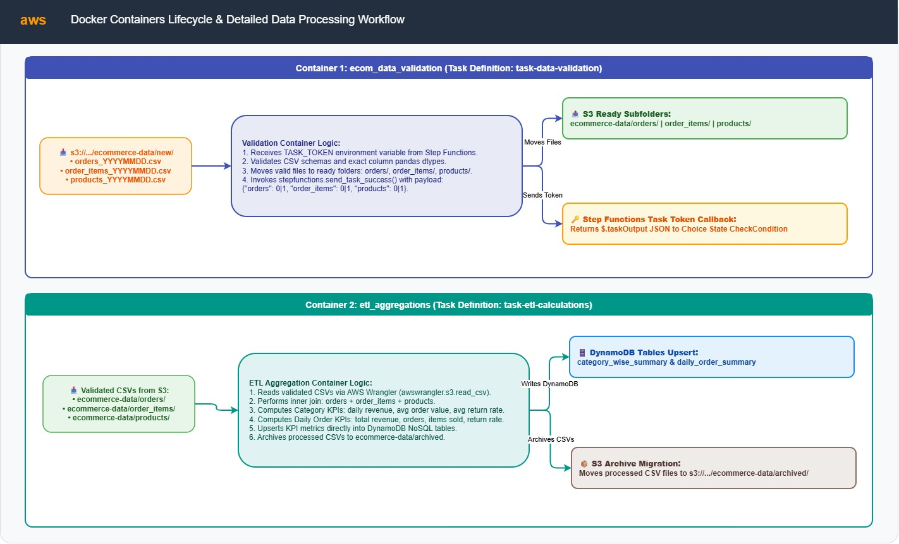
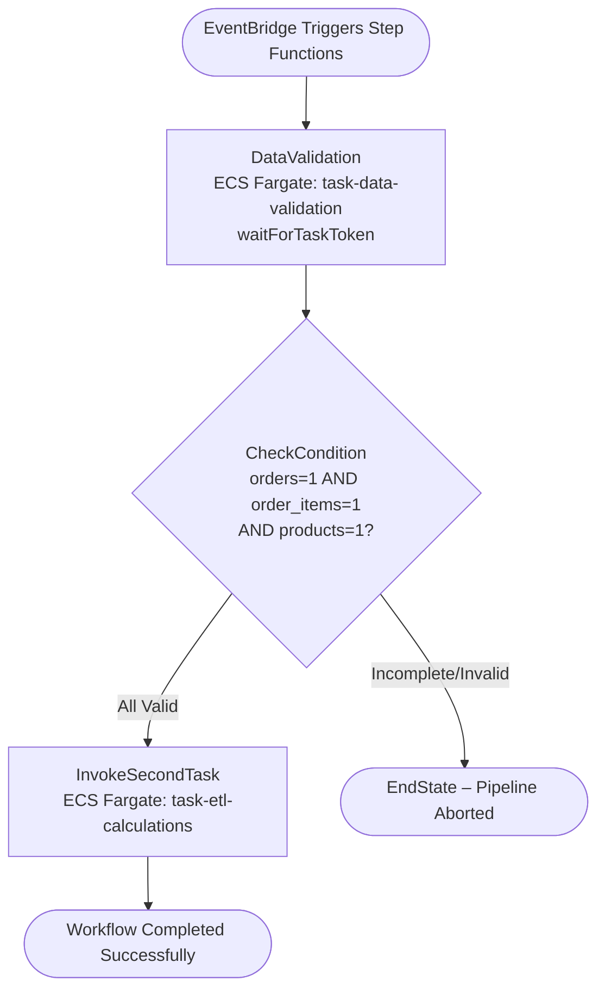

# 🛒 E-Commerce Data Engineering Pipeline: S3, ECS Fargate, DynamoDB, Step Functions & EventBridge


An event-driven, containerized data engineering pipeline built on AWS to validate, transform, and serve e-commerce order KPIs. Triggered automatically by **Amazon EventBridge** on S3 file uploads, orchestrated by **AWS Step Functions**, executed as serverless containers on **AWS ECS Fargate**, and persisting aggregated KPI metrics into **Amazon DynamoDB**.

---

## 📌 Table of Contents
- [Architecture Overview](#️-architecture-overview)
  - [AWS Services Infrastructure](#-aws-services-infrastructure)
  - [High-Level End-to-End System Architecture](#-high-level-end-to-end-system-architecture)
  - [Detailed Pipeline Architecture](#-detailed-pipeline-architecture)
  - [AWS Step Functions Orchestration Workflow](#-aws-step-functions-orchestration-workflow)
- [Step Functions Workflow & Execution Logic](#-step-functions-workflow--execution-logic)
- [Key Features](#-key-features)
- [AWS Infrastructure Specifications](#️-aws-infrastructure-specifications)
- [Datasets & Data Schemas](#-datasets--data-schemas)
  - [Source CSV Files](#source-csv-files)
  - [DynamoDB KPI Tables](#dynamodb-kpi-tables)
- [Docker Containers & ETL Logic](#-docker-containers--etl-logic)
  - [Container 1: Data Validation](#container-1-data-validation-ecom_data_validation)
  - [Container 2: ETL Aggregations](#container-2-etl-aggregations-etl_aggregations)
- [EventBridge Trigger Pattern](#-eventbridge-trigger-pattern)
- [Repository Structure](#-repository-structure)
- [Deployment & Getting Started](#-deployment--getting-started)

---

## 🏗️ Architecture Overview

The pipeline is triggered when new e-commerce CSV files (orders, order items, products) are uploaded to a designated **Amazon S3** prefix. **Amazon EventBridge** detects the S3 object-created event and triggers an **AWS Step Functions** state machine. Step Functions orchestrates two ECS Fargate tasks: the first validates and moves data files, and — only if all three datasets are valid — the second performs ETL aggregations and writes KPI summaries to **Amazon DynamoDB**.

### 🌐 AWS Services Infrastructure


---

### 🌐 High-Level End-to-End System Architecture





```
┌──────────────────────────────────────────────────────────────────────────────────────────────────────┐
│                                         AWS Cloud Environment                                        │
│                                                                                                      │
│  ┌────────────────┐   ┌───────────────────┐   ┌──────────────────────────────────────────────────┐  │
│  │  Amazon S3     │──►│  Amazon           │──►│              AWS Step Functions                  │  │
│  │ (ecommerce-    │   │  EventBridge      │   │          workflow-ecommerce-tasks                │  │
│  │  data/new/)    │   │  (S3 trigger)     │   │                                                  │  │
│  └────────────────┘   └───────────────────┘   │  ┌──────────────────────────────────────────┐   │  │
│                                               │  │  Task 1: ECS Fargate                     │   │  │
│  ┌─────────────────────────────────────────┐  │  │  container-data-validation               │   │  │
│  │  Amazon S3                              │  │  │  - Validate CSV schemas                  │   │  │
│  │  ecommerce-data/orders/                 │◄─│  │  - Move files to ready folders           │   │  │
│  │  ecommerce-data/order_items/            │  │  └──────────────────┬───────────────────────┘   │  │
│  │  ecommerce-data/products/               │  │                     │ (all valid)                │  │
│  └─────────────────────────────────────────┘  │                     ▼                           │  │
│                                               │  ┌──────────────────────────────────────────┐   │  │
│  ┌─────────────────────────────────────────┐  │  │  Task 2: ECS Fargate                     │   │  │
│  │  Amazon DynamoDB                        │◄─│  │  etl-calculations                        │   │  │
│  │  - category_wise_summary                │  │  │  - Join orders/items/products            │   │  │
│  │  - daily_order_summary                  │  │  │  - Calculate KPIs                        │   │  │
│  └─────────────────────────────────────────┘  │  │  - Write to DynamoDB                    │   │  │
│                                               │  │  - Archive processed files              │   │  │
│                                               │  └──────────────────────────────────────────┘   │  │
│                                               └──────────────────────────────────────────────────┘  │
└──────────────────────────────────────────────────────────────────────────────────────────────────────┘
```

---

### 🔄 Detailed Pipeline Architecture





---

### ⚡ AWS Step Functions Orchestration Workflow





---

## 🔄 Step Functions Workflow & Execution Logic

The AWS Step Functions state machine **`workflow-ecommerce-tasks`** coordinates two Fargate containers using `arn:aws:states:::ecs:runTask.sync` integrations with a conditional branching check between tasks.

### State-by-State Breakdown

1. **`DataValidation`** (`Type: Task`, `.sync` wait with `waitForTaskToken`):
   - Launches ECS Fargate task `task-data-validation` on cluster `dcn-ecommerce-data-cluster`.
   - Injects the Step Functions **task token** as an environment variable (`TASK_TOKEN`) into the container.
   - The container validates S3 CSV schemas, moves valid files, then calls `stepfunctions.send_task_success()` with a JSON result: `{"orders": 0|1, "order_items": 0|1, "products": 0|1}`.
   - Result is stored in `$.taskOutput`.

2. **`CheckCondition`** (`Type: Choice`):
   - Evaluates `$.taskOutput.orders == 1 AND $.taskOutput.order_items == 1 AND $.taskOutput.products == 1`.
   - Routes to `InvokeSecondTask` if all three datasets are valid.
   - Routes to `EndState` if any dataset is missing or invalid.

3. **`InvokeSecondTask`** (`Type: Task`, `.sync`):
   - Launches ECS Fargate task `task-etl-calculations` on the same cluster.
   - Reads validated CSVs from S3, joins all three datasets, computes category-wise and daily KPIs, upserts results to DynamoDB, and archives the processed files.

4. **`EndState`** (`Type: Pass`):
   - Gracefully terminates the pipeline when input data is incomplete.

---

## ✨ Key Features

- **Event-Driven Automation**: Amazon EventBridge monitors S3 for new `order_items` uploads and automatically fires the pipeline — zero manual intervention required.
- **Containerized, Serverless Compute**: Both validation and ETL workloads run as Docker containers on AWS ECS Fargate, eliminating server management and providing on-demand scalability.
- **Schema-Aware Data Validation**: The validation container enforces column presence and exact pandas dtypes (`int64`, `float64`, `object`, `datetime64[ns]`) for all three datasets before any downstream processing.
- **Conditional Workflow Branching**: Step Functions `Choice` state ensures the ETL task is invoked **only** when all three datasets pass validation — preventing partial or corrupt KPI writes.
- **Task Token Callback Pattern**: The validation container uses AWS Step Functions' `waitForTaskToken` pattern to signal workflow continuation asynchronously, enabling clean decoupling between orchestration and compute.
- **KPI-First DynamoDB Output**: Aggregated metrics (revenue, return rates, order counts) are directly upserted into DynamoDB tables optimized for low-latency reads by downstream applications.
- **Automated File Lifecycle**: Files flow through three S3 stages — `new/` → ready folder (post-validation) → `archived/` (post-ETL) — maintaining a clean data lake structure.
- **Multi-Stage Docker Builds**: Both containers use Alpine-based multi-stage Docker builds to minimize image size and reduce attack surface.

---

## ⚡️ AWS Infrastructure Specifications

| Infrastructure Component | Configuration / Specification |
| :--- | :--- |
| **Event Trigger** | Amazon EventBridge Rule (`trigger-stepfunctions-ecs-tasks`, S3 Object Created on `ecommerce-data/new/order_items`) |
| **Orchestration Workflow** | AWS Step Functions State Machine (`workflow-ecommerce-tasks`) |
| **Container Registry** | Amazon ECR Repository (`dcn-ecommerce-pipelines`) |
| **Container Orchestration** | Amazon ECS Cluster (`dcn-ecommerce-data-cluster`, Fargate launch type) |
| **Container 1 — Validation** | ECS Task Definition (`task-data-validation`), Image tag: `ecom_data_validation` |
| **Container 2 — ETL** | ECS Task Definition (`task-etl-calculations`), Image tag: `etl_aggregations` |
| **Data Storage (Landing)** | Amazon S3 Bucket (`dcn-dataengg`, prefix: `ecommerce-data/`) |
| **KPI Store** | Amazon DynamoDB Tables (`category_wise_summary`, `daily_order_summary`) |
| **Compute Networking** | AWS Fargate VPC Subnets (`subnet-01ebfc9913993f28d`, `subnet-0a3f5add484117c4a`), Public IP Enabled |
| **Task Execution IAM Role** | `dcn-ecs-task-execution-role` (DynamoDB, ECS Execution, S3, CloudWatch, Step Functions callback) |
| **Step Functions IAM Role** | `dcn-dataengg-stepfunc-ecs-role` (AmazonECS_FullAccess, CloudWatchLogsFullAccess) |

---

## 📁 Datasets & Data Schemas

### Source CSV Files

Three CSV datasets are deposited daily into S3 prefix `ecommerce-data/new/`:

#### 1. `orders` (`orders_YYYYMMDD.csv`)
| Column | Data Type | Description |
| :--- | :--- | :--- |
| `order_id` | `int64` | Unique order identifier |
| `user_id` | `int64` | Customer identifier |
| `status` | `object` | Order status (e.g., `Shipped`, `Returned`, `Complete`) |
| `created_at` | `datetime64[ns]` | Timestamp when the order was placed |
| `num_of_item` | `int64` | Number of items in the order |

#### 2. `order_items` (`order_items_YYYYMMDD.csv`)
| Column | Data Type | Description |
| :--- | :--- | :--- |
| `id` | `int64` | Unique order item identifier |
| `order_id` | `int64` | Foreign key referencing `orders.order_id` |
| `user_id` | `int64` | Customer identifier |
| `product_id` | `int64` | Foreign key referencing `products.id` |
| `sale_price` | `float64` | Actual sale price of the item |
| `created_at` | `datetime64[ns]` | Timestamp when the item was ordered |

#### 3. `products` (`products.csv`)
| Column | Data Type | Description |
| :--- | :--- | :--- |
| `id` | `int64` | Unique product identifier |
| `sku` | `object` | Product SKU code |
| `cost` | `float64` | Product cost price |
| `category` | `object` | Product category (e.g., `Tops & Tees`, `Accessories`) |
| `name` | `object` | Product display name |
| `retail_price` | `float64` | Standard retail price |
| `department` | `object` | Department (e.g., `Women`, `Men`) |

---

### DynamoDB KPI Tables

#### `category_wise_summary`
| Attribute | Type | Key | Description |
| :--- | :--- | :--- | :--- |
| `order_date` | String | **Hash Key (PK)** | Date of orders (e.g., `2024-05-31`) |
| `category` | String | Attribute | Product category name |
| `daily_revenue` | Decimal | Attribute | Total revenue = sum(sale_price x num_of_item) |
| `avg_order_value` | Decimal | Attribute | Average sale price per order item |
| `avg_return_rate` | Decimal | Attribute | Ratio of returned orders to total orders |

#### `daily_order_summary`
| Attribute | Type | Key | Description |
| :--- | :--- | :--- | :--- |
| `order_date` | String | **Hash Key (PK)** | Date of orders (e.g., `2024-05-31`) |
| `total_orders` | Number | Attribute | Count of unique orders |
| `total_revenue` | Decimal | Attribute | Total revenue for the day |
| `total_items_sold` | Number | Attribute | Sum of all items sold |
| `return_rate` | Decimal | Attribute | Fraction of orders returned |
| `unique_customers` | Number | Attribute | Count of distinct customers who ordered |

---

## 🐳 Docker Containers & ETL Logic

### Container 1: Data Validation (`ecom_data_validation`)

- **Directory**: `docker-data-validity/`
- **Base Image**: `python:3.9-alpine` (multi-stage build)
- **Dependencies**: `pandas`, `boto3`
- **Entry Point**: `docker-data-validity/app.py`

#### Validation Logic

1. **Retrieves Task Token**: Reads `TASK_TOKEN` environment variable injected by Step Functions.
2. **Lists S3 Files**: Paginates through three S3 prefixes (`ecommerce-data/new/orders`, `ecommerce-data/new/order_items`, `ecommerce-data/new/products`) to find `.csv` files.
3. **Schema Validation**: For each file, reads it into a pandas DataFrame and checks:
   - All required columns are present.
   - Each column dtype exactly matches the expected type (e.g., `order_id` must be `int64`, `created_at` must be `datetime64[ns]`).
4. **File Promotion**: Valid files are copied to the `ecommerce-data/{dataset}/` ready folder and the original deleted from `new/`.
5. **Reports Results**: Calls `stepfunctions.send_task_success()` with output `{"orders": 1, "order_items": 1, "products": 1}` (1 = valid, 0 = invalid/missing).

#### Column Format Specifications
```python
column_formats = {
    'orders':      {'order_id': 'int64', 'user_id': 'int64', 'status': 'object',
                    'created_at': 'datetime64[ns]', 'num_of_item': 'int64'},
    'order_items': {'id': 'int64', 'order_id': 'int64', 'user_id': 'int64',
                    'product_id': 'int64', 'created_at': 'datetime64[ns]'},
    'products':    {'id': 'int64', 'sku': 'object', 'cost': 'float64',
                    'category': 'object', 'name': 'object',
                    'retail_price': 'float64', 'department': 'object'}
}
```

---

### Container 2: ETL Aggregations (`etl_aggregations`)

- **Directory**: `docker-dynamo-etl-wrangler/`
- **Base Image**: `python:3.13-alpine` (multi-stage build with `libstdc++` for pyarrow)
- **Dependencies**: `pandas`, `awswrangler`
- **Entry Point**: `docker-dynamo-etl-wrangler/app.py`

#### ETL Logic

1. **Read Datasets**: Uses `awswrangler.s3.read_csv()` to read all CSV files from the three validated S3 folders.
2. **Join Datasets**:
   - Inner join `orders` with `order_items` on `order_id`.
   - Inner join result with `products` on `product_id = id`.
   - Renames `created_at_order` to `order_date`, `status_order` to `order_status`.
3. **Category-wise KPI Calculation** (grouped by `order_date.date` and `category`):
   - `daily_revenue` = sum(sale_price x num_of_item)
   - `avg_order_value` = mean(sale_price)
   - `avg_return_rate` = count(distinct returned order_id) / count(distinct order_id)
4. **Daily Order KPI Calculation** (grouped by `order_date.date`):
   - `total_orders` = count(distinct order_id)
   - `total_revenue` = sum(sale_price x num_of_item)
   - `total_items_sold` = sum(num_of_item)
   - `return_rate` = returned orders / total orders
   - `unique_customers` = count(distinct user_id)
5. **DynamoDB Upsert**: Uses `table.put_item()` to write all computed KPIs to both DynamoDB tables.
6. **Archive Files**: Moves processed CSV files from `orders/`, `order_items/`, `products/` to `archived/` folder in S3 via copy + delete.

---

## 📡 EventBridge Trigger Pattern

**Rule Name**: `trigger-stepfunctions-ecs-tasks`

The EventBridge rule listens for S3 `Object Created` events on bucket `dcn-dataengg` filtered to the `ecommerce-data/new/order_items` prefix. The arrival of the order items file acts as the final trigger signal for the daily batch:

```json
{
  "source": ["aws.s3"],
  "detail-type": ["Object Created"],
  "detail": {
    "bucket": { "name": ["dcn-dataengg"] },
    "object": {
      "key": [{ "prefix": "ecommerce-data/new/order_items" }]
    }
  }
}
```

> **Note**: S3 EventBridge notifications must be enabled on the bucket. The event pattern uses the `order_items` prefix as the trigger because it is typically the last file to arrive in the daily batch — ensuring all three datasets are available before the pipeline starts.

---

## 📂 Repository Structure

```
project5_ecommerce/
├── Infra.txt                                  # AWS infrastructure resource summary
├── README.md                                  # Main project documentation (this file)
├── docker-commands.sh                         # Docker build, tag & ECR push commands
├── data/
│   ├── orders_20240531.csv                    # Sample dataset: orders (2024-05-31)
│   ├── orders_20240601.csv                    # Sample dataset: orders (2024-06-01)
│   ├── order_items_20240531.csv               # Sample dataset: order items (2024-05-31)
│   ├── order_items_20240601.csv               # Sample dataset: order items (2024-06-01)
│   └── products.csv                           # Product catalog reference data
├── docker-data-validity/
│   ├── Dockerfile                             # Multi-stage Alpine build for validation container
│   ├── app.py                                 # S3 schema validation & file promotion logic
│   └── requirements.txt                       # pandas, boto3
├── docker-dynamo-etl-wrangler/
│   ├── Dockerfile                             # Multi-stage Alpine build (Python 3.13) for ETL container
│   ├── app.py                                 # ETL aggregations & DynamoDB upsert logic
│   └── requirements.txt                       # pandas, awswrangler
├── docs/
│   └── architecture/
│       ├── 0-services.png                     # AWS Services Overview diagram
│       ├── 1-highlevelflow.png                # High-Level End-to-End System Architecture diagram
│       ├── 2-architecture.png                 # Detailed Pipeline Architecture diagram
│       └── 3-stepfunction.png                 # Step Functions Workflow diagram
├── eventbridge/
│   └── event-pattern.json                     # EventBridge S3 event filter pattern
└── step-functions/
    ├── step-function.json                     # ASL definition for Step Functions State Machine
    └── step-functions-iam-execution-policy.json  # IAM policy for Step Functions ECS execution
```

---

## 🚀 Deployment & Getting Started

Follow these steps to provision infrastructure, build containers, and execute the pipeline end-to-end.

### 1️⃣ Amazon S3 Bucket Setup

1. Create S3 Bucket: **`dcn-dataengg`** (or reuse existing).
2. Enable **EventBridge notifications** on the bucket:
   - Go to **Bucket Properties** → **Event Notifications** → **Amazon EventBridge** → toggle **On**.
3. Create the following S3 prefixes (folders):
   ```
   ecommerce-data/new/orders/
   ecommerce-data/new/order_items/
   ecommerce-data/new/products/
   ecommerce-data/orders/
   ecommerce-data/order_items/
   ecommerce-data/products/
   ecommerce-data/archived/
   ```

---

### 2️⃣ Amazon DynamoDB Tables Setup

1. Open **AWS DynamoDB Console** → **Create table**:
   - Table name: **`category_wise_summary`**, Partition key: `order_date` (String)
2. Create a second table:
   - Table name: **`daily_order_summary`**, Partition key: `order_date` (String)

---

### 3️⃣ IAM Roles Setup

#### Role 1: `dcn-ecs-task-execution-role` (ECS Task Role)
Attach the following managed policies:
- `AmazonDynamoDBFullAccess`
- `AmazonECSTaskExecutionRolePolicy`
- `AmazonS3FullAccess`
- `CloudWatchLogsFullAccess`
- Inline policy for Step Functions (`stepfunctions:SendTaskSuccess`, `stepfunctions:SendTaskFailure`)

#### Role 2: `dcn-dataengg-stepfunc-ecs-role` (Step Functions Execution Role)
Attach the following managed policies:
- `AmazonECS_FullAccess`
- `CloudWatchLogsFullAccess`

Use the IAM policy definition in `step-functions/step-functions-iam-execution-policy.json`.

---

### 4️⃣ Amazon ECR & Docker Container Build

1. **Authenticate Docker with ECR**:
   ```bash
   aws ecr get-login-password \
       --region ap-south-1 | docker login \
       --username AWS \
       --password-stdin <aws-account-id>.dkr.ecr.ap-south-1.amazonaws.com
   ```

2. **Create ECR Repository** (if not exists): `dcn-ecommerce-pipelines`

3. **Build & Push the Data Validation container**:
   ```bash
   cd docker-data-validity
   docker build -t ecom_data_validation .
   docker tag ecom_data_validation:latest \
       <aws-account-id>.dkr.ecr.ap-south-1.amazonaws.com/dcn-ecommerce-pipelines:ecom_data_validation
   docker push \
       <aws-account-id>.dkr.ecr.ap-south-1.amazonaws.com/dcn-ecommerce-pipelines:ecom_data_validation
   ```

4. **Build & Push the ETL Aggregation container**:
   ```bash
   cd docker-dynamo-etl-wrangler
   docker build -t etl_aggregations .
   docker tag etl_aggregations:latest \
       <aws-account-id>.dkr.ecr.ap-south-1.amazonaws.com/dcn-ecommerce-pipelines:etl_aggregations
   docker push \
       <aws-account-id>.dkr.ecr.ap-south-1.amazonaws.com/dcn-ecommerce-pipelines:etl_aggregations
   ```

   > All Docker commands are also available in `docker-commands.sh`.

---

### 5️⃣ ECS Cluster & Task Definitions Setup

1. **Create ECS Cluster**:
   - Cluster name: **`dcn-ecommerce-data-cluster`**
   - Infrastructure: **AWS Fargate**

2. **Create Task Definition 1** (`task-data-validation`):
   - Launch type: Fargate
   - Container name: `container-data-validation`
   - Image: `<aws-account-id>.dkr.ecr.ap-south-1.amazonaws.com/dcn-ecommerce-pipelines:ecom_data_validation`
   - Task Role: `dcn-ecs-task-execution-role`
   - CloudWatch log group: `/ecs/task-data-validation`

3. **Create Task Definition 2** (`task-etl-calculations`):
   - Launch type: Fargate
   - Container name: `container-etl-calculations`
   - Image: `<aws-account-id>.dkr.ecr.ap-south-1.amazonaws.com/dcn-ecommerce-pipelines:etl_aggregations`
   - Task Role: `dcn-ecs-task-execution-role`
   - CloudWatch log group: `/ecs/task-etl-calculations`

---

### 6️⃣ AWS Step Functions State Machine Setup

1. Open **AWS Step Functions Console** → **State machines** → **Create state machine**.
2. Select **Blank** workflow (Standard type).
3. Paste the JSON definition from `step-functions/step-function.json`.
4. Update the Task Definition ARNs and subnet IDs to match your environment.
5. Name the state machine: **`workflow-ecommerce-tasks`**.
6. Assign IAM Role: `dcn-dataengg-stepfunc-ecs-role`.
7. Click **Create state machine**.

---

### 7️⃣ Amazon EventBridge Rule Setup

1. Open **Amazon EventBridge Console** → **Rules** → **Create rule**.
2. Rule name: **`trigger-stepfunctions-ecs-tasks`**
3. Event source: **AWS services** → **Simple Storage Service (S3)** → **Object Created**
4. Paste the event pattern from `eventbridge/event-pattern.json`:
   ```json
   {
     "source": ["aws.s3"],
     "detail-type": ["Object Created"],
     "detail": {
       "bucket": { "name": ["dcn-dataengg"] },
       "object": { "key": [{ "prefix": "ecommerce-data/new/order_items/" }] }
     }
   }
   ```
5. Target: **Step Functions state machine** `workflow-ecommerce-tasks`.
6. Click **Create rule**.

---

### 6️⃣ Upload Raw Data & Trigger Pipeline
1. Upload test datasets to trigger the EventBridge rule:
   ```bash
   aws s3 cp data/orders_20240601.csv       s3://dcn-dataengg/ecommerce-data/new/orders/
   aws s3 cp data/products.csv              s3://dcn-dataengg/ecommerce-data/new/products/
   aws s3 cp data/order_items_20240601.csv  s3://dcn-dataengg/ecommerce-data/new/order_items/
   ```

2. Monitor execution in **AWS Step Functions Console** → `workflow-ecommerce-tasks` → **Executions**.
3. Verify DynamoDB tables `category_wise_summary` and `daily_order_summary` are populated.
4. Verify processed files have been moved to `ecommerce-data/archived/`.
