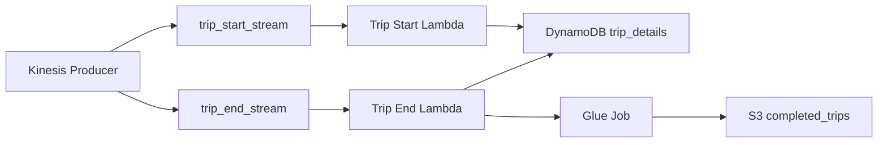
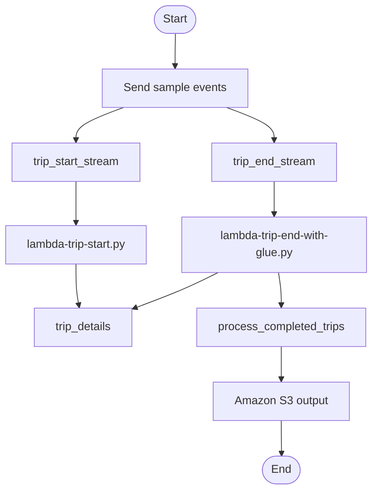
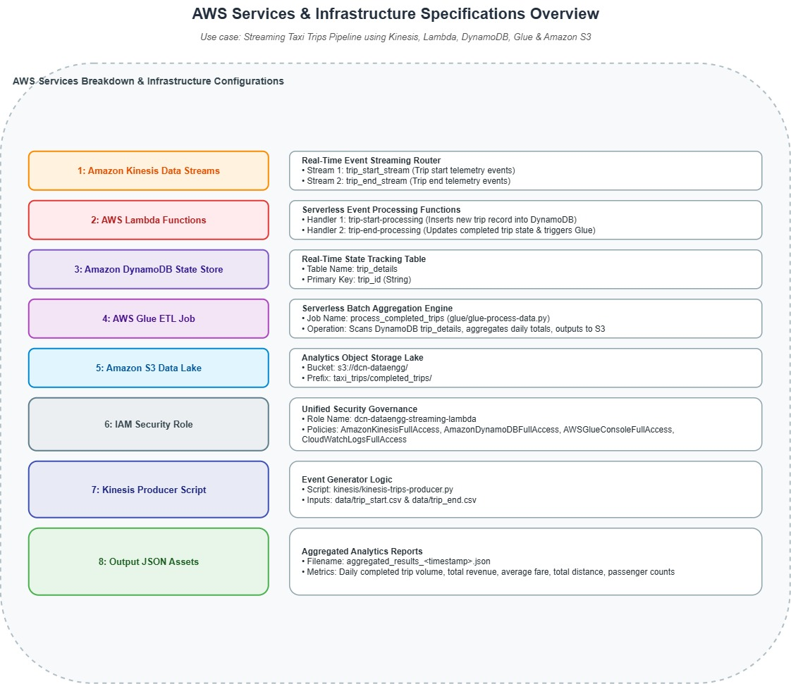
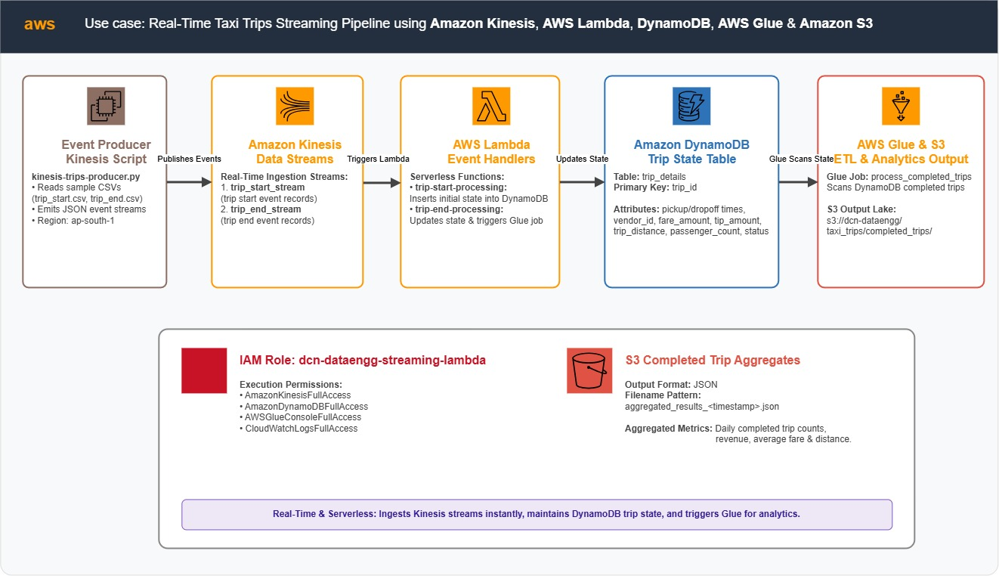
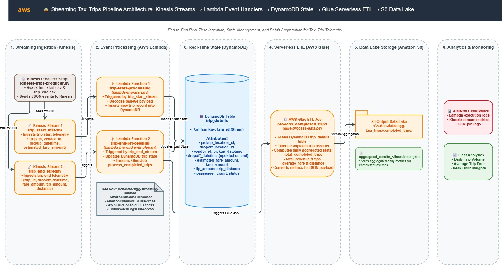
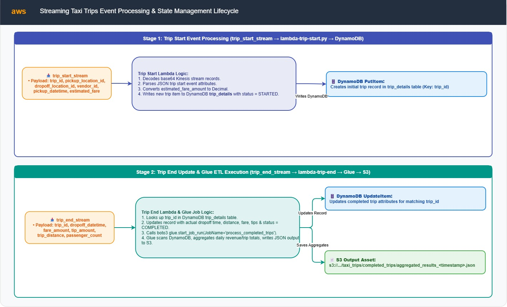
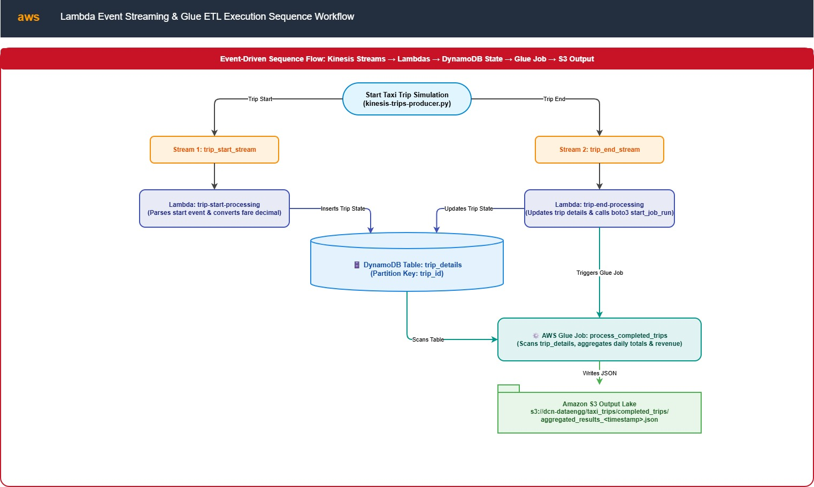

# Streaming Taxi Trips Pipeline


An AWS streaming pipeline for taxi trips that ingests start and end events from Kinesis, stores trip state in DynamoDB, and runs a Glue ETL job to produce completed-trip aggregates into S3.

---

## 📌 Table of Contents
- [Project Objective](#-project-objective)
- [Architecture Overview](#-architecture-overview)
  - [AWS Services](#-aws-services)
  - [High-Level Architecture](#-high-level-architecture)
  - [Service Flow Diagrams](#-service-flow-diagrams)
- [Data Flow](#-data-flow)
- [Repository Structure](#-repository-structure)
- [Key Components](#-key-components)
  - [Kinesis Producer](#kinesis-producer)
  - [Trip Start Lambda](#trip-start-lambda)
  - [Trip End Lambda](#trip-end-lambda)
  - [Glue ETL Job](#glue-etl-job)
- [Data Schemas](#-data-schemas)
- [Deployment & Execution](#-deployment--execution)
- [IAM Permissions](#-iam-permissions)
- [Notes](#-notes)

---

## 🏁 Project Objective

Build a reliable streaming taxi trip pipeline that:

- receives real-time taxi trip events through Amazon Kinesis
- persists trip start state in DynamoDB
- updates completed trip records on trip end events
- triggers AWS Glue to aggregate completed trips
- stores aggregated results in Amazon S3

This project demonstrates event-driven stream ingestion, Lambda-based state updates, and serverless ETL on AWS.

---

## 🧩 Architecture Overview

### 🔧 AWS Services

- Amazon Kinesis Data Streams
  - `trip_start_stream`
  - `trip_end_stream`
- AWS Lambda
  - `trip-start-processing`
  - `trip-end-processing`
- Amazon DynamoDB
  - `trip_details` (primary key: `trip_id`)
- AWS Glue
  - `process_completed_trips`
- Amazon S3
  - `dcn-dataengg`
  - prefix: `taxi_trips/`

### 🌐 High-Level Architecture

The pipeline follows this end-to-end flow:

1. `kinesis-trips-producer.py` sends sample taxi trip events to Kinesis streams.
2. `lambda-trip-start.py` consumes `trip_start_stream` and writes initial trip records into DynamoDB.
3. `lambda-trip-end-with-glue.py` consumes `trip_end_stream`, updates completed trip records in DynamoDB, and triggers the Glue job.
4. `process_completed_trips` scans `trip_details`, computes daily aggregates, and saves output to S3.

### � Mermaid Architecture Diagrams





### 🗂️ Service Flow Diagrams











---

## 🔄 Data Flow

1. Sample CSV files in `data/` are read by the Kinesis producer.
2. Start events are published to `trip_start_stream`.
3. The start Lambda writes initial trip state to DynamoDB.
4. End events are published to `trip_end_stream`.
5. The end Lambda updates existing trip state and starts Glue.
6. Glue aggregates completed trips and writes results to S3.

---

## 📁 Repository Structure

- `data/`
  - `trip_start.csv` — sample trip start records
  - `trip_end.csv` — sample trip end records
- `kinesis/`
  - `kinesis-trips-producer.py` — producer script that sends sample events to Kinesis
- `lambda/`
  - `lambda-trip-start.py` — processes start events and inserts into DynamoDB
  - `lambda-trip-end-with-glue.py` — updates completed trips and triggers Glue
- `glue/`
  - `glue-process-data.py` — Glue script for DynamoDB scan and S3 aggregation
- `docs/architecture/` — architecture diagrams
- `Infra.txt` — documented AWS components and infrastructure notes

---

## 🔑 Key Components

### Kinesis Producer

- `kinesis/kinesis-trips-producer.py`
- Reads `data/trip_start.csv` and `data/trip_end.csv`
- Sends start records to `trip_start_stream`
- Sends matching end records to `trip_end_stream`
- Uses `ap-south-1` as the default AWS region

### Trip Start Lambda

- `lambda/lambda-trip-start.py`
- Triggered by `trip_start_stream`
- Decodes Kinesis records and writes them to DynamoDB `trip_details`
- Converts `estimated_fare_amount` values to `Decimal`
- Logs record and error counts

### Trip End Lambda

- `lambda/lambda-trip-end-with-glue.py`
- Triggered by `trip_end_stream`
- Looks up `trip_id` in DynamoDB
- Updates trip details when the record exists
- Triggers AWS Glue job `process_completed_trips`

### Glue ETL Job

- `glue/glue-process-data.py`
- Scans `trip_details` DynamoDB table
- Aggregates daily totals and statistics
- Writes JSON output to S3 under `taxi_trips/completed_trips/`
- Filename pattern: `aggregated_results_<timestamp>.json`

---

## 📊 Data Schemas

### `trip_start.csv`

| Field | Description |
| --- | --- |
| `trip_id` | Unique trip identifier |
| `pickup_location_id` | Pickup location ID |
| `dropoff_location_id` | Dropoff location ID |
| `vendor_id` | Vendor identifier |
| `pickup_datetime` | Scheduled pickup timestamp |
| `estimated_dropoff_datetime` | Estimated dropoff timestamp |
| `estimated_fare_amount` | Estimated fare amount |

### `trip_end.csv`

| Field | Description |
| --- | --- |
| `dropoff_datetime` | Actual dropoff timestamp |
| `rate_code` | Rate code from trip metadata |
| `passenger_count` | Number of passengers |
| `trip_distance` | Trip distance |
| `fare_amount` | Final fare amount |
| `tip_amount` | Tip amount |
| `payment_type` | Payment method code |
| `trip_type` | Trip type code |
| `trip_id` | Unique trip identifier matching start event |

### DynamoDB `trip_details`

- Partition key: `trip_id`
- Contains merged start and end trip details
- Used by Glue for final aggregation

---

## 🚀 Deployment & Execution

### Prerequisites

- AWS CLI configured with valid credentials
- Python 3.x installed
- `boto3` installed

### Run locally

```bash
python kinesis/kinesis-trips-producer.py
```

This publishes sample start and end events to Kinesis.

### Deploy Lambda functions

Configure and deploy the following Lambda handlers:

- `lambda-trip-start.py`
- `lambda-trip-end-with-glue.py`

### Glue job

Create and configure Glue job `process_completed_trips` to execute `glue/glue-process-data.py`, with access to DynamoDB and S3.

---

## 🔒 IAM Permissions

The Lambda execution role should include at least:

- `AmazonKinesisFullAccess`
- `AmazonDynamoDBFullAccess`
- `AWSGlueConsoleFullAccess`
- `CloudWatchLogsFullAccess`

From `Infra.txt`:

- Role name: `dcn-dataengg-streaming-lambda`

---

## 💡 Notes

- The `trip_end` Lambda only updates DynamoDB records when `trip_id` exists.
- The Glue job scans the full DynamoDB table, so consider partitioning or filtering for production scale.
- Aggregated output is stored under `s3://dcn-dataengg/taxi_trips/completed_trips/`.
- If you change AWS region, update the hard-coded `ap-south-1` region in both Lambda scripts and the producer.

---

## 📍 References

- `Infra.txt` — infrastructure and service notes
- `docs/architecture/` — architecture diagrams and project flow visuals
