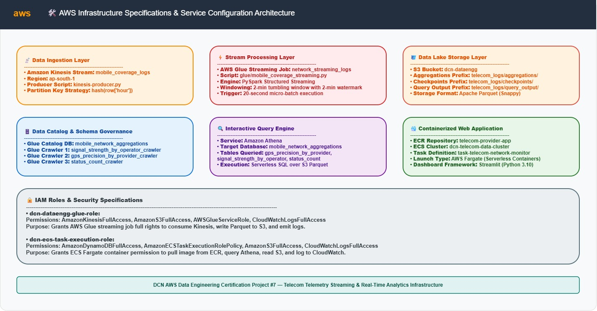
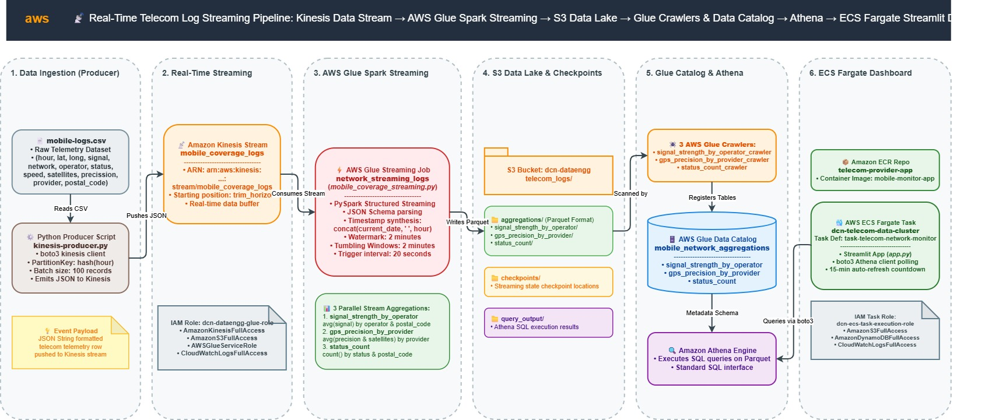
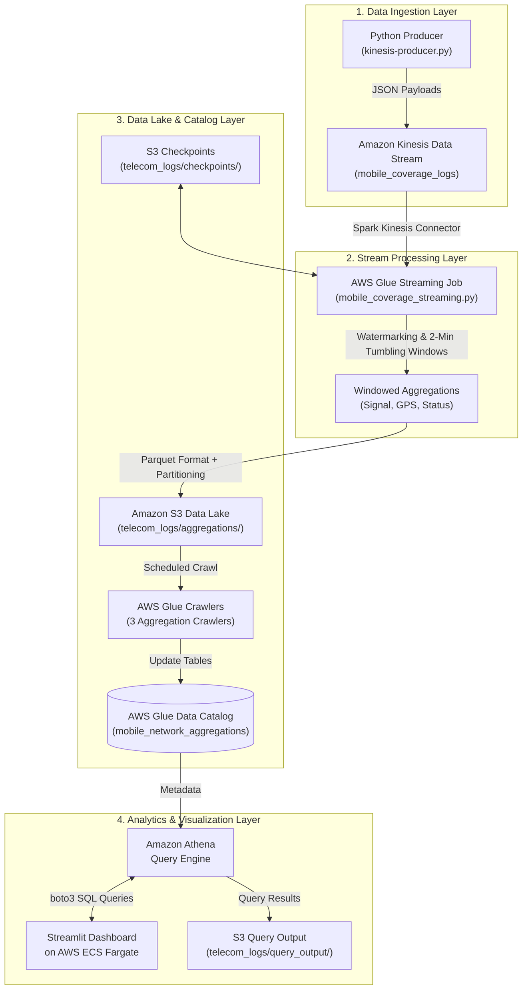
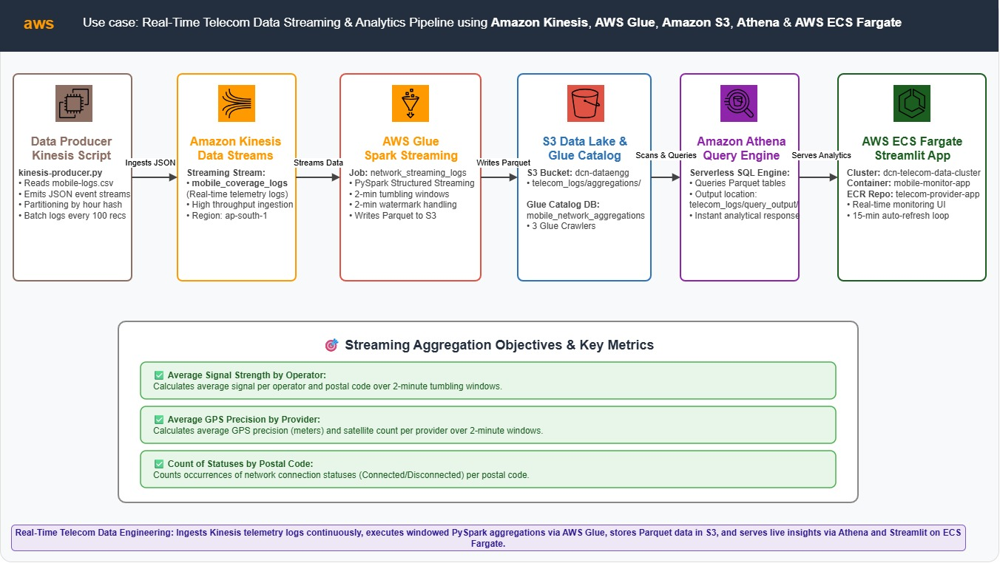
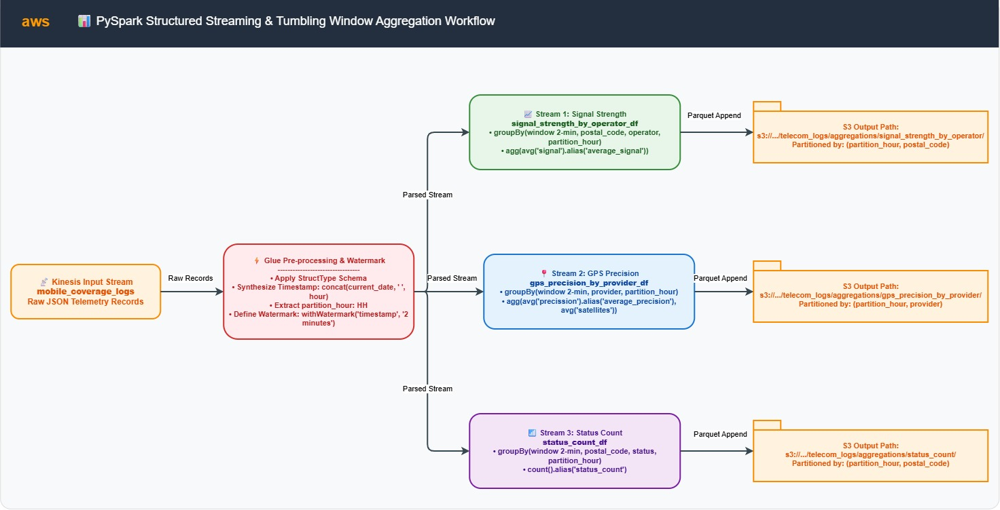
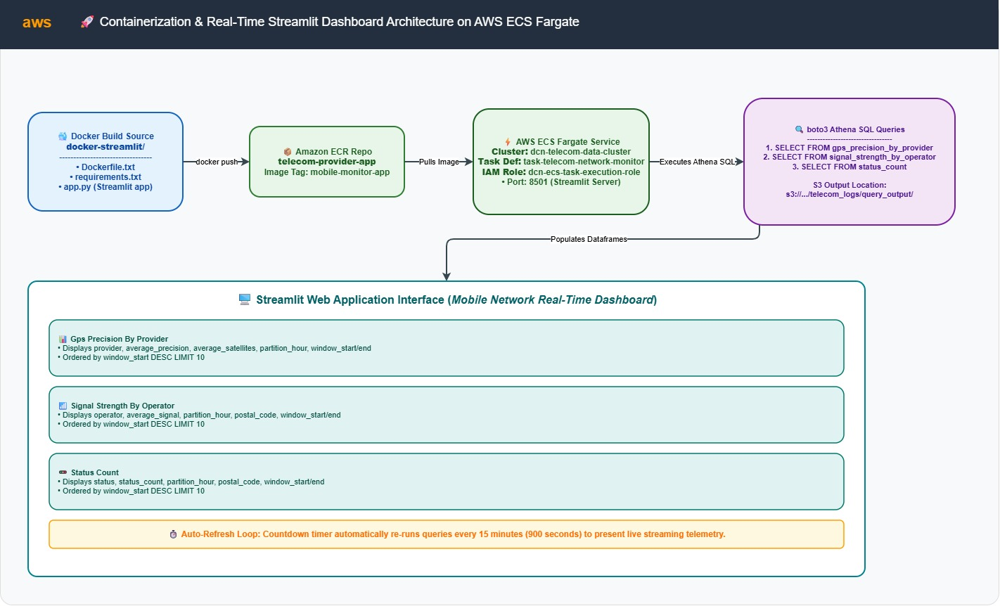

# 📡 Real-Time Telecom Data Streaming & Analytics Pipeline


A production-grade, end-to-end serverless streaming data engineering pipeline built on AWS to ingest, process, catalog, query, and visualize mobile network telemetry logs in near real-time. 

Telemetry events are streamed into **Amazon Kinesis Data Streams**, aggregated over tumbling time windows using a **PySpark Structured Streaming** job on **AWS Glue**, stored as columnar **Apache Parquet** files in **Amazon S3**, cataloged via **AWS Glue Crawlers**, queried serverlessly with **Amazon Athena**, and surfaced through an interactive **Streamlit** monitoring dashboard deployed on **AWS ECS Fargate**.

---

## 📌 Table of Contents

- [Architecture Overview](#️-architecture-overview)
  - [AWS Infrastructure Blueprint](#-aws-infrastructure-blueprint)
  - [System Architecture Diagram](#-system-architecture-diagram)
  - [Detailed Data Pipeline Flow](#-detailed-data-pipeline-flow)
- [Key Features](#-key-features)
- [Pipeline Logic & Streaming Aggregations](#-pipeline-logic--streaming-aggregations)
- [AWS Infrastructure Specifications](#-aws-infrastructure-specifications)
- [Datasets & Data Schemas](#-datasets--data-schemas)
  - [Source Kinesis Stream Schema](#source-kinesis-stream-schema)
  - [Aggregated S3/Athena Data Lake Schemas](#aggregated-s3athena-data-lake-schemas)
- [Core Components & Implementation](#-core-components--implementation)
  - [1. Data Ingestion Producer](#1-data-ingestion-producer-kinesis-producerpy)
  - [2. PySpark Structured Streaming Job](#2-pyspark-structured-streaming-job-mobile_coverage_streamingpy)
  - [3. Dashboard Application](#3-dashboard-application-docker-streamlit)
- [Repository Structure](#-repository-structure)
- [Deployment & Operational Guide](#-deployment--operational-guide)
  - [Prerequisites](#prerequisites)
  - [Step 1: Ingestion & Storage Setup](#step-1-ingestion--storage-setup)
  - [Step 2: Launch PySpark Streaming Job](#step-2-launch-pyspark-streaming-job)
  - [Step 3: Run Producer Script](#step-3-run-producer-script)
  - [Step 4: Catalog & Verify Athena Tables](#step-4-catalog--verify-athena-tables)
  - [Step 5: Containerize & Deploy Dashboard to ECS](#step-5-containerize--deploy-dashboard-to-ecs)
- [Verification & Observability](#-verification--observability)

---

## 🏗️ Architecture Overview

The system architecture is decoupled into four modular layers: **Ingestion**, **Stream Processing**, **Data Lake Storage & Cataloging**, and **Serverless Query & Visualization**.

### 🌐 AWS Infrastructure Blueprint



---

### 🌐 System Architecture Diagram





---

### 📊 Detailed Data Pipeline Flow



---

## ✨ Key Features

- **High-Throughput Streaming Ingestion**: Utilizes Amazon Kinesis Data Streams for scalable, low-latency log ingestion.
- **Stateful Spark Streaming**: Implements PySpark Structured Streaming with **2-minute event-time tumbling windows** and **2-minute watermarking** to elegantly handle late-arriving network data.
- **Fault-Tolerant Execution**: Stream checkpoints are stored in Amazon S3 to guarantee fault tolerance and exactly-once processing semantics across cluster restarts.
- **Cost-Optimized Columnar Data Lake**: Outputs aggregated metrics as partitioned Apache Parquet files in S3, drastically reducing Athena query scan volumes and costs.
- **Automated Cataloging**: AWS Glue Crawlers automatically discover schemas and register new hourly partitions in the Glue Data Catalog.
- **Serverless Analytics**: Amazon Athena enables instant standard SQL querying without maintaining persistent database infrastructure.
- **Containerized Monitoring Interface**: Streamlit application running inside Docker on AWS ECS Fargate, providing live auto-refreshing network metrics (Signal Strength, GPS Accuracy, Connection Statuses).

---

## 🔄 Pipeline Logic & Streaming Aggregations



1. **Ingestion**: `kinesis-producer.py` streams cellular log events from `data/mobile-logs.csv` to Kinesis (`mobile_coverage_logs`). Partitioning is hash-distributed by the log `hour`.
2. **Event Timestamp Parsing**: The AWS Glue job (`mobile_coverage_streaming.py`) parses raw JSON payloads into a structured DataFrame, derives an event `timestamp` column (`yyyy-MM-dd HH:mm:ss`), and extracts `partition_hour` for partition pruning.
3. **Tumbling Window Aggregations**: Over 2-minute non-overlapping tumbling windows, three parallel Spark Streaming queries execute:
   - **Signal Strength Metrics**: Computes average signal strength per operator and postal code (`avg(signal)`).
   - **GPS Precision & Satellites**: Computes average GPS accuracy and active satellite count per GPS provider (`avg(precission)`, `avg(satellites)`).
   - **Connection Status Counts**: Aggregates event occurrences by connection status and postal code (`count()`).
4. **S3 Parquet Sink**: Results are continuously committed every 20 seconds (`trigger(processingTime='20 seconds')`) to dedicated S3 prefixes (`s3://dcn-dataengg/telecom_logs/aggregations/`), partitioned by `partition_hour`, `postal_code`, and `provider`.
5. **Cataloging & Querying**: AWS Glue Crawlers sync S3 partitions with `mobile_network_aggregations` database. Streamlit queries Athena for the top 10 latest aggregation windows per table.

---

## ⚡️ AWS Infrastructure Specifications

| Infrastructure Component | Specification / Parameter | Details & Location |
| :--- | :--- | :--- |
| **AWS Region** | `ap-south-1` | Mumbai Region |
| **Kinesis Data Stream** | `mobile_coverage_logs` | Real-time telemetry ingestion stream |
| **S3 Data Lake Bucket** | `dcn-dataengg` | Primary storage bucket |
| **S3 Aggregations Path** | `s3://dcn-dataengg/telecom_logs/aggregations/` | Partitioned Parquet analytics datasets |
| **S3 Checkpoints Path** | `s3://dcn-dataengg/telecom_logs/checkpoints/` | PySpark streaming state checkpoints |
| **S3 Query Output Path** | `s3://dcn-dataengg/telecom_logs/query_output/` | Athena query execution result staging |
| **AWS Glue Job** | `network_streaming_logs` | PySpark 3.x Streaming job |
| **AWS Glue Database** | `mobile_network_aggregations` | Central Data Catalog database |
| **AWS Glue Crawlers** | `signal_strength_by_operator_crawler`<br>`gps_precision_by_provider_crawler`<br>`status_count_crawler` | Automatic S3 partition discovery crawlers |
| **Amazon ECR Repo** | `telecom-provider-app` | Container registry for dashboard image |
| **Amazon ECS Cluster** | `dcn-telecom-data-cluster` | Serverless AWS Fargate Cluster |
| **ECS Task Definition** | `task-telecom-network-monitor` | Container task definition (Port 5002) |
| **Glue IAM Role** | `dcn-dataengg-glue-role` | `AmazonKinesisFullAccess`, `AmazonS3FullAccess`, `AWSGlueServiceRole`, `CloudWatchLogsFullAccess` |
| **ECS Task IAM Role** | `dcn-ecs-task-execution-role` | `AmazonECSTaskExecutionRolePolicy`, `AmazonS3FullAccess`, `CloudWatchLogsFullAccess`, `AmazonDynamoDBFullAccess` |

---

## 📁 Datasets & Data Schemas

### Source Kinesis Stream Schema

Raw telemetry data sent by `kinesis-producer.py` to the Kinesis stream (`mobile_coverage_logs`) mirrors `data/mobile-logs.csv`:

| Column | PySpark Data Type | Description | Example Value |
| :--- | :--- | :--- | :--- |
| `hour` | `StringType` | Time of telemetry collection (`HH:mm:ss`) | `"00:01:16"` |
| `lat` | `DoubleType` | Latitude coordinate | `41.67089` |
| `long` | `DoubleType` | Longitude coordinate | `0.53407` |
| `signal` | `StringType` | Cellular signal strength | `"2"` |
| `network` | `StringType` | Network access technology | `"vodafone"` |
| `operator` | `StringType` | Network operator | `"vodafone ES"` |
| `status` | `StringType` | Connection status code | `"0"` |
| `description` | `StringType` | Human-readable network state | `"STATE_IN_SERVICE"` |
| `speed` | `DoubleType` | Device movement speed (m/s) | `0.0` |
| `satellites` | `StringType` | Count of visible GPS satellites | `"4.0"` |
| `precission` | `DoubleType` | GPS precision radius in meters | `51.0` |
| `provider` | `StringType` | Location provider (`gps`, `fused`, `network`) | `"gps"` |
| `activity` | `StringType` | Physical activity (`STILL`, `TILTING`, `IN_VEHICLE`) | `"STILL"` |
| `postal_code` | `StringType` | Location postal code | `"250236.0"` |

---

### Aggregated S3/Athena Data Lake Schemas

The streaming job outputs 3 aggregated datasets to S3, mapped to Athena tables in database `mobile_network_aggregations`:

#### 1. `signal_strength_by_operator`
*S3 Path*: `s3://dcn-dataengg/telecom_logs/aggregations/signal_strength_by_operator/`  
*Partition Keys*: `partition_hour`, `postal_code`

| Column | Type | Description |
| :--- | :--- | :--- |
| `window_start` | `timestamp` | Start timestamp of the 2-min window |
| `window_end` | `timestamp` | End timestamp of the 2-min window |
| `postal_code` | `string` | Postal code partition |
| `operator` | `string` | Telecom operator name |
| `partition_hour` | `string` | Hourly partition (`HH`) |
| `average_signal` | `double` | Average signal strength |

#### 2. `gps_precision_by_provider`
*S3 Path*: `s3://dcn-dataengg/telecom_logs/aggregations/gps_precision_by_provider/`  
*Partition Keys*: `partition_hour`, `provider`

| Column | Type | Description |
| :--- | :--- | :--- |
| `window_start` | `timestamp` | Start timestamp of the 2-min window |
| `window_end` | `timestamp` | End timestamp of the 2-min window |
| `provider` | `string` | Location provider (`gps`, `fused`) |
| `partition_hour` | `string` | Hourly partition (`HH`) |
| `average_precision` | `double` | Average GPS precision radius (m) |
| `average_satellites` | `double` | Average satellite count |

#### 3. `status_count`
*S3 Path*: `s3://dcn-dataengg/telecom_logs/aggregations/status_count/`  
*Partition Keys*: `partition_hour`, `postal_code`

| Column | Type | Description |
| :--- | :--- | :--- |
| `window_start` | `timestamp` | Start timestamp of the 2-min window |
| `window_end` | `timestamp` | End timestamp of the 2-min window |
| `postal_code` | `string` | Postal code partition |
| `status` | `string` | Connection status code |
| `partition_hour` | `string` | Hourly partition (`HH`) |
| `status_count` | `bigint` | Aggregate event count in window |

---

## 🐳 Core Components & Implementation

### 1. Data Ingestion Producer (`kinesis/kinesis-producer.py`)
- Reads `data/mobile-logs.csv` using Python `csv.DictReader`.
- Encapsulates records into JSON strings and dispatches them to Kinesis stream `mobile_coverage_logs` via `boto3.client('kinesis').put_record`.
- Uses `PartitionKey=str(hash(row['hour']))` for uniform stream shard distribution.
- Logs progress every 100 records.

### 2. PySpark Structured Streaming Job (`glue/mobile_coverage_streaming.py`)
- Initializes `GlueContext` and `SparkSession`.
- Reads continuously from Kinesis starting at `trim_horizon`.
- Constructs event timestamp by combining current execution date with telemetry `hour`.
- Defines 2-minute event-time watermark: `.withWatermark("timestamp", "2 minutes")`.
- Executes 3 concurrent `writeStream` queries in `append` mode writing Parquet files to S3 with checkpointing enabled.

### 3. Dashboard Application (`docker-streamlit`)



- **UI Framework**: Streamlit dashboard querying Athena tables via `boto3`.
- **Base Image**: `python:3.11-alpine` for lightweight container footprint.
- **Port**: Exposed on port `5002`.
- **Features**: Fetches top 10 latest records per metric and auto-refreshes every 15 minutes (900s countdown timer).

---

## 📂 Repository Structure

```
project7_streaming_telecom_logs/
├── Infra.txt                                # AWS infrastructure resource summary
├── README.md                                # Main project documentation
├── docker-bash-commands.sh                  # Shell script for ECR login, Docker build & push
├── data/
│   └── mobile-logs.csv                      # Sample mobile network log dataset (1,000+ records)
├── docker-streamlit/
│   ├── Dockerfile.txt                       # Alpine-based Dockerfile for Streamlit web app
│   ├── app.py                               # Streamlit dashboard querying Athena via boto3
│   └── requirements.txt                     # Python dependencies (streamlit, pandas, boto3)
├── glue/
│   └── mobile_coverage_streaming.py         # PySpark Structured Streaming script for AWS Glue
├── kinesis/
│   └── kinesis-producer.py                  # Python script for Kinesis stream record ingestion
└── docs/
    └── architecture/
        ├── 0-Overview.jpg                   # High-level pipeline flow diagram
        ├── 1-Architecture.jpg               # Detailed AWS system architecture diagram
        ├── 2-WindowsAggregation.jpg          # Spark 2-min windowed aggregation flow diagram
        ├── 4-AppBuild_Dashboard.jpg         # Streamlit dashboard & container deployment flow
        ├── 5-Services.jpg                   # AWS services infrastructure blueprint
        └── architecture_diagram.drawio      # Editable Draw.io architecture source file
```

---

## 🚀 Deployment & Operational Guide

### Prerequisites

- **AWS CLI** installed and configured (`aws configure`).
- **Python 3.9+** installed locally with `boto3`.
- **Docker Engine** installed and running.

---

### Step 1: Ingestion & Storage Setup

1. **Create Kinesis Data Stream**:
   - Stream Name: `mobile_coverage_logs`
   - Region: `ap-south-1`
   - Capacity mode: On-demand (or 1 provisioned shard).

2. **Create Amazon S3 Bucket & Folders**:
   - Bucket Name: `dcn-dataengg`
   - Key Prefixes:
     - `telecom_logs/aggregations/`
     - `telecom_logs/checkpoints/`
     - `telecom_logs/query_output/`

3. **Configure IAM Roles**:
   - Create `dcn-dataengg-glue-role` for AWS Glue with policies: `AmazonKinesisFullAccess`, `AmazonS3FullAccess`, `AWSGlueServiceRole`, `CloudWatchLogsFullAccess`.
   - Create `dcn-ecs-task-execution-role` for ECS Task Execution with policies: `AmazonECSTaskExecutionRolePolicy`, `AmazonS3FullAccess`, `CloudWatchLogsFullAccess`, `AmazonDynamoDBFullAccess`.

---

### Step 2: Launch PySpark Streaming Job

1. Open AWS Glue Console -> **ETL jobs** -> **Script editor**.
2. Create a Python Spark Streaming job named `network_streaming_logs`.
3. Paste code from [glue/mobile_coverage_streaming.py](file:///D:/code/dcn-aws-dataengg-cert-projects/project7_streaming_telecom_logs/glue/mobile_coverage_streaming.py).
4. Assign IAM Role `dcn-dataengg-glue-role`.
5. Save and **Run Job**.

---

### Step 3: Run Producer Script

Execute the local producer script to start ingesting log records into Kinesis:

```bash
# Navigate to project directory
cd project7_streaming_telecom_logs

# Run Kinesis producer
python kinesis/kinesis-producer.py
```

> [!TIP]
> Monitor progress in the terminal output. The producer will log every 100 sent records.

---

### Step 4: Catalog & Verify Athena Tables

1. **Create Glue Database**:
   - Database Name: `mobile_network_aggregations`

2. **Create & Run Glue Crawlers**:
   Create 3 Glue Crawlers pointing to respective S3 paths:
   - `signal_strength_by_operator_crawler` -> `s3://dcn-dataengg/telecom_logs/aggregations/signal_strength_by_operator/`
   - `gps_precision_by_provider_crawler` -> `s3://dcn-dataengg/telecom_logs/aggregations/gps_precision_by_provider/`
   - `status_count_crawler` -> `s3://dcn-dataengg/telecom_logs/aggregations/status_count/`
   - Output database: `mobile_network_aggregations`.

3. **Verify in Amazon Athena**:
   Run test query in Athena Editor:
   ```sql
   SELECT * FROM "mobile_network_aggregations"."signal_strength_by_operator" 
   ORDER BY window_start DESC 
   LIMIT 10;
   ```

---

### Step 5: Containerize & Deploy Dashboard to ECS

1. **Create ECR Repository**:
   - Repository Name: `telecom-provider-app`

2. **Build and Push Container Image**:
   Execute commands from `docker-bash-commands.sh` or run:
   ```bash
   # Authenticate Docker to AWS ECR
   aws ecr get-login-password --region ap-south-1 | docker login --username AWS --password-stdin <aws-account-id>.dkr.ecr.ap-south-1.amazonaws.com

   # Build Docker image
   cd docker-streamlit
   docker build -t mobile-monitor-app -f Dockerfile.txt .

   # Tag and push to ECR
   docker tag mobile-monitor-app:latest <aws-account-id>.dkr.ecr.ap-south-1.amazonaws.com/telecom-provider-app:mobile-monitor-app
   docker push <aws-account-id>.dkr.ecr.ap-south-1.amazonaws.com/telecom-provider-app:mobile-monitor-app
   ```

3. **Deploy on AWS ECS Fargate**:
   - **Cluster**: Create Fargate Cluster `dcn-telecom-data-cluster`.
   - **Task Definition**: Create `task-telecom-network-monitor` using container URI `<aws-account-id>.dkr.ecr.ap-south-1.amazonaws.com/telecom-provider-app:mobile-monitor-app` on Port `5002`. Attach IAM execution role `dcn-ecs-task-execution-role`.
   - **Service**: Launch ECS Fargate Service with a Public IP address.
   - **Access App**: Open `http://<ECS_PUBLIC_IP>:5002` in a browser.

---

## 🔍 Verification & Observability

- **Kinesis Stream Metrics**: Check AWS Kinesis Console -> **Monitoring** for `IncomingRecords` and `GetRecords.Success` metrics.
- **Glue CloudWatch Logs**: Inspect CloudWatch log group `/aws-glue/jobs/output` to monitor streaming batch progress.
- **S3 Data Lake Partitioning**: Verify Parquet files are written under `partition_hour=HH/` subdirectories.
- **Athena Query Performance**: Confirm query results complete in `< 2 seconds` due to Parquet columnar indexing.
- **ECS Task Health**: Monitor container memory and CPU usage in ECS Console.
