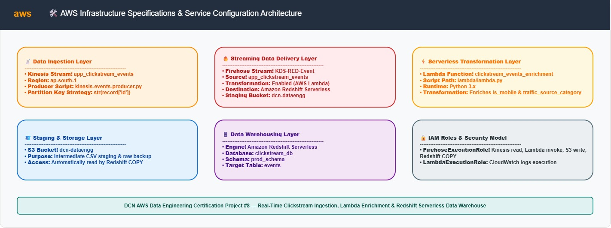
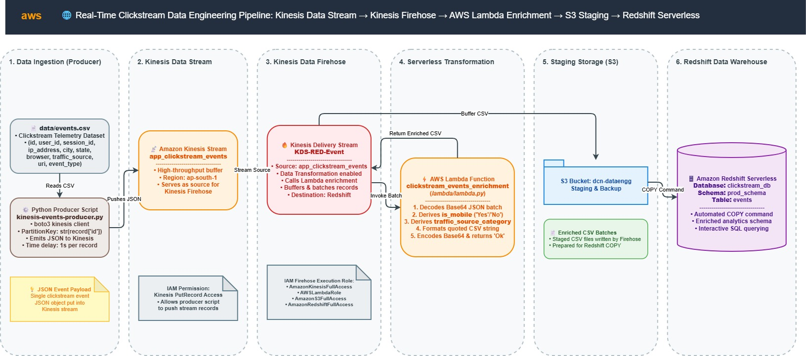
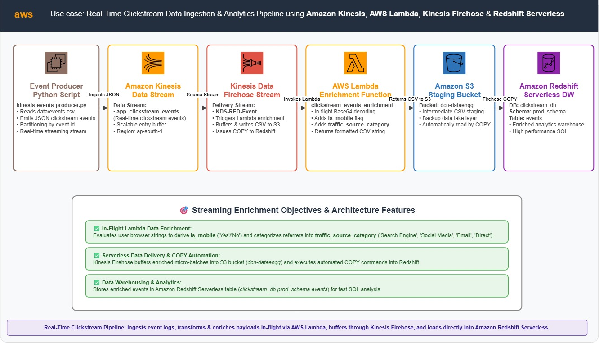
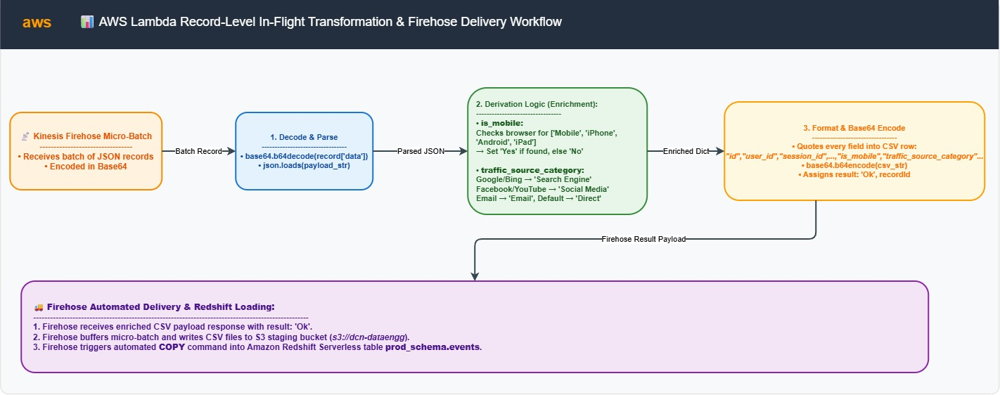
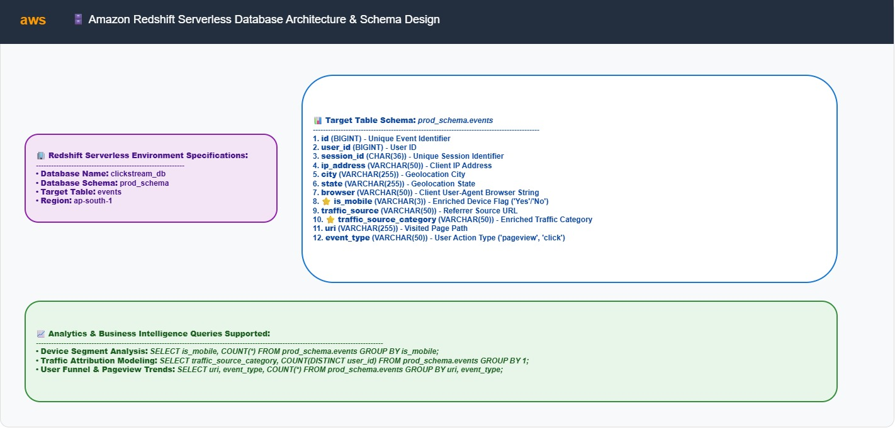

# 🌐 Real-Time Clickstream Data Engineering Pipeline


A production-grade, serverless data engineering pipeline built on AWS to ingest, transform, enrich, and analyze real-time web application clickstream events.

Raw clickstream events are streamed continuously into **Amazon Kinesis Data Streams**, transformed and enriched in-flight by an **AWS Lambda** function, buffered and delivered via **Amazon Kinesis Data Firehose**, staged in **Amazon S3**, and automatically loaded into **Amazon Redshift Serverless** for low-latency SQL analytics.

---

## 📌 Table of Contents

- [Architecture Overview](#-architecture-overview)
  - [AWS Infrastructure Blueprint](#-aws-infrastructure-blueprint)
  - [System Architecture Diagram](#-system-architecture-diagram)
  - [Detailed Pipeline Flow](#-detailed-pipeline-flow)
- [Key Features](#-key-features)
- [Pipeline Logic & In-Flight Transformation](#-pipeline-logic--in-flight-transformation)
- [AWS Infrastructure Specifications](#-aws-infrastructure-specifications)
- [Datasets & Data Schemas](#-datasets--data-schemas)
  - [Source Kinesis JSON Payload](#source-kinesis-json-payload)
  - [Enriched Redshift Target Schema](#enriched-redshift-target-schema)
- [Core Components & Implementation](#-core-components--implementation)
  - [1. Data Producer (`kinesis/kinesis-events-producer.py`)](#1-data-producer-kinesiskinesis-events-producerpy)
  - [2. In-Flight Enrichment Lambda (`lambda/lambda.py`)](#2-in-flight-enrichment-lambda-lambdalambdapy)
  - [3. Redshift Data Warehouse DDL (`redshift/redshift-create-table.sql`)](#3-redshift-data-warehouse-ddl-redshiftredshift-create-tablesql)
- [Repository Structure](#-repository-structure)
- [Deployment & Operational Guide](#-deployment--operational-guide)
  - [Prerequisites](#prerequisites)
  - [Step 1: Kinesis & S3 Provisioning](#step-1-kinesis--s3-provisioning)
  - [Step 2: Redshift Serverless Database Setup](#step-2-redshift-serverless-database-setup)
  - [Step 3: Deploy AWS Lambda Function](#step-3-deploy-aws-lambda-function)
  - [Step 4: Configure Kinesis Data Firehose Stream](#step-4-configure-kinesis-data-firehose-stream)
  - [Step 5: Run Data Producer Script](#step-5-run-data-producer-script)
  - [Step 6: Query & Verify in Redshift](#step-6-query--verify-in-redshift)
- [Verification & Observability](#-verification--observability)

---

## 🏗️ Architecture Overview

The pipeline is designed with a serverless, decoupled architecture spanning four distinct operational stages: **Ingestion**, **In-Flight Transformation**, **Staged Delivery**, and **Data Warehousing**.

### 🌐 AWS Infrastructure Blueprint



---

### 🌐 System Architecture Diagram



```mermaid
graph TD
    subgraph "1. Data Producer & Ingestion"
        Producer["Python Producer Script\n(kinesis-events-producer.py)"] -->|JSON Payloads via put_record()| KDS["Amazon Kinesis Data Stream\n(app_clickstream_events)"]
    end

    subgraph "2. In-Flight Transformation & Delivery"
        KDS -->|Stream Source| Firehose["Amazon Kinesis Data Firehose\n(KDS-RED-Event)"]
        Firehose <-->|Batch Invocation & CSV Encoding| Lambda["AWS Lambda Function\n(clickstream_events_enrichment)"]
        Firehose -->|Micro-batch CSV Staging| S3["Amazon S3 Staging Bucket\n(dcn-dataengg)"]
    end

    subgraph "3. Serverless Data Warehousing"
        S3 -->|Auto COPY Command| Redshift["Amazon Redshift Serverless\n(clickstream_db.prod_schema.events)"]
    end
```

---

### 📊 Detailed Pipeline Flow



---

## ✨ Key Features

- **Real-Time Data Ingestion**: Uses Amazon Kinesis Data Streams for scalable, partition-based ingestion of clickstream telemetry.
- **Serverless In-Flight Enrichment**: AWS Lambda transparently intercepts Firehose batches, decoding payloads, deriving mobile indicators, and categorizing traffic sources on-the-fly.
- **Zero-ETL Automated Loading**: Amazon Kinesis Data Firehose manages batching, compression, S3 staging, and automated `COPY` execution into Amazon Redshift Serverless.
- **Resilient Error Handling**: Failed records during Lambda transformation return `ProcessingFailed` status, allowing Firehose to route raw payloads to S3 error locations without dropping events.
- **Cost-Effective Analytics**: Serverless Redshift compute auto-scales based on query load, eliminating fixed cluster compute costs.

---

## 🔄 Pipeline Logic & In-Flight Transformation



1. **Streaming Ingestion**: `kinesis-events-producer.py` reads events from `data/events.csv` and streams them into Kinesis (`app_clickstream_events`) using `PartitionKey=str(record['id'])`.
2. **Firehose Trigger & Lambda Invocation**: Firehose (`KDS-RED-Event`) buffers incoming stream records and invokes `clickstream_events_enrichment` Lambda function in batches.
3. **Data Decoding & Transformation**:
   - Decodes Base64 payload into JSON dictionaries.
   - **`is_mobile` Enrichment**: Evaluates `browser` string against `['Mobile', 'iPhone', 'Android', 'iPad']`. Returns `'Yes'` if matched, otherwise `'No'`.
   - **`traffic_source_category` Enrichment**: Evaluates `traffic_source`. Maps `'Google'` / `'Bing'` -> `'Search Engine'`, `'Facebook'` / `'YouTube'` -> `'Social Media'`, `'Email'` -> `'Email'`, else `'Direct'`.
4. **CSV Formatted Output**: Formats enriched fields into quote-escaped CSV strings (`"id","user_id","session_id"...`) and Base64-encodes them back to Firehose.
5. **Staging & Redshift Loading**: Firehose commits CSV files to S3 (`s3://dcn-dataengg/`) and executes a serverless Redshift `COPY` command to populate `prod_schema.events`.

---

## ⚡️ AWS Infrastructure Specifications

| Component | Specification / Value | Details & Description |
| :--- | :--- | :--- |
| **AWS Region** | `ap-south-1` | Mumbai Region |
| **Kinesis Data Stream** | `app_clickstream_events` | 1 Shard / On-Demand streaming ingestion |
| **Kinesis Data Firehose** | `KDS-RED-Event` | Firehose delivery stream with Lambda transformation |
| **AWS Lambda Function** | `clickstream_events_enrichment` | Python 3.9+ runtime for in-flight data transformation |
| **S3 Staging Bucket** | `dcn-dataengg` | Intermediate S3 bucket for Firehose COPY staging |
| **Redshift Serverless DB** | `clickstream_db` | Amazon Redshift Serverless Database |
| **Target Schema** | `prod_schema` | Production analytics database schema |
| **Target Table** | `prod_schema.events` | Redshift column-store target table |

---

## 📁 Datasets & Data Schemas

### Source Kinesis JSON Payload

Raw events sent by `kinesis-events-producer.py` to `app_clickstream_events` mirror `data/events.csv`:

| Field | JSON Type | Description | Sample Value |
| :--- | :--- | :--- | :--- |
| `id` | `string` | Unique event identifier | `"1001"` |
| `user_id` | `string` | User ID | `"5042"` |
| `session_id` | `string` | Session UUID | `"c7a911f4-3d8b-4a5f-9e12-88f11ab32011"` |
| `ip_address` | `string` | Client IPv4 address | `"192.168.1.45"` |
| `city` | `string` | Geolocation city | `"Mumbai"` |
| `state` | `string` | Geolocation state | `"Maharashtra"` |
| `browser` | `string` | User agent browser string | `"Mozilla/5.0 (iPhone; CPU OS 15_0)"` |
| `traffic_source` | `string` | Referrer URL or source | `"Google"` |
| `uri` | `string` | Web page path requested | `"/products/electronics"` |
| `event_type` | `string` | Event action type | `"pageview"` |

---

### Enriched Redshift Target Schema



Destination table DDL defined in [redshift/redshift-create-table.sql](file:///D:/code/dcn-aws-dataengg-cert-projects/project8_clickstreamdata/redshift/redshift-create-table.sql):

| Column Name | Redshift Data Type | Enrichment Status | Description |
| :--- | :--- | :--- | :--- |
| `id` | `BIGINT` | Raw Field | Unique event ID |
| `user_id` | `BIGINT` | Raw Field | User identifier |
| `session_id` | `CHAR(36)` | Raw Field | 36-character session UUID |
| `ip_address` | `VARCHAR(50)` | Raw Field | Client IP address |
| `city` | `VARCHAR(255)` | Raw Field | City name |
| `state` | `VARCHAR(255)` | Raw Field | State name |
| `browser` | `VARCHAR(50)` | Raw Field | Browser string |
| `is_mobile` | `VARCHAR(3)` | **Derived (Lambda)** | `'Yes'` or `'No'` indicator |
| `traffic_source` | `VARCHAR(50)` | Raw Field | Traffic referrer |
| `traffic_source_category` | `VARCHAR(50)` | **Derived (Lambda)** | `'Search Engine'`, `'Social Media'`, `'Email'`, or `'Direct'` |
| `uri` | `VARCHAR(255)` | Raw Field | Page URI path |
| `event_type` | `VARCHAR(50)` | Raw Field | Event action (`pageview`, `click`, `purchase`) |

---

## 🐳 Core Components & Implementation

### 1. Data Producer (`kinesis/kinesis-events-producer.py`)
- Reads `data/events.csv` line-by-line using `csv.DictReader`.
- Serializes each row dictionary into a JSON string.
- Dispatches records to Kinesis stream `app_clickstream_events` using `put_record` with `PartitionKey=str(record['id'])`.
- Implements 1-second throttling delay between record puts (`time.sleep(1)`).

### 2. In-Flight Enrichment Lambda (`lambda/lambda.py`)
- Receives record batches from Firehose: `event['records']`.
- Base64-decodes payload data and parses JSON string.
- Evaluates `is_mobile_browser()` and `categorize_traffic_source()`.
- Formats enriched data into a CSV string with double-quote escaping:
  ```python
  f'"{id}","{user_id}","{session_id}","{ip_address}","{city}","{state}","{browser}","{is_mobile}","{traffic_source}","{traffic_source_category}","{uri}","{event_type}"\n'
  ```
- Base64-encodes CSV string and returns `'result': 'Ok'` to Firehose.

### 3. Redshift Data Warehouse DDL (`redshift/redshift-create-table.sql`)
- Creates database `clickstream_db` and schema `prod_schema`.
- Configures column storage optimized for clickstream reporting queries.

---

## 📂 Repository Structure

```
project8_clickstreamdata/
├── Infra.txt                       # AWS infrastructure resource summary
├── README.md                       # Main project documentation
├── data/
│   └── events.csv                  # Sample clickstream event dataset
├── kinesis/
│   └── kinesis-events-producer.py  # Python script to stream events into Kinesis
├── lambda/
│   └── lambda.py                   # Data transformation & enrichment Lambda script
├── redshift/
│   └── redshift-create-table.sql   # DDL script for Redshift Serverless table creation
└── docs/
    └── architecture/
        ├── 0-Overview.jpg           # Pipeline flow overview diagram
        ├── 1-Architecture.jpg       # High-level AWS system architecture diagram
        ├── 2-LambdaTransformation.jpg # Firehose-Lambda in-flight transformation diagram
        ├── 3-DataWarehouseSchema.jpg  # Redshift Data Warehouse table schema diagram
        ├── 4-Services.jpg           # AWS services infrastructure blueprint
        └── architecture_diagram.drawio # Editable Draw.io architecture diagram file
```

---

## 🚀 Deployment & Operational Guide

### Prerequisites

- **AWS CLI** configured (`aws configure`) with credentials for Kinesis, Lambda, S3, and Redshift.
- **Python 3.9+** with `boto3` library (`pip install boto3`).

---

### Step 1: Kinesis & S3 Provisioning

1. **Create Kinesis Data Stream**:
   ```bash
   aws kinesis create-stream \
     --stream-name app_clickstream_events \
     --shard-count 1 \
     --region ap-south-1
   ```

2. **Create S3 Staging Bucket**:
   ```bash
   aws s3 mb s3://dcn-dataengg --region ap-south-1
   ```

---

### Step 2: Redshift Serverless Database Setup

1. Open **Amazon Redshift Console** -> **Serverless dashboard**.
2. Create or connect to workgroup and open Query Editor v2 on database `clickstream_db`.
3. Execute DDL script from [redshift/redshift-create-table.sql](file:///D:/code/dcn-aws-dataengg-cert-projects/project8_clickstreamdata/redshift/redshift-create-table.sql):
   ```sql
   CREATE DATABASE clickstream_db;

   CREATE SCHEMA prod_schema;

   CREATE TABLE prod_schema.events (
       id BIGINT,
       user_id BIGINT,
       session_id CHAR(36),
       ip_address VARCHAR(50),
       city VARCHAR(255),
       state VARCHAR(255),
       browser VARCHAR(50),
       is_mobile VARCHAR(3),
       traffic_source VARCHAR(50),
       traffic_source_category VARCHAR(50),
       uri VARCHAR(255),
       event_type VARCHAR(50)
   );
   ```

---

### Step 3: Deploy AWS Lambda Function

1. Open **AWS Lambda Console** -> **Create function**.
2. Function Name: `clickstream_events_enrichment`.
3. Runtime: `Python 3.9` (or newer).
4. Paste code from [lambda/lambda.py](file:///D:/code/dcn-aws-dataengg-cert-projects/project8_clickstreamdata/lambda/lambda.py).
5. Deploy the function and set execution timeout to `1 minute`.

---

### Step 4: Configure Kinesis Data Firehose Stream

1. Open **Amazon Kinesis Console** -> **Data Firehose** -> **Create delivery stream**.
2. Stream Name: `KDS-RED-Event`.
3. **Source**: Amazon Kinesis Data Streams (`app_clickstream_events`).
4. **Transform records**: Enable AWS Lambda transformation -> Select `clickstream_events_enrichment`.
5. **Destination**: Amazon Redshift Serverless.
   - Cluster / Workgroup connection: `clickstream_db`.
   - Schema: `prod_schema`.
   - Table: `events`.
   - Intermediate S3 Bucket: `s3://dcn-dataengg`.
   - S3 backup mode: Failed records only (or all records).

---

### Step 5: Run Data Producer Script

Execute the local producer to ingest clickstream events into Kinesis:

```bash
# Navigate to project directory
cd project8_clickstreamdata

# Execute Python producer
python kinesis/kinesis-events-producer.py
```

> [!TIP]
> The producer script logs each successfully dispatched record along with its event `id`.

---

### Step 6: Query & Verify in Redshift

Connect to Redshift Serverless via Query Editor v2 and run analytics SQL queries:

```sql
-- 1. Inspect recent enriched events
SELECT * FROM prod_schema.events ORDER BY id DESC LIMIT 10;

-- 2. Analyze traffic source breakdown
SELECT 
    traffic_source_category, 
    COUNT(*) AS total_events,
    SUM(CASE WHEN is_mobile = 'Yes' THEN 1 ELSE 0 END) AS mobile_events
FROM prod_schema.events
GROUP BY traffic_source_category
ORDER BY total_events DESC;
```

---

## 🔍 Verification & Observability

- **Kinesis Stream Metrics**: Monitor `PutRecord.Success` and `IncomingRecords` in Kinesis Console.
- **Lambda Metrics & Logs**: Check CloudWatch Log Group `/aws/lambda/clickstream_events_enrichment` to review batch size and processing logs.
- **Firehose Delivery Metrics**: Check Firehose metrics for `DeliveryToRedshift.Success` and `ExecuteProcessing.Success`.
- **Redshift COPY Auditing**: Check Redshift `stl_load_errors` or `sys_load_history` system tables to verify error-free `COPY` executions from S3.